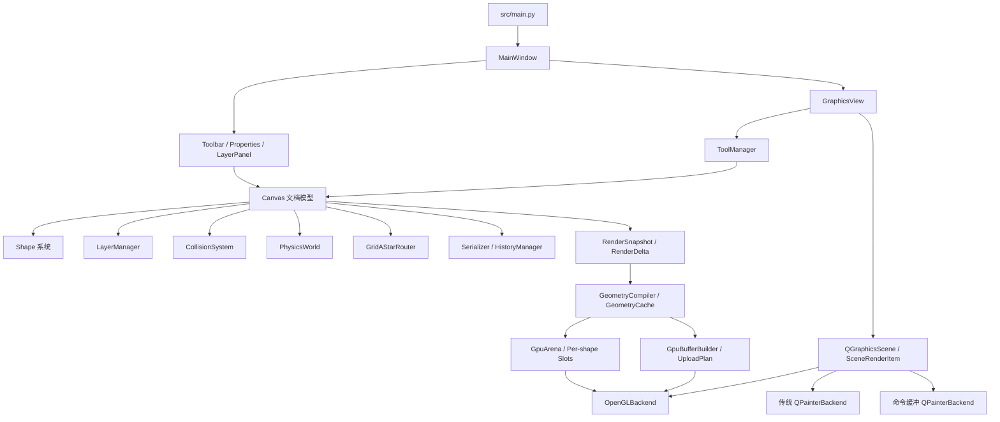

# 矢量图形编辑器：项目分析与优化总结

> 文档状态：当前架构与已完成工作的权威总结  
> 更新日期：2026-07-27  
> 适用版本：完成实验性 OpenGL、持久化 VBO 与图层可见性修复后的工作区

## 1. 项目定位

本项目是一个基于 Qt Graphics View Framework 的桌面矢量图形编辑器，同时作为游戏客户端、游戏引擎与计算机图形学岗位的技术展示工程。

它包含常规矢量编辑能力，也有意展示以下引擎基础概念：

- 2D AABB/圆形碰撞检测与碰撞调试显示；
- 图层、Z-order、锁定、隐藏及整层变换；
- 简单刚体运动、边界反弹和弹簧约束；
- 节点连接线与基于网格的自动避障路由；
- 可替换渲染后端、渲染增量、几何缓存与 GPU 顶点批处理；
- Qt/OpenGL 混合渲染，以及未来接入 C++ 原生模块的稳定数据边界。

项目保持 Qt 为应用与窗口体系，不引入完整外部游戏引擎。Python 负责编辑器业务、文档模型与快速迭代；性能敏感的几何、碰撞、批处理和渲染模块允许在后续逐步替换为 C++。

## 2. 程序入口与运行环境

### 2.1 入口

主入口为：

```text
src/main.py
  -> QApplication
  -> ui.main_window.MainWindow
  -> core.canvas.Canvas
  -> widgets.graphics_view.GraphicsView
  -> QGraphicsScene + SceneRenderItem
```

辅助启动文件包括 `start.py`、`run.bat` 和安装脚本。项目元数据位于 `pyproject.toml` 与 `setup.py`。

### 2.2 已确认环境

- Python：3.9；
- 已验证解释器：`C:\Users\lenovo1\AppData\Local\Programs\Python\Python39\python.exe`；
- GUI：PyQt5 5.15+；
- 当前开发平台：Windows；
- 项目可直接运行，之前“找不到解释器”是自动化执行环境与 IDE 虚拟环境/解释器选择不同导致，并非项目无法运行。

### 2.3 运行方式

```powershell
python src/main.py
```

安装依赖：

```powershell
python -m pip install -r requirements.txt
```

## 3. 技术栈

| 领域 | 当前实现 |
|---|---|
| 桌面 GUI | PyQt5、QMainWindow、Dock、Toolbar |
| 场景与视图 | QGraphicsView、QGraphicsScene、QGraphicsItem |
| 传统渲染 | QPainter |
| 实验渲染 | QOpenGLWidget、Shader、VAO、VBO、DrawArrays |
| 文档模型 | Python 对象 + 稳定图元 ID |
| 数据持久化 | JSON 风格字典、Serializer |
| 撤销/重做 | 完整文档纯数据快照 + 事务 |
| 碰撞 | AABB、圆形碰撞体、空间哈希宽相位 |
| 路由 | 网格 A* 自动避障 |
| 物理 | 固定时间步风格的简单刚体与弹簧约束 |
| 性能基准 | 无窗口 benchmark、tracemalloc |
| 自动化测试 | Python unittest、Qt offscreen 测试 |
| 未来原生层 | C++/pybind11 或 Qt C++ 模块，尚未引入 |

## 4. 当前目录与核心职责

```text
vector_editor/
├── src/
│   ├── main.py                    # 应用入口
│   ├── core/
│   │   ├── canvas.py              # 中央文档模型与统一更新入口
│   │   ├── shape.py               # 图元、样式、变换与绘制
│   │   ├── layer.py               # 图层状态和排序
│   │   ├── selection.py           # 选择状态
│   │   ├── transform.py           # 变换工具
│   │   ├── serializer.py          # 保存、加载、历史快照
│   │   ├── collision.py           # 碰撞体与空间哈希检测
│   │   ├── physics.py             # 刚体与弹簧
│   │   ├── routing.py             # 网格 A* 连接线路由
│   │   ├── rendering.py           # 渲染接口与 QPainter 后端
│   │   ├── geometry.py            # 中立几何指令与几何缓存
│   │   ├── gpu_buffers.py         # GPU 顶点布局、批次和上传计划
│   │   ├── gpu_arena.py           # 按图元分配、free-list 与 dirty ranges
│   │   └── opengl_backend.py      # 实验性 OpenGL 后端
│   ├── tools/                     # 鼠标工具与工具管理器
│   ├── ui/                        # 主窗口、属性、图层和工具栏
│   └── widgets/graphics_view.py   # 视图、场景项和后端切换
├── tests/                         # 无窗口单元与集成测试
├── benchmarks/                    # 性能基准
├── data/                          # 项目数据
└── *.md / *.toml / setup.py       # 文档与构建配置
```

## 5. 主要模块调用关系



Canvas 是当前最重要的业务边界。编辑操作不应直接修改渲染后端；应先修改 Canvas/Shape，再通过统一的世界状态更新生成碰撞、路由和渲染失效信息。

## 6. 数据流

### 6.1 编辑数据流

```text
鼠标/菜单/属性面板
  -> Tool 或 MainWindow/LayerPanel
  -> Canvas 操作 API
  -> Shape/Layer 文档状态变化
  -> update_world_state()
  -> 碰撞增量更新 + 连接线路由
  -> RenderDirtyFlag / RenderDelta
  -> canvas_changed
  -> QGraphicsScene 重绘
```

### 6.2 渲染数据流

```text
Canvas / Shape
  -> 纯数据 RenderSnapshot 或 RenderDelta
  -> GeometryCompiler
  -> 按图元 ID 的 GeometryCache
  -> RenderPrimitive
  -> GpuBufferBuilder
  -> TRIANGLES / LINES / TEXT
  -> 顶点批次与上传计划
  -> QPainter 或 OpenGL 后端
```

### 6.3 撤销数据流

```text
开始操作
  -> 捕获操作前文档快照
  -> 完成一组原子修改
  -> 提交操作后快照
  -> undo/redo 恢复完整文档
  -> 重建碰撞、路由、选择和渲染派生状态
```

历史记录不保存 QPainter、GPU Buffer、QObject 或碰撞缓存等派生对象。

## 7. 已完成的修改与优化

### 7.1 撤销/重做结构修复

原问题是绘制图元后再执行移动、旋转、缩放等操作时，历史状态粒度和保存时机不一致，导致撤销不能正确恢复。

已完成：

- 历史状态改为完整文档的纯数据快照；
- 引入 begin/commit 事务，将一次拖拽或变换视为一个操作；
- 恢复后统一重建连接关系、碰撞、路由和渲染状态；
- 选择状态不作为持久文档历史保存；
- 图层显示/隐藏也已进入统一历史路径。

### 7.2 画布边界约束

- 移动、整层平移、旋转、缩放统一进行世界空间边界检查；
- 群组操作按联合包围盒限制；
- 图元大于画布时拒绝异常移动，消除缩放后拖拽震荡；
- 超界旋转/缩放自动回滚或限制到最大合法比例。

### 7.3 2D 碰撞检测

- 图元支持 AABB 和圆形碰撞体；
- 拖拽、移动和物理模拟时实时检测；
- 碰撞对象高亮；
- 使用空间哈希作为宽相位，减少不必要的窄相位检测；
- 支持单图元变化时的增量更新；
- 调试覆盖层显示碰撞体、速度向量和碰撞状态。

### 7.4 自动避障连接线

- 连接线端点绑定节点锚点；
- 节点移动后自动刷新；
- 通过可替换的网格 A* 路由后端避开其它节点；
- 路由点进入 RenderDelta，可供 QPainter、OpenGL 或未来 C++ 后端消费。

### 7.5 图层管理

- 图层顺序与图元 Z-order；
- 图层锁定；
- 图层隐藏；
- 活动图层与图元移动到指定图层；
- 整层平移、旋转、缩放；
- 隐藏和锁定图层不能被重新设置为活动绘制目标；隐藏当前层且存在其它可编辑层时自动切换；
- 图层面板增加明确的“隐藏图层/显示图层”按钮、复选框说明和文字状态；
- 隐藏已选中图元时不再泄露选择框覆盖层。

### 7.6 简单刚体与弹簧

- 图元可配置质量和速度；
- 基于定时器执行运动；
- 画布边界反弹；
- 两图元之间可添加弹簧约束；
- 物理状态与编辑器图元保持同一坐标体系。

### 7.7 渲染抽象与增量同步

- 定义 RenderBackend 抽象；
- 保留传统 QPainterBackend；
- 新增 RenderSnapshot 与 RenderDelta；
- RenderDelta 支持 upsert、remove、顺序和可见性变化；
- 节点变化导致的连接线路由也会进入同一批增量；
- 后端切换时强制一次全量同步，之后恢复增量同步。

### 7.8 中立几何指令与缓存

- 图元编译为 `TRIANGLE_FAN`、`LINE_LOOP`、`LINE_STRIP`、`LINES`、`TEXT`；
- 支持基础图元、流程图、电气符号、文字和连接线；
- 几何缓存以稳定图元 ID 为键；
- 单图元变化只重新编译对应图元；
- 每条指令拥有世界空间包围盒；
- 命令缓冲 QPainter 后端用于验证新旧管线视觉一致性。

### 7.9 GPU 缓冲与批处理

- GPU 只接收展开后的 TRIANGLES、LINES 和独立文字命令；
- 固定小端 float32 顶点格式：`x, y, r, g, b, a`；
- 每顶点 24 字节；
- 同拓扑、同材质且相邻的指令自动合批；
- 文字会打断批次并通过 command stream 保持严格绘制顺序；
- 视口外指令通过世界包围盒裁剪。

### 7.10 实验性 OpenGL 后端

- QGraphicsView 可切换为 QOpenGLWidget viewport；
- 使用 Qt ShaderProgram、VAO、VBO 和 DrawArrays；
- 透明混合和线宽由 OpenGL 执行；
- 文字及编辑器调试覆盖层继续使用 QPainter；
- OpenGL 初始化失败时自动回退到命令缓冲 QPainter；
- 当前 PyQt5 缺少可用的版本化 Functions 包装，因此通过 Qt `getProcAddress()` 和标准库 ctypes 建立最小 GL 函数表，不依赖 PyOpenGL；
- 状态栏实时显示是否回退、GPU 顶点数、批次数和上传统计。

### 7.11 持久化 VBO 与局部更新

- 首帧和顶点数量变化时全量 allocate；
- 布局长度不变时比较顶点槽位；
- 将变化顶点合并为连续区间并调用 QOpenGLBuffer.write；
- 无变化重绘不重复上传；
- 相同文档 revision 与视口复用 CPU GpuBufferFrame；
- 状态栏显示最近上传的 full/partial、字节数、区间数及累计次数。

### 7.12 按图元管理的 GPU Slot/Arena

- 新增单逻辑 GpuPage，接口保留未来多页能力；
- 每个矢量 primitive 拥有稳定 allocation key、offset、capacity 和 generation；
- free-list 支持释放、排序合并和优先复用；
- primitive 容量内变化保持 offset 不变，扩容时重新分配并增加 generation；
- RenderDelta 只展开 dirty shape ID 对应的 primitive；
- Z-order 只更新 draw command 顺序，不移动顶点；
- 图层隐藏/显示保留 allocation，并在顶点未变化时保持零上传；
- dirty ranges 在上传前合并；碎片达到阈值时允许 compaction 和一次 full upload；
- 旧 GpuBufferBuilder 保留为参考和回退路径。

## 8. 性能与验证结果

当前自动化测试共 25 项，覆盖：

- RenderDelta 新增、删除、消费与连接线路由；
- 几何缓存全量和增量编译；
- GPU 顶点布局、合批、文字顺序和视口裁剪；
- full/partial 上传计划；
- Arena 槽位稳定、释放复用、扩容、Z-order、可见性和 compaction；
- 节点移动时节点与连接线的定向 Arena 更新；
- undo full sync 后的 Arena 等价重建；
- 图层按钮、复选框、撤销和渲染同步；
- 传统 QPainter、命令缓冲 QPainter 和 OpenGL 无上下文回退。

最近验证结果：`25/25` 通过。

1000 个矩形的代表性安全档结果：

| 指标 | 结果 |
|---|---:|
| RenderDelta 图元数 | 1 |
| RenderDelta 生成 | 约 2.20 ms |
| 单图元几何更新 | 约 0.07 ms |
| GPU 顶点数 | 14,000 |
| GPU 批次数 | 2 |
| 完整 GPU Frame 构建 | 约 52.31 ms |
| 320×240 裁剪 Frame 构建 | 约 9.32 ms |
| 单矩形局部上传 | 336 bytes / 2 ranges |
| 上传计划生成 | 约 16.05 ms |
| Arena 单图元更新 | 约 0.60 ms |
| Arena 上传计划 | 约 0.04 ms |
| Arena 扫描范围 | 1 shape / 2 primitives |

真实 OpenGL 窗口验证结果：

```text
fallback=False
首帧 full 上传=1
移动后 partial 上传=1
最近上传=336 bytes / 2 ranges
OpenGL error=''
```

测试命令：

```powershell
$env:QT_QPA_PLATFORM='offscreen'
python -m unittest discover -s tests -v
python benchmarks/benchmark_pipeline.py --counts 100 1000
```

基准默认限制在 100/1000 图元。超过 1000 必须显式传入 `--allow-large`，避免开发机意外进行高资源测试。

## 9. 当前构建与发布方式

- 依赖定义：`requirements.txt`、`requirements_dev.txt`、`pyproject.toml`；
- Python 包构建：setuptools；
- 本地启动：`python src/main.py`；
- 可执行安装入口在 `pyproject.toml` 与 `setup.py` 中均有定义；
- 当前没有 CMake、C++ 编译目标或二进制扩展；
- 当前没有持续集成配置。

后续引入 C++ 时应新增独立的 CMake/pybind11 可选构建，不应破坏纯 Python 回退路径。

## 10. 已知限制与技术债务

1. OpenGL 的 dirty 几何更新已接近 O(k)，但 render 阶段仍会遍历可见 primitive 生成命令。
2. Arena 容量预留会打断连续批次；draw call 数可能高于旧完整构帧，需要后续命令合并、页面分桶或间接绘制优化。
3. OpenGL 后端仍是混合渲染：文字、选择框和调试覆盖层使用 QPainter。
4. 宽线支持受具体 OpenGL 驱动限制，未来需要用三角形生成稳定粗线。
5. 尚未加入 GPU Timer Query、帧时间曲线和性能调试面板。
6. 尚未有所有图元的视觉黄金图回归测试，仍需人工 GUI 验证视觉一致性。
7. `shape.py` 中仍有 `QPen.setWidth(float)` 的 PyQt 弃用警告，应统一改为 `setWidthF()`。
8. README 和旧 PROJECT_STATUS 反映的是早期计划，部分目录及完成状态已经过时；本文件与 `PROJECT_PLAN.md` 应作为后续工作的主要依据。
9. C++ 原生模块尚未建立，当前稳定的是纯数据接口和 GPU 字节布局。

## 11. 重要文件阅读优先级

后续开发前建议按以下顺序阅读：

1. `PROJECT_PLAN.md`：阶段目标、设计约束和执行记录；
2. `src/core/canvas.py`：所有编辑和派生状态的统一入口；
3. `src/core/rendering.py`：后端契约与参考渲染器；
4. `src/core/geometry.py`：中立几何表示和缓存；
5. `src/core/gpu_buffers.py`：稳定 GPU 数据布局；
6. `src/core/gpu_arena.py`：allocation、free-list、dirty ranges 和 compaction；
7. `src/core/opengl_backend.py`：当前 OpenGL 生命周期和上传路径；
8. `src/widgets/graphics_view.py`：QGraphicsScene 与后端切换；
9. `src/core/shape.py`：图元序列化、局部坐标、变换和旧绘制实现；
10. `src/core/serializer.py`：撤销与持久化边界；
11. `tests/` 与 `benchmarks/`：验收标准和性能基线。
