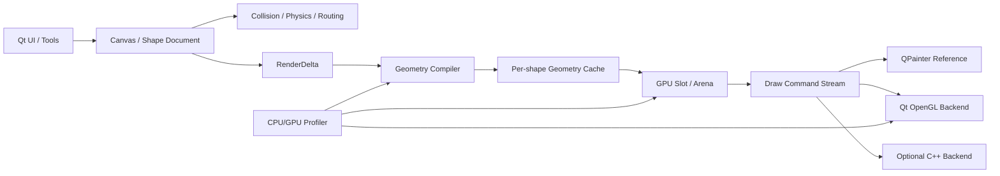

# 矢量图形编辑器：持续开发计划

> 文档用途：后续阶段开发的设计依据、执行计划和结果记录  
> 建立日期：2026-07-27  
> 当前状态：M17.1 3D Viewport、二维挤出与管线追踪——实现完成，待 GUI 验收

## 1. 使用规则

本文件不是一次性路线图，而是持续维护的工程计划。今后每次执行分阶段任务时必须遵循以下流程：

1. **读取当前计划**：确认当前阶段、前置条件、架构约束和未解决风险。
2. **先设计后编码**：分析本阶段涉及的数据所有权、调用边界、后端兼容性、撤销语义和资源风险。
3. **先写入计划**：将设计结论、修改范围、测试方案和验收标准写入本文件对应的“阶段执行记录”。
4. **按记录实施**：实际代码修改以写入的计划为准；若实施中必须改变方案，先更新计划并说明原因。
5. **分层验证**：依次执行语法/单元测试、无窗口集成测试、安全档基准、真实 GUI 或 OpenGL 验证。
6. **回填结果**：记录完成状态、实际指标、偏差、遗留问题和下一阶段建议。
7. **用户验收**：自动化验证由开发侧完成；视觉、交互手感和真实工作流由用户在 GUI 中验收。

禁止在没有更新本计划的情况下直接开始新的大型阶段。小型缺陷修复可直接执行，但完成后仍需在最近阶段记录中补充变更与影响。

## 2. 项目长期目标

### 2.1 产品目标

- 保持一个可实际使用的 PyQt5 矢量编辑器；
- 展示游戏客户端/引擎常见的场景、碰撞、物理、层级、路由和渲染概念；
- 展示从高层编辑器到低层 GPU 数据管线的完整工程能力；
- 保持模块可测试、可回退、可逐步迁移到 C++。

### 2.3 技术展示定位：可视、可用、可讲

自 2026-07-30 起，后续功能以展示计算机图形学与 C++ 核心能力为第一优先级，工程优化服务于理论展示，而不是为了架构完整度进行无收益重写：

- **可视**：算法必须有最终效果和中间过程可视化，能够观察输入、步骤、缓存/附件和输出差异；
- **可用**：算法必须消费编辑器真实图元、图层或交互数据，并能在正常编辑流程中开关、调整和回退，不能只是脱离项目的孤立 Demo；
- **可讲**：实验室必须呈现算法原理、复杂度、数据结构、C++/Python/OpenGL 分工、关键参数、性能代价与限制，使功能可以形成完整的面试讲解闭环；
- 每个阶段至少包含一个经典算法、一个真实 C++ 计算路径、一个真实 OpenGL pass/Shader，以及一个参考或调试视图；
- C++ 优先承担几何、空间查询、数值计算和批量数据生成；OpenGL 承担顶点处理、光栅化、纹理采样、混合和多 pass 合成；Qt/Python 继续承担文档、交互、输入和实验编排；
- 不把“将 Python 代码翻译成 C++”本身视为成果；必须能说明迁移对应的理论、数据边界或可测收益。

### 2.2 非目标

- 不引入 Unity、Unreal、Godot 等完整游戏引擎；
- 不为了使用 C++ 而重写全部业务层；
- 不让 OpenGL 对象侵入 Canvas、Shape、Serializer 或撤销历史；
- 不在缺少基准数据时进行无法量化的“优化”；
- 不牺牲传统 QPainter 回退路径和文档兼容性。

## 3. 架构设计原则

### 3.1 Qt 是应用外壳

窗口、事件循环、Dock、工具栏、输入法、文件对话框和编辑器交互继续由 Qt 管理。OpenGL 是可替换渲染后端，而不是新的应用框架。

### 3.2 文档模型与渲染器分离

Canvas/Shape 是事实来源；碰撞缓存、路由点、RenderDelta、GeometryCache 和 VBO 都是可重建的派生状态。渲染器不得反向修改文档。

### 3.3 跨语言只传纯数据

未来 Python/C++ 边界优先传递：

- 稳定图元 ID；
- 数值数组；
- 小端 float32 顶点数据；
- 批次描述；
- dirty IDs 与删除 IDs；
- 不透明的原生资源句柄（仅在明确所有权后）。

初期禁止跨边界传递 QObject、QPainter、Python Shape 对象或 QOpenGLContext。

### 3.4 正确性优先于加速

每个新后端都必须先与参考 QPainter 后端对齐。任何优化必须保留撤销、图层、连接线、碰撞、选择覆盖层和文档保存行为。

### 3.5 增量化与可回退

- 文档变化通过 RenderDelta 表达；
- 几何、CPU Frame 和 GPU Buffer 分层缓存；
- 结构变化允许全量同步；
- 局部变化尽量只更新 dirty IDs；
- 原生模块或 OpenGL 不可用时回退到纯 Python/QPainter。

### 3.6 资源和测试纪律

- 默认基准仅运行 100/1000 图元；
- 大规模压力测试必须明确授权并使用 `--allow-large`；
- GUI 与 OpenGL 测试使用短时、可自动退出的窗口；
- 不以一次帧率结果替代可重复的分阶段指标；
- 性能结论必须同时说明 CPU 构帧、上传量、批次和渲染耗时。

## 4. 目标架构



## 5. 已完成里程碑

| 里程碑 | 状态 | 关键结果 |
|---|---|---|
| M1 文档历史重构 | 完成 | 完整快照、事务、可靠撤销/重做 |
| M2 边界与整层变换 | 完成 | 无超界震荡，旋转缩放可回滚/限制 |
| M3 碰撞、物理、路由 | 完成 | 空间哈希、AABB/圆、弹簧、A* 避障 |
| M4 图层管理 | 完成 | Z-order、锁定、隐藏、整层变换、明确 UI |
| M5 渲染抽象 | 完成 | RenderBackend、Snapshot、Delta |
| M6 中立几何与命令后端 | 完成 | GeometryCache、参考命令渲染器 |
| M7 GPU 数据与 OpenGL | 完成 | 固定布局、裁剪、合批、Shader/VAO/VBO |
| M7.1 持久化 VBO | 完成 | full/partial 上传、336-byte 单图元更新 |
| M8 GPU Slot/Arena | 完成 | dirty-ID 更新、free-list、compaction、轻量命令流；GUI 验收通过 |
| M9 性能观测与调试面板 | 完成 | 有界采样、CPU/GPU 分段、性能 Dock、JSON 报告；GUI 验收通过 |
| M10 GPU 粗线与抗锯齿 | 完成 | CPU 三角形描边、join/cap、连接线统一批次、coverage AA；GUI 验收通过 |
| M11 渲染管线可视化实验室 | 完成 | 真实管线快照、六种调试视图、有界覆盖层；复制/物理图层缺陷修复后 GUI 验收通过 |
| M12 C++ 原生几何内核 | 完成 | C++17 描边/coverage 细分、CPython 窄绑定、自动 Python 回退、端到端性能对照；GUI 验收通过 |
| M13 Shader 与光栅状态实验 | 完成 | 真实 Shader 变体、混合、scissor/stencil、coverage 对照与运行时面板；GUI 验收通过 |
| M14 离屏渲染与 GPU 拾取 | 完成 | ID picking、两遍后处理、附件预览与 1×/2× PNG 导出；GUI 验收通过 |
| UI 工作区布局整理 | 被架构替代 | 临时 Dock 重排经测试仍不足以承载持续扩展，改用双窗口分页 |
| 双窗口分页架构 | 完成 | 主窗口保留基础编辑；独立引擎实验室分页承载管线、Shader、离屏与性能；GUI 验收通过 |
| M15.1 纹理图集与 GPU 实例化 | 完成 | 程序化 Atlas、per-instance buffer、单 draw 精灵/粒子实验；自动化、真实 OpenGL 与 GUI 验收通过 |
| M15.2 动态字形 Atlas 与 GPU 文本批处理 | 完成 | Qt 字体度量/栅格化、共享 glyph texture、连续文字命令 GPU batching 与安全回退；自动化、真实 OpenGL 与 GUI 验收通过 |
| M15 纹理、文字与实例化 | 后移 | 字形/图片 atlas、GPU 文本批处理、instancing/粒子实验 |
| M16 C++ 2D 可见性与 OpenGL 光照/阴影 | 已完成 | C++ 可见性、多光源 Shadow Mask/Light Texture、加法累积、缓存与三后端恢复均通过自动化、真实 OpenGL 和用户 GUI 验收 |
| M17 3D 渲染管线实验室 | M17.1 待 GUI 验收 | 独立 3D viewport、C++ 二维挤出、轨道相机、MVP/depth/culling/wireframe 与顶点阶段追踪已完成 |
| M18 C++ 软件光栅器与 OpenGL 管线对照 | 进行中 | M18.1 原生边函数/重心/深度/透视校正与 CPU/OpenGL 页面已实现，待 GUI 验收；M18.2 计划差异热图与误差指标 |
| M19 C++ 距离场与 OpenGL SDF 渲染 | 后移候选 | 距离变换、SDF 文字/轮廓、缩放抗锯齿与描边/发光效果；待高可视管线阶段完成后再评估 |

## 6. 当前阶段：M8 按图元管理的 GPU Slot/Arena

### 6.1 状态

`完成`。代码、自动化测试、性能基准、短时真实 OpenGL 验证和用户 GUI 验收均已通过。

### 6.2 问题定义

当前 VBO 上传已经可以局部更新，但当文档 revision 变化时，CPU 仍会：

1. 遍历可见图元；
2. 重新展开整个 GpuBufferFrame；
3. 扫描全部顶点寻找变化；
4. 之后才得到很小的局部上传范围。

1000 图元移动一个矩形时，实际只上传 336 bytes，但完整 CPU GPU Frame 构建约 52 ms，上传差异计划约 16 ms。下一阶段的目标是让 CPU 工作量也接近 dirty 图元数量。

### 6.3 设计结论

采用“按图元分配 + 独立绘制命令”的 GPU Arena，而不是继续比较完整扁平数组。

核心数据结构计划如下：

```text
GpuArena
  pages: topology/material bucket -> vertex storage
  allocations: shape_id -> [GpuAllocation]
  free_ranges: page -> sorted free list
  dirty_ranges: page -> merged upload ranges

GpuAllocation
  shape_id
  primitive_role
  page_id
  first_vertex
  capacity
  vertex_count
  generation

GpuDrawCommand
  render_pass
  z_order
  page_id
  first_vertex
  vertex_count
  topology/material state
```

设计选择：

- 以图元 ID 作为 allocation 所有权键；
- dirty 图元只重新编译、重新展开并写入自己的 allocation；
- 新顶点数不超过 capacity 时复用原槽位；
- 超过 capacity 时申请新槽位并释放旧槽位；
- 删除图元将槽位放回 free list；
- Z-order 只重建 draw command 顺序，不搬移顶点；
- 图层隐藏只移除 draw command，保留或延迟释放槽位；
- dirty ranges 排序并合并后再执行 QOpenGLBuffer.write；
- 达到碎片率阈值后才进行显式 compaction；
- compaction 属于结构操作，允许一次全量上传；
- 初期接受 draw command 数略有增加，先优化 CPU 构帧和上传；后续再做 page 内连续批处理或 MultiDraw。

本轮实施细化：

- 首版使用一个逻辑 `GpuPage(page_id=0)` 和单 VBO，`page_id`、页面接口及 allocation 数据结构保留多页扩展能力；
- 顶点颜色继续内嵌在 24-byte 顶点布局中，本阶段不按材质拆分多个 VBO；
- RenderDelta 在 `sync_document` 阶段驱动 arena，仅 upsert dirty shape IDs、释放 removed IDs；
- render 阶段只遍历有序 primitive 引用，生成轻量 draw/text command，不再展开全部顶点或做全数组差异扫描；
- 初始构建、上下文重建、page 扩容和 compaction 允许 full upload；常规同容量修改生成合并后的 partial ranges；
- 当前 `GpuBufferBuilder`、`plan_gpu_upload` 和命令缓冲 QPainter 路径保留为参考、基准及 OpenGL 失败回退。

### 6.4 计划修改范围

- 新增纯数据 `GpuArena`、`GpuAllocation`、`GpuPage` 和 free-list 分配器；
- GeometryCache 暴露按 dirty ID 获取 primitives 的稳定接口；
- OpenGLBackend 在 sync_document 阶段直接更新 arena；
- render 阶段仅生成/排序 draw commands，不重新展开全部顶点；
- 保留现有 GpuBufferBuilder 作为参考路径和回退路径；
- 状态栏增加 allocation、fragmentation、dirty bytes 和 compaction 指标；
- benchmark 增加 arena update 时间与扫描图元数。

### 6.5 正确性约束

- 图元移动、旋转、缩放、样式变化后画面必须与参考后端一致；
- 新增、删除、隐藏、图层排序、撤销/重做必须正确；
- 连接线路由变化必须更新连接线 allocation；
- 文字仍通过独立 command stream 保持顺序；
- viewport 变化不得破坏 allocation；视口只影响 draw command 可见集合；
- 上下文重建必须能够从 GeometryCache 全量恢复 arena；
- OpenGL 失败仍自动回退。

### 6.6 测试计划

自动化测试：

- free-list 分配、释放、复用和合并；
- allocation 容量内更新保持 offset 不变；
- allocation 扩容后 generation 增加且旧槽位释放；
- 删除图元后不再生成 draw command；
- Z-order 变化只改变命令顺序；
- 隐藏/显示不破坏几何；
- dirty range 合并；
- compaction 前后顶点和绘制命令等价；
- RenderDelta 单图元变化只访问对应 ID；
- 无 OpenGL 上下文回退。

真实 GUI 测试：

- 传统、命令缓冲、OpenGL 三后端切换；
- 连续拖拽、缩放、旋转；
- 图层隐藏和 Z-order；
- 物理模拟和连接线路由；
- OpenGL 上下文重建与窗口缩放。

### 6.7 验收标准

- 17 项现有测试全部继续通过；
- 新增 Arena 测试全部通过；
- 1000 图元移动 1 个矩形时，只重新展开该图元及受影响连接线；
- dirty upload 保持约 336 bytes/2 ranges（无连接线的矩形场景）；
- CPU arena update 目标 `< 1 ms`，不再进行 14,000 顶点全量差异扫描；
- 不发生非必要 compaction；
- 真实 OpenGL 测试 `fallback=False`；
- GUI 视觉与交互由用户确认通过。

### 6.8 风险与回退

| 风险 | 对策 |
|---|---|
| Arena 碎片增长 | 容量分级、free range 合并、阈值 compaction |
| Draw call 增加 | 先保证增量正确，后续 page/bucket 合批 |
| Z-order 与批处理冲突 | 顶点存储和 draw order 分离 |
| 文本穿插顺序错误 | 保留统一 command stream |
| 上下文丢失 | GeometryCache 作为可重建来源 |
| 实现复杂度过高 | 保留当前 GpuBufferBuilder 和完整上传回退 |

## 7. 后续阶段路线（2026-07-27 加速版）

路线由“逐项补全编辑器功能”调整为“高价值图形学纵向切片”。每个阶段应尽量同时形成真实实现、可交互可视化、理论说明和性能数据，避免长期只做底层铺垫而缺少可展示成果。

### M11 渲染管线可视化实验室（下一阶段）

- 直接读取现有 RenderPrimitive、GeometryCache、GpuArena 和 draw command，不制作与真实后端脱节的演示动画；
- 展示“文档图元 → CPU 几何编译 → 描边三角化 → 顶点流 → 模型/世界/视图/投影 → clip/NDC/屏幕 → 光栅化 → fragment/blend”的阶段关系；
- 提供最终画面、线框、三角形/批次着色、裁剪区域、overdraw 热力图、坐标轴与矩阵数据等可切换视图；
- 展示当前 Shader、uniform、顶点布局、批次、顶点数、裁剪数和 CPU/GPU 计时；
- 支持选中单个图元追踪其在各坐标空间中的数据，优先形成适合作品集演示的完整纵向切片；
- 本阶段不实现完整材质编辑器，不改变文档格式和既有编辑语义。

### M12 C++ 原生几何内核（提前）

M10 已测得 1000 个矩形描边产生 138,000 顶点，Python 完整构帧约 668.44 ms、Arena 初建约 734.80 ms，因此原生化已有明确依据。首个迁移目标固定为描边细分，而不是泛化重写。

- 建立可选 `native/` CMake 工程和 `vector_engine_native` Python 扩展；
- 首选 pybind11 或等价的窄纯数据绑定，输入点/宽度/join/cap，输出连续 float32 顶点数据；
- Python 参考实现保留同名契约，扩展缺失、ABI 不匹配或运行失败时可回退；
- 对退化路径、miter limit、round join/cap 和 coverage fringe 做逐项一致性测试；
- 用同一 100/1000 图元基准比较 Python/C++ 构建时间、峰值内存和输出规模；
- 只有数据证明有收益时，才继续迁移空间哈希、dirty range 合并或其它纯计算热点。

建议目录：

```text
native/
├── CMakeLists.txt
├── include/
├── src/
└── python_bindings/
```

### M13 Shader 与光栅状态实验

- 增加可热切换的基础 Shader 变体、渐变和时间 uniform；
- 可视化 vertex/fragment 输入输出以及 uniform 值；
- 对照 alpha blending、加色混合和不透明覆盖；
- 对照 scissor、stencil 与普通几何裁剪；
- 对照 coverage fringe、MSAA 可用路径和后续可选 SDF/解析抗锯齿；
- 以实验预设代替大而全的材质编辑器。

### M14 离屏渲染、GPU 拾取与后处理

- 建立 FBO/RenderTarget 抽象与附件可视化；
- 使用 ID buffer 实现 GPU picking，并与 CPU `contains_point` 对照正确性和耗时；
- 支持颜色、ID、深度/模板附件的调试查看；
- 支持高分辨率离屏导出和少量代表性后处理效果；
- 保持正常编辑路径默认使用稳定的 CPU 拾取，实验路径可独立开关。

### M15 纹理、文字与实例化（后移）

- 字形/图片 atlas、GPU 文本批处理；
- 保留输入法与文字编辑 UI 在 Qt 层；
- 结合实例化绘制展示重复图元或粒子；
- 仅在前述管线实验需要纹理输入，或核心展示主线完成后实施。

### M16 C++/Qt 原生 Renderer 决策门

在 M11-M15 获得实际指标后再决定是否迁移完整 Renderer：

- 若主要瓶颈已经由原生几何内核解决，则保留 Python 管理 Qt/OpenGL 生命周期；
- 若驱动调用、命令提交或资源管理成为明确瓶颈，再评估 C++ Qt OpenGL 后端；
- 使用与 PyQt5 匹配的 Qt ABI 和编译器，明确 context 所在线程；
- RAII 管理 Shader、Buffer、VAO、FBO；Python 只发送 RenderDelta/command 纯数据；
- C++ 后端不得持有 Python Shape 生命周期，并必须实现相同 RenderBackend 契约。

### 7.1 加速执行规则

- 以“技术展示包”为验收单位，不再为每个小控件或微功能单独安排一轮 GUI 验收；
- 每个里程碑只安排一次集中 GUI 验收，覆盖视觉效果、交互回归、性能面板和三后端对照；结构性缺陷仍立即修复；
- 优先完成能贯通真实数据管线的最小闭环，再增加可选效果；可选效果阻塞时记录原因并进入下一主线；
- Dock 跨会话状态、虚线细节和高级文字排版等低性价比完善项后移，除非它们阻塞当前展示；
- 不以加速进度为由取消 Python/QPainter 回退、文档兼容、撤销正确性、自动化测试或安全档基准；
- 每一阶段必须回答四个问题：展示了什么理论、使用了哪段真实管线、指标改善或代价是什么、失败时如何回退。

## 8. C++ 与 Qt 接口策略

### 第一层：纯计算扩展

输入输出为 Python buffer、NumPy 兼容 buffer protocol 或 bytes。没有 Qt ABI 风险，最适合首先落地；按加速路线在 M12 实施，并以描边细分作为首个可量化迁移点。

### 第二层：共享 GPU 数据布局

C++ 读取固定的 24-byte 顶点格式和 draw command；Python 仍管理 Qt 窗口与 context 生命周期。

### 第三层：完整原生 Renderer

只有在驱动调用、资源管理和 Python 调度成为明确瓶颈时，才把 Renderer 迁移到 C++。必须保留相同 RenderBackend 契约和纯 Python 回退。

## 9. 测试职责与合格标准

### 自动化开发侧

- 修改前确认基线；
- 新逻辑必须有定向测试；
- 运行完整安全档测试；
- 性能改动运行 benchmark；
- OpenGL 改动运行短时真实上下文测试；
- 报告实际通过数量、关键指标和未覆盖风险。

### 用户 GUI 验收侧

- 按真实编辑流程操作；
- 比较三种后端视觉；
- 验证拖拽手感、缩放、图层、撤销和文件保存；
- 反馈可复现步骤、当前后端、状态栏信息和截图。

### 阶段完成定义

一个阶段只有在以下条件全部满足时才标记完成：

- 计划中的必需实现完成；
- 自动化测试通过；
- 性能或资源指标达到验收标准，或偏差已记录并接受；
- 没有未说明的回退或错误；
- 计划文档已回填实施结果；
- 需要 GUI 验收的阶段已获得用户确认。

## 10. 阶段执行记录模板

每次开始新阶段时复制以下模板到本节末尾，并在编码前填写“设计结果”和“执行计划”。

```markdown
### YYYY-MM-DD / 阶段编号与名称

- 状态：设计中 / 待实施 / 实施中 / 待 GUI 验收 / 完成 / 阻塞
- 目标：
- 前置条件：
- 设计结果：
- 修改范围：
- 不修改范围：
- 风险与回退：
- 自动化测试计划：
- GUI 测试计划：
- 资源预算：
- 验收标准：

实施后回填：

- 实际修改：
- 自动化结果：
- 性能结果：
- GUI 验收：
- 与计划偏差：
- 遗留问题：
- 下一步：
```

## 11. 当前执行记录

### 2026-07-27 / M8 GPU Slot/Arena 设计与实施

- 状态：完成
- 目标：消除单图元变化时 CPU 对完整可见顶点数组的重建与全量差异扫描。
- 前置条件：RenderDelta、GeometryCache、GPU 固定布局、OpenGL 后端和持久化 VBO 已完成并验证。
- 设计结果：采用按图元 allocation、free-list、dirty range、独立 draw command 和阈值 compaction；首版落地为单逻辑 page/单 VBO，接口保留多页扩展；详细设计见第 6 节。
- 修改范围：`gpu_buffers.py`、新增 arena 模块、`opengl_backend.py`、tests、benchmark、状态栏指标。
- 不修改范围：Canvas 文档格式、Shape 保存格式、传统 QPainter 输出、用户文件兼容性、C++ 模块。
- 风险与回退：保留当前 GpuBufferBuilder 与全量上传路径；Arena 异常时允许回退完整构帧。
- 自动化测试计划：分配/释放/扩容/排序/隐藏/撤销/连接线/compaction/dirty range。
- GUI 测试计划：三后端对照、拖拽、物理、图层、连接线、窗口缩放与上下文恢复。
- 资源预算：默认仅执行 100/1000 图元；真实 GUI 测试自动在 2 秒内退出。
- 验收标准：见第 6.7 节。

实施后回填：

- 实际修改：
  - 新增 `src/core/gpu_arena.py`，实现单逻辑 page、按图元/primitive allocation、容量分级、free-list 合并、槽位复用与扩容 generation；
  - 实现 dirty range 合并、full/partial 上传计划、碎片率、显式/阈值 compaction；
  - GeometryCache 新增稳定 primitive key 与按 shape ID 访问接口；
  - GPU 图元编码从完整 BufferBuilder 中提取，旧构帧与 Arena 共享同一编码规则；
  - OpenGLBackend 在 `sync_document(RenderDelta)` 阶段更新 Arena，render 阶段只生成可见 draw/text commands；
  - Z-order 与图层顺序改为纯 ORDER 失效，不重建几何；
  - 图层隐藏/显示保留 allocation，顶点未变化时不产生 GPU 上传；
  - 状态栏新增 slot、碎片率和 dirty shape 指标；
  - benchmark 新增 Arena 构建、更新、上传计划和 allocation 指标。
- 自动化结果：25/25 通过；新增 8 项 Arena 测试，覆盖槽位稳定、释放复用、扩容、Z-order、隐藏/显示、compaction、连接线路由和撤销重建。
- 性能结果（1000 矩形安全档）：
  - Arena 初始构建约 56.56 ms；
  - 单图元 Arena update 约 0.60 ms；
  - 只访问 1 个 shape、展开 2 条 primitive；
  - Arena 上传计划约 0.04 ms；
  - 上传 336 bytes / 2 ranges；
  - 对照旧完整 GPU Frame 构建约 50.72 ms、完整差异计划约 15.97 ms；
  - allocation 2000，测试场景碎片率 0%。
- 真实 OpenGL：`fallback=False`，首帧 full=1，移动后 partial=1；隐藏/显示没有新增上传；OpenGL error 为空。
- GUI 验收：2026-07-27 用户确认通过，包括重做入口修复后的复测。
- 与计划偏差：
  - 首版按设计细化为单 page/单 VBO，没有实现材质多页；
  - allocation 的容量预留使相邻绘制指令不一定连续，5 个矩形真实测试产生 10 个 draw batches，而旧完整构帧为 2 个；本阶段优先达成 O(k) CPU 更新目标，批次优化留待后续；
  - 图层可见性变化会重新编译该图层的 primitive 以更新 visible 标志，但保留槽位且零上传。
- 遗留问题：
  - render 阶段仍需遍历可见 primitive 生成命令；
  - draw call 数量上升，需要 page 内批处理、间接绘制或命令合并策略；
  - `shape.py` 仍有 `QPen.setWidth(float)` 弃用警告。
- 下一步：进入 M9 性能观测与调试面板；先建立可重复指标，再依据数据优化批次。

### 2026-07-27 / M8 GUI 验收缺陷：重做入口无响应

- 状态：完成
- 现象：用户验收时发现“重做”无响应。
- 复现结果：底层 `HistoryManager.redo()`、`Canvas.redo()` 以及直接触发工具栏 Action 均可正确恢复状态；通过 GUI 发送 `Ctrl+Y` 时历史索引不前进。
- 根因：菜单栏与左侧编辑工具栏分别创建了撤销、重做等 `QAction`，两组 Action 同时注册相同快捷键，Qt 将快捷键判定为歧义，因而不触发任何一个重做入口。
- 设计结果：主窗口只创建一组共享编辑 Action，菜单栏和工具栏引用同一对象；由 `history_changed` 统一维护撤销/重做的 enabled 状态；Canvas 撤销/重做返回是否实际执行，状态栏只报告真实成功的操作。
- 修改范围：`src/ui/main_window.py`、`src/core/canvas.py`、定向 GUI/历史测试。
- 不修改范围：历史快照格式、RenderDelta、GPU Arena、文件格式与各渲染后端。
- 风险与回退：属于 UI 命令入口去重，不改变文档状态语义；若共享 Action 在不同容器表现异常，可退回为无快捷键的代理 Action，但保留唯一快捷键所有者。
- 自动化测试计划：验证 Action 唯一性、初始 enabled 状态、创建/移动后的状态变化、工具栏触发撤销与重做、`Ctrl+Z/Ctrl+Y`、redo 后历史索引和图元位置。
- GUI 测试计划：分别点击菜单与工具栏，再分别使用 `Ctrl+Z/Ctrl+Y`，覆盖创建、拖拽、属性变换和图层可见性。
- 验收标准：所有入口指向同一历史命令；有可重做状态时一次操作前进一步；无可重做状态时入口禁用且不显示虚假成功消息。

实施后回填：

- 实际修改：
  - 菜单栏和左侧编辑工具栏改为共享唯一的撤销、重做、剪切、复制、粘贴与删除 `QAction`，消除重复快捷键注册；
  - `history_changed` 现在统一刷新撤销/重做入口的 enabled 状态；
  - `Canvas.undo()` / `Canvas.redo()` 返回布尔执行结果，主窗口只在真正发生历史恢复后显示成功消息；
  - 新增 `tests/test_history_actions.py`，覆盖历史返回值、Action 唯一性、enabled 状态、真实工具栏点击和 `Ctrl+Z/Ctrl+Y`。
- 自动化结果：新增定向测试 4/4 通过；完整测试 29/29 通过。修复前同一无窗口 GUI 用例可稳定复现 `Ctrl+Y` 后历史索引不变，修复后一次 `Ctrl+Y` 正确前进一步并恢复图元位置。
- GUI 验收：2026-07-27 用户确认菜单、工具栏与快捷键重做均通过。
- 遗留问题：现有 `QPen.setWidth(float)` 仍产生弃用警告，与本缺陷无关。
- 下一步：缺陷关闭，进入 M9。

### 2026-07-27 / M9 性能观测与调试面板

- 状态：完成
- 目标：建立低开销、可导出、跨三种渲染后端的统一性能观测基础，为 M10 及后续 C++ 优化提供可比较证据。
- 前置条件：M8 与重做缺陷 GUI 验收通过；Canvas/RenderDelta/GeometryCache/GpuArena 边界稳定。
- 设计结果：
  - 新增纯 Python `PerformanceProfiler`，使用 `perf_counter_ns`、固定长度 ring buffer 和上下文计时器；性能数据是运行时派生状态，不进入文档、序列化或撤销历史；
  - CPU 指标分层为 `world_total`、`collision`、`routing`、`frame_total`、`render_sync`、`backend_render`、`geometry`、`arena_update`、`arena_frame`、`upload_plan` 和 `gpu_upload_cpu`；
  - 计数/仪表包含图元、可见 primitive、碰撞候选/窄相、路由展开节点、dirty shape、顶点、批次、上传 bytes/ranges、allocation 和碎片率；
  - 新增只读 Qt 性能 Dock，以 250 ms 刷新摘要，展示最近值/平均值/P95/最大值及轻量帧时间曲线；支持暂停采样、清空和导出 JSON；
  - OpenGL 上下文与版本信息写入元数据；GPU Timer Query 采用能力检测和异步读取，不支持时明确显示 unavailable，绝不以 `glFinish` 或同步阻塞读取伪造 GPU 指标；
  - M9 首轮先完成采样器、CPU 全链路、面板与 JSON；GPU Query 若当前 PyQt/OpenGL 函数表不能安全异步读取，则作为 M9.1 遗留而不阻塞其它后端。
- 修改范围：新增 `src/core/profiling.py`、新增 `src/ui/performance_panel.py`，并在 Canvas、SceneRenderItem、渲染后端和 MainWindow 接入；新增 profiling 测试。
- 不修改范围：文档格式、Shape 数据结构、历史语义、绘制结果、Arena allocation 策略和 C++ 模块。
- 风险与回退：计时器本身可能扰动微小操作，因此默认固定 120 样本且面板低频刷新；可暂停采样；面板异常不得中断渲染；GPU Query 不可用时只缺少该指标。
- 自动化测试计划：ring buffer 截断、统计值、暂停/恢复、计时上下文异常安全、JSON schema、Canvas 分阶段指标、三后端渲染指标、面板无窗口刷新。
- GUI 测试计划：显示/隐藏 Dock、暂停与清空、连续拖拽和物理运行、三后端切换、JSON 导出并检查内容、OpenGL 能力状态。
- 资源预算：完整单元测试目标低于 2 秒；GUI 测试使用 offscreen；100/1000 图元安全档，不运行大规模压力测试；面板刷新 4 Hz。
- 验收标准：采样开关关闭时不增长样本；ring buffer 有界；导出 JSON 可解析且包含环境/摘要/原始样本；常规编辑可看到各阶段数据；面板刷新不触发文档历史；完整测试通过；用户确认交互无明显卡顿。

实施后回填：

- 实际修改：
  - 新增 `src/core/profiling.py`，实现 120 样本有界 ring buffer、启停、计时上下文、gauge/metadata、latest/average/P95/max 汇总和 UTF-8 JSON 导出；
  - Canvas 的统一世界更新入口新增 world/collision/routing 分段计时与碰撞、路由计数；
  - CommandQPainter/OpenGL 后端与 SceneRenderItem 新增 geometry、arena update/frame、upload plan、GPU upload CPU、render sync、backend render 和 frame total 计时；
  - 新增 `src/ui/performance_panel.py`，提供 250 ms 刷新的只读 Dock、帧时间曲线、统计表、采样暂停、清空和 JSON 导出；Dock 默认隐藏，可从“视图 → 性能”打开；
  - OpenGL 新增 4 槽异步 `GL_TIME_ELAPSED` 查询池，仅轮询 `GL_QUERY_RESULT_AVAILABLE`，不调用 `glFinish` 且不阻塞等待；
  - OpenGL 上下文版本、profile、回退状态、顶点/批次、allocation、碎片率、dirty shape 和上传量进入报告；
  - 新增 `tests/test_profiling.py` 覆盖采样器、JSON、Canvas 分段、Dock 和历史隔离。
- 自动化结果：M9 定向测试 6/6 通过；完整测试 35/35 通过；无窗口主界面首帧确认传统后端产生 6 类实际阶段样本，性能 Dock 可刷新且不改变历史索引。
- 性能结果：
  - 单次 `record_ms` 微基准约 174 ns（采样开启）、65 ns（采样暂停），样本始终截断为 120；
  - 1000 矩形安全档：Arena update 0.65 ms、upload plan 0.05 ms、336 bytes/2 ranges，只访问 1 shape/2 primitives，延续 M8 的 O(k) 更新特征；
  - 同一安全档完整 GPU Frame 52.54 ms、完整差异计划 14.95 ms，说明后续优化仍应基于 Arena；
  - 面板隐藏时不运行 250 ms UI 刷新定时器。
- GPU Timer Query：真实 OpenGL 4.6 验证 `fallback=False`、错误为空；异步 Query 可用，连续矢量绘制得到 2 个延迟样本（0.007168 ms、0.001024 ms），未执行同步等待。
- GUI 验收：2026-07-27 用户确认性能功能与调整后的右侧标签页布局均通过。
- 与计划偏差：GPU 时间按“连续矢量绘制块”采样；纯矢量帧通常只有一个块，文字穿插会拆成多个样本，避免让 Query 跨越 Qt 文字绘制和 native painting 边界。
- 遗留问题：`shape.py` 的 `QPen.setWidth(float)` 弃用警告仍存在；性能报告目前是单次快照，尚未加入命名会话或多报告对比。
- 下一步：进入 M10 GPU 粗线、连接线与抗锯齿。

### 2026-07-27 / M9 GUI 验收缺陷：右侧 Dock 拥挤与文本受限

- 状态：完成
- 现象：性能功能正确，但属性、图层和性能面板同时占用右侧区域后布局拥挤，部分文字受窗口尺寸限制无法正常显示。
- 复现结果：800×600 无窗口布局中三个 Dock 被纵向排列，几何位置延伸到主窗口可视高度之外，未形成任何 tabified dock；性能计数使用单个长文本标签，不适合窄侧栏。
- 根因：三个独立 Dock 被连续加入同一 RightDockWidgetArea，却没有 tabify 或可恢复的面板布局策略；性能 gauge 采用 JSON 长文本展示，信息密度与侧栏宽度不匹配。
- 设计结果：
  - 属性、图层、性能改为同一右侧区域的标签页 Dock，一次只占用一个完整侧栏页面；
  - 三个 Dock 都保留“视图”菜单显隐入口，打开性能面板时自动切换到性能标签；
  - 为 Dock 设置稳定 objectName，给后续 `saveState/restoreState` 保留兼容接口；
  - 性能 gauge 从自动换行长文本改为两列表格，计时表采用响应式列宽和水平滚动；
  - 不通过固定超大最小宽度强迫主画布缩小，窄窗口仍由表格滚动保证信息完整。
- 修改范围：`src/ui/main_window.py`、`src/ui/performance_panel.py`、布局回归测试。
- 不修改范围：Profiler 数据、渲染后端、文档、撤销历史、性能 JSON schema。
- 自动化测试计划：800×600 下验证三个 Dock 互相 tabified、几何不越过主窗口、性能标签可切换、两列表格包含完整 gauge、历史不变化。
- GUI 测试计划：在常用窗口尺寸下切换属性/图层/性能标签，缩小窗口，检查属性文字、计时表滚动和性能计数；关闭/重开各面板。
- 验收标准：右侧只显示一个完整面板；无纵向堆叠越界；所有性能字段可通过表格或滚动查看；画布不因强制侧栏宽度明显缩小。

实施后回填：

- 实际修改：
  - 主窗口保存属性、图层和性能 Dock 引用，并为三者设置稳定 objectName；
  - 三个右侧 Dock 改为顶部标签页布局，不再纵向堆叠；
  - “视图”菜单提供三个面板的显隐入口，重新显示后通过延迟 `raise_()` 自动切换到目标标签；
  - 属性面板置于可调整大小的 `QScrollArea`，小窗口使用垂直滚动而不是强制撑高主窗口；
  - 性能计数由长 JSON 文本改为两列表格，碎片率格式化为百分比；计时表首列弹性伸缩，其余列按内容调整并保留水平滚动。
- 自动化结果：M9 定向测试 6/6、完整测试 35/35 通过；新增验证 Dock 互相 tabified、视图菜单入口、目标标签切换、可视区边界、gauge 完整值和历史隔离。
- 布局结果：修复前 800×600 请求被内容撑到约 800×827，三个 Dock 纵向位置延伸到窗口外；修复后窗口保持 800×600，活动性能 Dock 为 `(269, 83, 531, 495)`，完整位于可视区。
- GUI 验收：2026-07-27 用户确认通过。
- 遗留问题：尚未实现跨会话保存/恢复用户自定义 Dock 布局，但 objectName 已为后续 `saveState/restoreState` 做好准备。
- 下一步：缺陷关闭，进入 M10。

### 2026-07-27 / M10 GPU 粗线、连接线与抗锯齿

- 状态：完成
- 目标：消除 OpenGL `glLineWidth` 的驱动差异，让粗线、折线、闭合轮廓和连接线在 GPU 后端获得稳定宽度、join/cap 与抗锯齿表现，并保持 QPainter 参考后端兼容。
- 前置条件：M9 及其 GUI 布局修复已通过；固定 GPU 顶点布局、GeometryCache、Arena、性能面板和真实 OpenGL 验证链可用。
- 设计结果：
  - 新增纯数值 stroke tessellator，将 LINE_STRIP、LINE_LOOP、LINES 展开为 TRIANGLES；输入输出仅为点、宽度、join、cap 和三角形顶点，便于后续迁移到 C++；
  - 每段生成稳定四边形；join 支持 miter/bevel/round，miter 超过限制时回退 bevel；cap 支持 butt/square/round；退化或重复点安全跳过；
  - `ShapeStyle` 新增向后兼容的 `line_join`、`line_cap` 默认值，属性面板提供选项；旧文件缺字段时使用默认值，新字段参与序列化和撤销；
  - QPainter 命令后端映射同一 join/cap 语义，作为视觉基线；
  - OpenGL 不再以 `GL_LINES + glLineWidth` 绘制矢量描边，所有描边与连接线箭头进入 triangle stream；相邻且材质一致时由现有命令合并为同一批次；
  - 抗锯齿首轮采用请求 4×MSAA 的 `QOpenGLWidget`，记录实际 sample count；驱动不支持时自动退回可用 sample 数，不影响渲染；后续若细线质量仍不足再评估 shader coverage fringe；
  - 传统 QPainter 路径继续使用 Qt 抗锯齿，不改变文档交互、碰撞、路由或选择覆盖层。
- 修改范围：`shape.py`、`geometry.py`、新增 stroke tessellation 模块、`gpu_buffers.py`、`opengl_backend.py`、`graphics_view.py`、属性面板与相关测试/benchmark。
- 不修改范围：Canvas 文档拓扑、RenderDelta 契约、Arena 分配算法、碰撞体、路由算法、文字管线和 C++ 模块。
- 风险与回退：三角形描边会增加顶点数和局部上传 bytes；以 M9 指标记录实际代价。旧 GpuBufferBuilder/QPainter 路径保留；MSAA 创建失败不触发后端失败；极端锐角通过 miter limit 避免尖峰。
- 自动化测试计划：水平/垂直/斜线宽度、退化点、独立线段、闭合轮廓、三种 join/cap、miter limit、连接线与箭头批次、Arena 局部更新、旧文件默认值和撤销/重做。
- GUI 测试计划：1/3/8/20 px 线宽；直线、折线、矩形/椭圆轮廓、连接线；三种 join/cap；缩放 10%–1000%；三后端视觉对比；OpenGL 状态中的 MSAA 与回退。
- 资源预算：完整测试与 100/1000 图元安全档；真实 OpenGL 约 2 秒自动退出；不运行大规模压力测试。
- 验收标准：OpenGL 粗线宽度不依赖驱动宽线；三种 join/cap 可辨识且与 QPainter 语义一致；连接线箭头顺序正确；无越界尖峰/NaN；Arena 仍只更新 dirty 图元；真实 OpenGL 无回退；用户确认视觉质量。

实施后回填：

- 实际修改：
  - 新增 `src/core/stroke_tessellation.py`，实现纯数值线段/折线/闭合路径三角形展开，支持 miter/bevel/round join、butt/square/round cap、miter limit、重复点与退化路径；
  - 新增约 1 px coverage fringe，主体顶点 alpha=1、外沿 alpha=0，通过现有 RGBA 插值和 blending 在 MSAA=0 时提供抗锯齿；
  - `ShapeStyle`、RenderMaterial、序列化和属性面板新增向后兼容的 line_join/line_cap；旧文件默认 miter/butt，样式进入撤销/重做；
  - 传统 Shape paint 与命令 QPainter 后端映射相同 Qt join/cap，并统一使用 `QPen.setWidthF`；
  - GPU encoder 将 LINE_STRIP/LINE_LOOP/LINES 全部转换为 TRIANGLES，OpenGL 生产路径移除 `glLineWidth` 依赖并拒绝未展开线拓扑；
  - 连接线描边与箭头使用相同 triangle stream，并由现有命令流合并为同一连接线批次；
  - 程序入口和 QOpenGLWidget 都请求 4×MSAA，性能元数据记录实际 sample count；状态栏在 samples=0 时明确显示 `coverage AA`；
  - world bounds 为 coverage fringe 增加 1 px padding，避免视口边界裁切。
- 自动化结果：新增 stroke tessellation/style/属性/连接线批次测试；完整测试 47/47 通过，覆盖三种 join/cap、退化点、闭合轮廓、miter limit、coverage、缩放线宽、旧文件、历史和 Arena。
- 性能结果（1000 矩形最终 coverage 版本）：
  - GPU 顶点 138,000，批次仍为 2；
  - 单图元 Arena update 1.51 ms，只访问 1 shape/2 primitives；
  - Arena upload plan 0.05 ms，局部上传 3312 bytes/2 ranges；
  - 完整 GPU frame 668.44 ms、Arena 初建 734.80 ms、Python 峰值 81.72 MB；
  - 与 M9 的 14,000 顶点/336 bytes 相比增长明显，但消除了驱动宽线并提供 coverage AA；后续应考虑索引化描边网格、共享顶点或 C++ 细分。
- 真实 OpenGL：OpenGL 4.6，`fallback=False`、错误为空；当前驱动实际 MSAA samples=0，因此使用 coverage AA；粗线/圆角/圆头/连接线场景为 651 个可见顶点、7 批次，异步 GPU Query 返回 2 个样本，移动后局部上传 6912 bytes/4 ranges。
- GUI 验收：2026-07-27 用户确认全部通过。
- 与计划偏差：计划优先请求 MSAA，但当前 Qt/Windows 默认 framebuffer 即使在 QApplication 前请求仍返回 0 samples，因此实现了不依赖 MSAA 的 coverage fringe 回退；它使用现有顶点 alpha，不需要扩大固定顶点布局。
- 遗留问题：非索引 triangle list 存在较多重复顶点；虚线/点线仍沿用旧行为，GPU 尚未按 dash pattern 分段；跨会话 Dock 状态保存仍待后续。
- 下一步：进入加速后的 M11 渲染管线可视化实验室；描边网格原生化提前至 M12，并以本阶段指标作为 C++ 对照基线。

### 2026-07-27 / M10 GUI 验收缺陷：多阶段绘制工具无可见预览

- 状态：完成
- 现象：用户无法正常绘制折线、连接线和多边形，其它一次拖拽完成的图元暂未发现问题。
- 复现结果：QTest 多次点击/双击和节点拖拽均能最终创建对应 Shape，说明工具状态机和最终文档写入可执行；但临时 polyline/line 直接写入 `canvas.shapes` 且只调用 scene update，没有 RenderDelta，命令缓冲/OpenGL 后端不可见。
- 根因：
  - 旧工具预览借用了文档图元列表；传统 QPainter 每帧读取 Canvas 因而偶然可见，而增量后端只读取 RenderDelta/GeometryCache；
  - `base_tool.py` 在导入核心 `ShapeStyle` 后又定义了一个旧版同名 dataclass，缺少 M10 新增的 `line_join/line_cap`，临时图元 paint 时访问缺失字段并中断 Qt 绘制回调；
  - 多阶段工具依赖不按键移动的橡皮筋，但 QGraphicsView/替换后的 viewport 未明确开启 mouse tracking。
- 设计结果：
  - Canvas 新增独立 `preview_shapes` 运行时集合与 preview changed 信号/API；
  - SceneRenderItem 在任意后端完成正式画面后，以 QPainter overlay 绘制 preview，不经过 GeometryCache/Arena；
  - 所有绘制工具的 temp/preview shape 统一迁移到该集合，创建、更新、移除都不修改文档 revision、历史、碰撞或保存数据；
  - 工具切换、完成、取消和新建/清空时必须清理 transient preview；
  - 最终图元仍只通过 `Canvas.add_shape()` 进入文档和历史。
- 修改范围：`canvas.py`、`graphics_view.py`、`tools/base_tool.py`、工具交互测试。
- 不修改范围：最终图元格式、RenderDelta、GPU stroke、碰撞/路由和历史快照 schema。
- 自动化测试计划：三后端预览可绘制；预览不进入 shapes/snapshot/history/hit-test；多边形双击、折线双击、连接线拖拽最终各只增加一个正式图元；切换工具清理预览。
- GUI 测试计划：分别在传统/命令/OpenGL 后端绘制三类图元，观察逐点橡皮筋和拖拽临时线，验证 Esc/切换工具取消、完成后无残影及撤销一次删除最终图元。
- 验收标准：三个后端都有即时预览；最终创建正确；无预览残影；预览不影响保存、碰撞和撤销。

实施后回填：

- 实际修改：
  - 删除工具层重复的 ShapeType/ShapeStyle 定义，所有预览统一使用 `core.shape.ShapeStyle`；
  - Canvas 新增 `preview_shapes`、preview_changed 及 add/update/remove/clear API；历史恢复与清空画布同时清理预览；
  - SceneRenderItem 在正式后端绘制完成后增加 `preview_render` QPainter overlay，三后端共享同一预览表现；
  - base_tool 中所有一次拖拽、多边形、折线、连接线和文字临时图元均迁移到 preview API；
  - DrawTool 切换时统一清理 temp shape；多边形/折线/连接线继续清理各自预览；
  - GraphicsView 及每次替换的 viewport 开启 mouse tracking；Esc 取消当前操作并保持当前工具激活。
- 自动化结果：新增 5 项真实 QTest 交互测试；完整测试 52/52 通过。覆盖 overlay 图像中蓝色预览可见、snapshot/history/hit-test 隔离、双击完成、连接线拖拽、撤销、切换工具和 Esc 清理。
- 真实 OpenGL：`fallback=False`、错误为空；polygon/polyline/connection 三类预览均被观察到，完成后 preview 数为 0，正式 Shape 类型和数量正确。
- GUI 验收：2026-07-27 用户确认通过。
- 遗留问题：预览层当前使用 QPainter overlay，不计入 GPU triangle stream；这是有意的编辑器 UI 分层，后续若要展示纯 GPU 编辑覆盖层可另设实验开关。
- 下一步：缺陷关闭，M10 整体完成，进入加速后的 M11。

### 2026-07-27 / 路线调整：加速图形学展示与原生化

- 状态：完成（计划调整，不涉及代码修改）
- 背景：M5-M10 已完成文档/渲染分离、RenderDelta、GeometryCache、GpuArena、真实 OpenGL、性能观测和三角形描边，继续以编辑器零散完善项为主的边际展示收益下降；用户希望更快进入 C++、OpenGL 和渲染管线等核心图形学内容。
- 决策：将路线改为“高价值图形学纵向切片”，把原 M15 的渲染管线展示提前为 M11，把有明确性能依据的 C++ 描边细分提前为 M12；Shader/光栅状态与 FBO/GPU picking 紧随其后。
- 新顺序：M11 渲染管线可视化 → M12 C++ 原生几何内核 → M13 Shader/光栅状态 → M14 离屏渲染与 GPU 拾取 → M15 文字/纹理/实例化 → M16 完整原生 Renderer 决策。
- 后移内容：文字排版、图片图元、Dock 跨会话状态、虚线细节和其它不阻塞主展示的编辑器完善项。
- 验收节奏：由“小功能逐次验收”改为“每个技术展示包集中验收一次”；自动化、真实 OpenGL、性能基准和 Python/QPainter 回退仍为强制门槛。
- 架构约束：Canvas/Shape 继续作为事实来源；实验视图读取真实派生数据但不反写文档；C++ 仅通过纯数据契约接入；完整 C++ Renderer 仍需性能指标触发。
- 下一步：先为 M11 写入详细阶段设计和验收标准，再开始实现；本次不修改程序代码。

### 2026-07-27 / M11 渲染管线可视化实验室

- 状态：待 GUI 验收
- 目标：用当前编辑器的真实 RenderPrimitive、GPU 编码结果、GpuArena allocation 和视图变换构建可交互的渲染管线检查器，使用户能够选中图元并追踪其从文档数据到屏幕坐标与 GPU 批次的过程。
- 最小闭环：
  - 新增独立“渲染管线”Dock，与属性/图层/性能面板共用右侧标签区；
  - 面板显示当前后端、渲染 revision、选中图元、Primitive 数、GPU 顶点数、批次、顶点布局、Shader 摘要与混合状态；
  - 阶段列表明确展示 Document、Geometry、Tessellation、Vertex Stream、View/Clip、Raster/Fragment、Blend/Output，并显示每阶段的真实数量或状态；
  - 选中单个图元时展示 primitive 拓扑、render pass、local/world bounds、模型矩阵，以及有限数量的 local/world/device/clip/NDC/screen 顶点样本；
  - 提供最终画面、线框、Primitive 着色、批次着色、裁剪区域和 overdraw 热力六种模式；除最终画面外均以只读调试覆盖层显示；
  - 覆盖层数据来自当前 GeometryCache/GpuArena；传统后端缺少持久缓存时使用同一 GeometryCompiler 临时编译快照，不建立不同语义的数据源。
- 数据边界：
  - 新增纯数据 `PipelineSnapshot`/trace builder，输入 Canvas、当前 backend、QTransform、viewport 尺寸和可选选中 shape ID；
  - 调试模块只读取后端缓存与 Arena，不消费 RenderDelta、不修改图元、不持有 OpenGL resource；
  - UI 只渲染 snapshot，不解析 Shape 子类；覆盖层只消费 snapshot 中已展开的三角形和分组信息；
  - OpenGL Shader 源码仍由后端拥有，检查器只读取公开的描述/摘要，避免 UI 与 GL 生命周期耦合。
- 修改范围：新增 `src/core/pipeline_debug.py` 与 `src/ui/pipeline_panel.py`；扩展 GraphicsView/SceneRenderItem 的 snapshot 提供和覆盖层绘制；MainWindow 新增 Dock、菜单入口和选择/画布/后端刷新连接；新增定向测试。
- 不修改范围：Canvas/Shape/Serializer schema、历史系统、碰撞/物理/路由算法、GpuArena 分配策略、正式 Shader 行为、C++ 模块和文档保存格式。
- 视觉实现约束：覆盖层使用 QPainter 绘制于正式后端之后，避免为调试功能复制 VBO 或破坏 OpenGL 批次；线框按真实 GPU 三角形绘制，Primitive/批次模式使用稳定调试色；overdraw 以低透明度三角形叠加近似展示覆盖复杂度，并明确它不是硬件 fragment 精确计数。
- 自动化测试计划：
  - 坐标变换链 local→world→device→clip/NDC/screen 数值；
  - 选中/未选中 trace、primitive 与 GPU 顶点计数；
  - 同一图元的三角化结果与 `encode_gpu_primitive` 一致；
  - OpenGL Arena allocation/batch 映射与命令后端回退；
  - 六种模式切换不改变 revision、历史索引、selection 或文档快照；
  - MainWindow Dock 标签化、视图菜单入口和小窗口可滚动性。
- GUI 集中验收计划：在传统、命令和 OpenGL 三后端分别选择矩形、折线、椭圆与连接线；检查阶段/矩阵/顶点表变化；切换六种视图；拖拽、缩放和图层隐藏后观察数据同步；最后验证撤销/重做、保存与正常绘制没有受到影响。
- 资源预算：完整安全档测试；调试覆盖层默认关闭且只在可见 Dock/非 final 模式刷新；顶点表最多展示有限样本；不新增持续全场景深拷贝；真实 OpenGL 短时测试约 2 秒，不运行大规模压力测试。
- 验收标准：数据来自真实管线且能追踪选中图元；六种视图可辨识；三后端均不崩溃且 OpenGL 无回退；调试切换不写入文档/历史；Dock 不重新造成右栏拥挤；自动化通过并由用户完成一次集中 GUI 验收。

实施后回填：

- 实际修改：
  - 新增 `src/core/pipeline_debug.py`，提供只读 `PipelineSnapshot`、Primitive/Vertex trace、local→world→device→clip/NDC/screen 坐标计算、真实 GPU 编码三角形分组及通用 QPainter 调试覆盖层；
  - OpenGL 后端的批次视图直接读取当前 `GpuArena.page.vertices` 与 `GpuArenaFrame` allocation/batch 范围；命令/传统后端复用同一 GeometryCache/GeometryCompiler 和 `encode_gpu_primitive`；
  - 新增最终画面、GPU 三角形线框、Primitive 着色、批次着色、裁剪区域、Overdraw 热力六种视图；选中对象附带 world bounds 与模型原点标识；
  - 新增 `src/ui/pipeline_panel.py`，以“阶段/选中追踪/GPU 状态”三个标签页展示七段管线、模型矩阵、顶点坐标、顶点布局、实际 uniform、Shader/混合摘要和 Arena 指标；
  - MainWindow 新增“渲染管线”Dock、视图菜单入口和“引擎展示→打开渲染管线实验室”入口；与属性/图层/性能 Dock 标签化，不新增纵向堆叠；
  - GraphicsView/SceneRenderItem 增加只读 snapshot 提供和后端无关覆盖层；调试计时进入现有 Profiler 的 `pipeline_debug` 阶段；
  - benchmark 增加 `pipeline_debug_ms` 与调试三角形数量。
- 资源修正：首版完整复制全场景 Primitive 和 batch 三角形，1000 图元快照约 1857.63 ms、整项 benchmark Python 峰值约 132.12 MB，不符合交互要求；最终改为按 fill/stroke 两个 pass 均衡采样最多 96 个真实 Primitive、最多 4000 个调试三角形，选中图元始终完整追踪，OpenGL 全局顶点/批次统计仍读取 Arena 的精确计数。
- 最终安全档指标：
  - 100 图元管线快照约 5.55 ms（修正前约 204.60 ms）；
  - 1000 图元最终均衡采样管线快照约 52.02 ms，展示 2208 个真实三角形（修正前约 1857.63 ms/46000 三角形）；
  - 1000 图元整项 benchmark Python 峰值约 83.15 MB；面板仅可见时以 250 ms 有界刷新，最终画面模式不构建全场景覆盖层。
- 自动化结果：新增 4 项 M11 测试；完整测试 56/56 通过。覆盖坐标链数值、选中 trace、真实 Arena 映射、六模式文档/历史隔离、Dock 标签化和模式切换。
- 真实 OpenGL：短时窗口测试 `fallback=False`、错误为空；单矩形为 138 GPU 顶点、2 批次，批次视图读取 46 个真实三角形，选中对象得到 2 个 Primitive trace；覆盖层与 OpenGL native painting 边界兼容。
- 与计划偏差：Overdraw 当前是对真实三角形进行低透明度加色叠加的近似可视化，不是 GPU fragment 精确计数；覆盖层为保证跨三后端一致性和低风险，仍绘制在正式后端后的 QPainter editor overlay 中；全场景覆盖几何采用明确标注的有界采样，以防调试工具自身阻塞 UI。
- 遗留问题：命令/传统后端在“最终画面”模式不会为了仅显示面板而完整生成 GPU 顶点流，因此其 GPU 顶点统计为参考编码器采样值；OpenGL 后端显示 Arena 精确值。硬件级 overdraw、Shader 热切换和 stencil/scissor 实验按计划留到 M13。
- GUI 验收：2026-07-28 用户确认通过；复制渲染和物理期间图层闪烁缺陷修复后复验通过。
- 下一步：GUI 验收通过后关闭 M11，进入 M12 C++ 原生几何内核；首先执行 MSVC/CMake/pybind11/Python 3.9 ABI 工具链预检，再迁移描边细分。

### 2026-07-28 / M11 GUI 验收缺陷：复制后 GPU 几何丢失与物理期间图层闪烁

- 状态：完成
- 现象一：打开渲染管线实验室并复制/粘贴图元后，部分原图元或复制图元不再显示正式填充/描边，只剩浅绿色碰撞调试框。
- 根因一：剪贴板数据包含原图元 ID，`Shape.from_dict()` 在粘贴时原样恢复 ID；GeometryCache、GpuArena allocation 和调试追踪均以 ID 为稳定所有权键，两个文档对象共享 ID 后发生缓存覆盖和槽位替换。
- 修复一：
  - `Shape.from_dict()` 增加显式 `preserve_id` 语义，文档加载/历史恢复默认保留 ID，复制/粘贴明确生成新 ID；
  - 复制对象清除临时 selection 状态；
  - `Canvas.add_shape()` 增加最终唯一性防线，即使外部调用传入重复 ID，也在进入文档前重新生成；
  - 保持普通文件加载、撤销/重做、连接线端点恢复和已有文档 ID 不变。
- 现象二：运行刚体/碰撞测试并添加弹簧后，图层列表重复闪烁，点击其它图层会被拉回内容层，无法稳定执行隐藏、锁定、移动或变换。
- 根因二：LayerPanel 订阅通用 `canvas_changed`；物理定时器每 16 ms 更新世界并发出该信号，`refresh()` 每帧 clear/rebuild QListWidget，与用户 currentItemChanged 事件竞争。
- 修复二：
  - Canvas 新增语义化低频 `layers_changed` 信号；仅在图层增删、排序、显隐、锁定、活动层相关恢复/加载时发出；
  - LayerPanel 改为只订阅 `layers_changed`，物理位置、碰撞对、渲染 revision 变化不再重建图层列表；
  - 图层操作仍同时按需要发出 `canvas_changed`，保证画布、碰撞、路由和渲染更新；
  - 列表重建继续屏蔽 Qt item/current 信号，避免程序性刷新反向修改活动层。
- 修改范围：`shape.py`、`canvas.py`、`main_window.py`、`layer_panel.py` 与复制/GPU Arena/物理图层回归测试。
- 不修改范围：文档 schema、RenderDelta/GpuArena key 设计、物理积分、弹簧算法、图层序列化结构和 M11 覆盖层颜色。
- 自动化测试计划：复制/连续粘贴 ID 唯一；原件与副本分别存在 GeometryCache/Arena allocation；复制后 final OpenGL command 数完整；撤销/重做保持文档 ID 稳定；物理连续 step/canvas_changed 不触发 LayerPanel refresh；模拟运行时切换活动层、显隐、锁定和变换仍有效；历史恢复与文件加载会刷新图层列表。
- GUI 验收计划：在 OpenGL+渲染管线 Dock 下连续粘贴同一矩形并切换调试视图；确认所有副本正常渲染且选中追踪 ID 不同。创建至少两个图层、两个刚体和弹簧，运行模拟时反复切换图层并测试隐藏/锁定/变换，确认列表无闪烁和自动跳回。
- 验收标准：文档内不存在重复图元 ID；缓存/Arena 不覆盖；复制视觉正常；60 Hz 物理更新不重建图层列表；运行模拟时所有图层操作稳定；完整自动化和真实 OpenGL 冒烟通过。

实施后回填：

- 实际修改：
  - `Shape.from_dict(data, preserve_id=True)` 明确区分持久化恢复和剪贴板克隆；加载/历史默认保留 ID，MainWindow paste 与 Canvas copy 明确使用 `preserve_id=False`，并清除副本的临时 selected 标志；
  - `Canvas.add_shape()` 在图元进入文档前检查现有 ID 集合，重复时生成新 UUID，作为 GeometryCache/GpuArena 所有权键的最终不变量防线；
  - Canvas 新增 `layers_changed` 低频信号；历史恢复、文件加载、隐显、排序、移动到层及隐式新增层均发出该信号；
  - LayerPanel 不再订阅 60 Hz 的通用 `canvas_changed`，仅订阅 `layers_changed`；新增/删除/锁定图层时显式发出图层状态变化；
  - 正常画布和物理更新仍使用 `canvas_changed`，没有降低渲染、碰撞、路由或性能面板刷新频率。
- 自动化结果：新增 5 项回归测试；完整测试 61/61 通过。覆盖重复 ID 最终防线、连续粘贴唯一性、GeometryCache/Arena 独立 ownership、selection 隔离、物理帧不重建 QListWidget、活动层保持以及模拟期间图层变换。
- 真实 OpenGL 联合验证：连续粘贴得到 3/3 唯一 ID，GeometryCache `shape_count=3`、Arena owner 数为 3；`fallback=False`、错误为空。两个刚体和弹簧运行期间切换新图层后，`active_layer_id` 与目标层 ID 一致且保持稳定。
- 资源结果：新增验证仅使用 12 个离散物理 step、5 项离屏测试和约 1.5 秒自动退出的真实 OpenGL 窗口；未运行大规模压力测试。
- 遗留边界：复制包含连接线的复合子图仍沿用既有 source/target index 语义，本缺陷修复只保证所有粘贴对象身份唯一；后续若实现“复制节点并自动复制内部连接”，应单独建立 old ID→new ID 映射，不得重新允许重复 ID。
- GUI 复验：2026-07-28 用户确认通过，正式填充/描边、连续粘贴、刚体/弹簧运行和图层操作均正常。
- 下一步：缺陷关闭，M11 完成，进入 M12 工具链预检。

### 2026-07-28 / M12 C++ 原生几何内核

- 状态：实施中
- 工具链预检：
  - Python `3.9.13`、CPython ABI `cp39-win_amd64`、MSVC runtime 标识 `MSC v.1929`；
  - `Python.h` 与 `python39.lib` 位于已配置 Python 3.9 安装目录；
  - Visual Studio 2022 位于 `D:\visual studio`，x64 编译器 `19.38.33139` 可通过 `vcvars64.bat` 激活；
  - VS 自带 CMake `3.28.3` 与 Ninja 可用，但未加入普通 PowerShell PATH；
  - pybind11 与 NumPy 均未安装。
- 绑定决策：采用 C++17 + CPython C API 的窄绑定，不下载 pybind11/NumPy。生成标准 `vector_engine_native.pyd`，导出纯数值描边接口；这属于计划允许的“pybind11 或等价纯数据绑定”。
- 目标：把 M10 已量化的 stroke/coverage tessellation 迁移到可选 C++ 内核，在不改变 GeometryCache、GpuArena、24-byte GPU 顶点布局和视觉结果的前提下降低几何展开耗时。
- 原生接口：
  - `tessellate_stroke(points, width, closed, join, cap, miter_limit, round_segments)`；
  - `tessellate_stroke_coverage(points, width, closed, join, cap, antialias_width, miter_limit, round_segments)`；
  - 输入只接受二维数字序列与标量/枚举字符串，输出保持 Python 参考实现的不可变点元组语义；
  - 模块提供版本/编译器信息，不接收 QObject、Shape、QTransform 或 OpenGL 资源。
- Python 接入：新增 `native_geometry.py` facade，自动发现 `native/bin` 下与当前 CPython 匹配的扩展；环境变量可禁用原生路径；导入、ABI、调用异常时回退 `stroke_tessellation.py` 参考实现，并暴露 backend/error 状态用于性能面板和渲染管线实验室。
- 构建结构：
  - `native/CMakeLists.txt`：明确 C++17、x64 CPython Development、Release 输出目录和 MSVC 警告级别；
  - `native/include`/`native/src`：纯 C++ 几何算法与 CPython binding 分离；
  - `native/build_native.ps1`：定位 VS/CMake 与指定 Python 解释器，构建到 `native/bin`；
  - build 中间目录和二进制产物不属于文档/撤销状态，Python 模块缺失时程序仍完整运行。
- 数值一致性：保持 Python 算法的清理顺序、退化阈值、三角形追加顺序、miter/bevel/round 分支、round steps 与 coverage fringe 顺序；比较长度、coverage 集合、有限值、bounds 和逐分量误差。
- 修改范围：新增 `native/`、`src/core/native_geometry.py`；`gpu_buffers.py` 改为从 facade 获取 tessellator；性能/管线状态显示当前几何内核；新增 native parity/fallback/benchmark 测试与安全档基准。
- 不修改范围：Qt UI 生命周期、RenderPrimitive schema、GpuArena allocation、OpenGL Shader/VBO 布局、文档格式、碰撞/物理/路由和 C++ Qt Renderer。
- 自动化测试计划：无扩展时 Python 回退；显式禁用；基础/退化/闭合路径；三种 join/cap；miter limit；coverage；独立 segments；随机确定性路径逐分量误差；GPU frame 与 Arena 输出完全一致；现有完整测试继续通过。
- 性能计划：同一进程分别强制 Python/C++，运行 100/1000 个矩形描边安全档；记录总耗时、每路径耗时、顶点数和加速比。若 Python 对象构造抵消收益，如实记录并把连续 float32 buffer 列为后续接口优化，不伪造收益。
- GUI 验收计划：性能/渲染管线面板显示 `C++ native`；传统/命令/OpenGL 三后端对比粗线、join/cap、连接线、缩放和撤销；临时移走/禁用 `.pyd` 后程序自动显示 Python fallback 且视觉不变。
- 资源预算：只构建 x64 Release；默认 100/1000 路径，不运行大规模压力测试；真实 OpenGL 约 2 秒自动退出；构建失败不影响 Python 应用。
- 验收标准：Release `.pyd` 可复现构建；native parity 测试通过；完整测试通过；OpenGL 无回退；Python fallback 可用；性能结果已记录；用户确认视觉与交互无回归。

实施后回填：

- 实际修改：
  - 建立 `native/include/stroke_tessellation.hpp` 与 `native/src/stroke_tessellation.cpp`，以纯 C++17 实现点清理、segment body、miter/bevel/round join、butt/square/round cap、闭合路径、miter limit 和 coverage fringe；
  - 建立 `native/python_bindings/module.cpp`，通过 CPython C API 导出不可变二维/三维点元组；扩展不包含 Qt/OpenGL 头文件，也不持有 Python Shape；
  - 新增 CMake Release 工程、可复现 `build_native.ps1`、生成目录忽略规则和 `native/README.md`；最终产物为 `native/bin/vector_engine_native.pyd`，约 37 KB；
  - 新增 `src/core/native_geometry.py` facade，自动发现本地扩展，提供 available/enabled/version/MSVC/load/runtime 状态，支持 `VECTOR_EDITOR_NATIVE=0` 和运行时强制 Python reference；
  - `gpu_buffers.py` 统一经 facade 调用描边细分；性能面板、渲染管线状态和 OpenGL 状态栏显示 `C++ native` 或 `Python reference`；
  - 新增 native parity 测试与 `benchmark_native_geometry.py` 安全档基准。
- 构建偏差与处理：Visual Studio CMake generator 在自定义安装路径上首次探测超过 120 秒且无输出，已终止本轮启动的残留 CMake/MSBuild/cl 进程；最终构建脚本改为通过 `vswhere` 定位 VS、导入 `VsDevCmd x64` 环境并使用 VS 自带 Ninja。重新配置约 3.2 秒，之后增量构建约数秒。
- 数值修正：初次随机 round 路径测试发现 CPython/MSVC `atan2` 在圆弧 steps 整数边界两侧产生极小差异，导致个别路径相差 3/9 个顶点；Python 与 C++ 同时对 steps 的 `ceil` 输入施加 `1e-12` 稳定偏置。修正后规则路径、20 组确定性随机路径、顶点数量、顺序和逐分量全部一致，原有描边测试无回归。
- 细分微基准（同一进程、相同 3 px 闭合矩形 coverage 输出）：
  - 100 路径/13200 顶点：Python 5.575 ms，C++ 0.897 ms，约 6.21×；
  - 1000 路径/132000 顶点：Python 59.121 ms，C++ 8.663 ms，约 6.82×；
  - 两条路径的输出顶点数完全相同。
- 1000 图元端到端安全档（本机单次安全档，主要比较同轮相对值）：
  - 完整 GPU frame：Python 718.71 ms，C++ 572.77 ms，降低约 20.3%；
  - Arena 初建：Python 768.73 ms，C++ 558.17 ms，降低约 27.4%；
  - M11 pipeline debug：Python 49.38 ms，C++ 39.81 ms，降低约 19.4%；
  - 两者均为 138000 GPU 顶点、2 批次、局部上传 3312 bytes/2 ranges；Python 峰值约 82.6 MB，未出现以质量或内存换速度。
- 自动化结果：新增 4 项 native 测试；完整测试 65/65 通过。覆盖 Python fallback、三种 join/cap、闭合/退化路径、miter/coverage、随机路径、GPU frame 顶点/命令一致性及既有编辑器回归。
- 真实 OpenGL：
  - C++ native：`fallback=False`、错误为空、138 顶点/2 批次，状态栏显示 `Geometry: C++ native`；
  - `VECTOR_EDITOR_NATIVE=0`：`fallback=False`、错误为空、同样 138 顶点/2 批次，状态栏显示 `Geometry: Python reference`。
- 与计划偏差：输出仍保持 Python 点元组契约而不是直接输出 float32 buffer；即便包含 Python 对象构造，细分微基准仍达到约 6.8×，且端到端 Arena 初建降低约 27%，因此本阶段不扩大为 GPU 顶点编码重构。连续 buffer 可在后续数据证明对象构造成为主要瓶颈时再实施。
- 遗留边界：`.pyd` 是生成物且不进入源码版本控制；更换 Python minor/架构或 MSVC ABI 后必须重新构建。当前 facade 可跨平台回退 Python，但本阶段只构建和验证了 Windows CPython 3.9 x64。
- GUI 验收：2026-07-28 用户确认通过；性能/渲染管线状态、粗线 join/cap、连接线、缩放、撤销/重做和三后端视觉均无回归。
- 下一步：M12 正式关闭，进入 M13 Shader 与光栅状态实验。

### 2026-07-28 / M13 Shader 与光栅状态实验

- 状态：待 GUI 验收；代码、完整自动化回归与真实 OpenGL 上下文验证已通过。
- 目标：在现有真实 OpenGL 图元批次上建立可交互的 Shader、Blend、Scissor/Stencil 实验闭环，使渲染实验室既能显示管线数据，也能直接改变 GPU 管线状态；QPainter 参考后端及文档语义保持不变。
- 运行时状态设计：新增独立的 `RasterExperimentConfig` 纯数据配置，由 `GraphicsView` 持有并在 OpenGL 后端重建时继续应用。配置不写入 Canvas/Shape、保存格式、复制数据或撤销/重做历史。
- Shader 变体：
  - `vertex_color`：现有顶点色与 coverage alpha，作为基准；
  - `screen_gradient`：使用片元屏幕坐标插值冷暖渐变，展示 varying/fragment 输入；
  - `time_pulse`：使用 `u_time` 产生明暗脉冲，且仅在 OpenGL + 该模式下以约 30 FPS 请求重绘；
  - `coverage`：把顶点 alpha 映射为灰度，直观看到 M10 coverage fringe。
- 混合状态：支持标准 Alpha（`SRC_ALPHA, ONE_MINUS_SRC_ALPHA`）、加色（`SRC_ALPHA, ONE`）和关闭混合/不透明覆盖。每次原生绘制结束恢复 Qt 后续绘制所需的安全状态，避免污染文字、选择框和调试覆盖层。
- 裁剪状态：
  - `none`：不附加光栅裁剪；
  - `scissor`：使用视口中央矩形和真实 `glScissor`；
  - `stencil`：请求至少 8-bit stencil buffer，先在中央矩形写入模板值，再以 `GL_EQUAL` 限制图元批次；若平台实际无 stencil，明确显示警告并安全回退 scissor。
- 生效边界：实验只作用于 OpenGL 的矢量三角形批次；白色画布、网格、QPainter 文字、选择框、碰撞覆盖层和管线调试覆盖层不被裁剪，以便对照“GPU vector pass”与“编辑器 overlay pass”。传统/命令后端保存配置但明确提示当前不生效。
- UI：在渲染管线 Dock 新增“Shader 实验”页，提供 Shader/混合/裁剪选择与一键复位；状态页同步显示请求状态、实际生效裁剪、`u_time`、stencil bits 和平台回退说明。面板刷新不得触发配置写入或历史变化。
- OpenGL 接口范围：扩展当前 Qt context 解析表，仅增加 `glDisable/glScissor/glClearStencil/glClear/glStencilMask/glStencilFunc/glStencilOp` 等固定功能光栅状态调用；不引入外部引擎、不改变 VBO 24-byte 布局、不创建材质系统。
- SurfaceFormat：应用启动和运行时新建 `QOpenGLWidget` 均请求 MSAA 与至少 8-bit stencil；以实际 context format 为准并在面板展示。
- 数据与可观测性：`pipeline_snapshot`、性能 gauges 和状态栏展示当前 Shader/Blend/Clip、实际 clip、uniform 和警告；实验状态变化只更新 scene 与调试信号，不增加 document revision。
- 自动化测试计划：配置枚举/校验/复位；切换实验不修改 revision/history；非 OpenGL 后端的无副作用；后端重建后配置保留；Shader 源包含并使用相关 uniform/varying；管线快照反映运行时状态；既有完整测试继续通过。
- 真实 OpenGL 验证计划：短时窗口依次运行 4 种 Shader、3 种混合、3 种裁剪代表组合，确认 `fallback=False`、无 GL 错误、stencil bits/实际裁剪正确、pulse 定时器可启动停止；切回传统/命令后端后编辑功能正常。
- 资源预算：自动测试只使用少量图元；真实 OpenGL 组合验证约 2 秒自动退出；不运行大规模 benchmark，因为本阶段评估正确性和状态切换而非吞吐优化。
- 验收标准：所有实验能在 OpenGL 中产生可辨认视觉差异；scissor/stencil 是真实 GL 状态而非 QPainter 模拟；无 stencil 平台可解释回退；实验切换不污染文档/撤销；完整自动化测试和真实 OpenGL 验证通过；最后由用户完成 GUI 视觉验收。

实施后回填：

- 实际修改：
  - 新增 `src/core/raster_experiments.py`，用不可变 `RasterExperimentConfig` 管理 4 种 Shader、3 种 Blend 与 3 种 Clip 选择，并集中提供中文 UI 标签和合法值校验；
  - `GraphicsView` 持有运行时配置，OpenGL 后端切换/重建时继续传入；只在 OpenGL + `time_pulse` 下启动 33 ms 重绘 timer，退出该模式或切换后端即停止；
  - 顶点 Shader 新增屏幕 UV varying；Fragment Shader 增加顶点色基准、屏幕冷暖渐变、时间脉冲和 coverage 灰度四条真实分支，并传入 `u_shader_mode/u_time`；
  - OpenGL 函数表增加禁用、Scissor、Stencil clear/mask/test/op 等调用；Blend 支持 alpha、additive 与 disabled；每次 native pass 后恢复 Scissor/Stencil/Blend 安全状态；
  - 应用默认 `QSurfaceFormat` 与运行时 `QOpenGLWidget` 均请求至少 8-bit stencil 和原有 4x MSAA；实际位数来自 context；
  - Stencil 模式先把模板缓冲清零，再通过中央 Scissor clear 写入值 1，之后关闭 Scissor 并用 `GL_EQUAL` 完成真实模板测试；无 stencil 时回退 Scissor 并显示原因；
  - 渲染管线面板新增“Shader 实验”页和复位按钮；阶段表、GPU 状态、Shader 摘要、状态栏及 profiler gauges 均报告请求/实际状态；
  - 新增 `tests/test_raster_experiments.py` 与可重复运行的短时真实窗口脚本 `tests/opengl_raster_smoke.py`。
- 数据边界结果：实验切换不调用 Canvas invalidate，不改变 render revision、history index 或序列化文档；传统/命令后端只保留配置并提示“切换到 OpenGL 后生效”。
- 自动化结果：新增 6 项配置、Shader 契约、快照、后端转交、UI 历史中立测试；完整测试 71/71 通过，语法编译检查通过。
- 真实 OpenGL 结果：约 1.3 秒窗口依次验证 8 个代表组合，覆盖全部 4 种 Shader、全部 3 种 Blend 和全部 3 种 Clip；每组均为 1290 GPU 顶点/4 批次，`fallback=False`、`last_error=''`。
- 光栅状态结果：本机 context 实际提供 `stencil_bits=8`；None、Scissor、Stencil 的实际状态分别为 `none/scissor/stencil`，没有发生回退。`time_pulse` 下 `u_time>0` 且 timer 激活，离开后 timer 停止。
- 资源结果：完整单元测试约 0.4 秒；真实 OpenGL 脚本约 2.6 秒进程总时长，没有大规模场景、持续压力测试或新增外部依赖。
- 设计偏差：首版 Stencil mask 使用中央矩形写模板，和 Scissor 使用同一几何区域，目的是让两种硬件机制可以直接对照；任意形状 mask 与多层 stencil operation 留给后续 FBO/附件可视化阶段，不提前扩张为材质系统。
- 遗留边界：光栅实验只裁剪 GPU vector batches，QPainter 文字、网格、选择框及调试覆盖层按设计不裁剪；coverage 灰度模式用于检查 alpha fringe，不代表最终材质效果。
- GUI 验收：2026-07-28 用户确认通过；四种 Shader、三种 Blend、Scissor/Stencil、脉冲动画、复位和后端切换均满足预期。
- 下一步：M13 正式关闭，进入 M14 离屏渲染、GPU 拾取与后处理。

### 2026-07-28 / M14.1 离屏 ID RenderTarget 与 GPU 拾取对照

- 状态：待 GUI 验收；代码、完整自动化回归与真实 OpenGL 上下文验证已通过。
- 阶段拆分：M14 涉及 FBO 生命周期、拾取正确性、纹理采样后处理和导出四个不同风险面。先完成 M14.1“真实 ID FBO + 拾取闭环”，通过 GUI 验收后直接进入 M14.2“颜色附件 + 全屏后处理 + 高分辨率导出”，不把两个资源生命周期改动混在一次回归中。
- 展示理论：把稳定图元 ID 编码到离屏 RGBA8 color attachment；点击时只同步读取一个像素并解码 ID；用后绘制覆盖模拟可见表面的 top-most fragment，展示 object-ID picking、readback stall 与 CPU 几何 hit test 的差异。
- RenderTarget：OpenGL 后端按当前 device viewport 创建无 MSAA 的 `QOpenGLFramebufferObject`，颜色附件用于精确 ID，附带 CombinedDepthStencil 以建立后续附件扩展边界。窗口 resize/context 重建时安全重建，后端 release 时释放。
- ID pass：复用现有 VAO/VBO、scene→device→clip 顶点 Shader 与 GpuArena allocation，不重新细分几何；Fragment Shader 通过独立 uniform 输出 24-bit ID 颜色。逐图元 primitive 按真实 GeometryCache 命令顺序绘制，关闭 Blend/MSAA，背景写 0 表示未命中。
- 身份与回退：ID 颜色只映射到现有稳定 UUID，不写回 Shape；隐藏图元不进入 cache，锁定图元不进入拾取 pass；文字仍由 QPainter 绘制，因此 M14.1 GPU pass 不拾取文字并会在对照状态中明确显示差异。ID 超过 24-bit 或 FBO/context/readback 失败时使用 CPU `Canvas.hit_test`。
- 交互模式：
  - `CPU`（默认）：完全保持现有选择路径且不构建 ID FBO；
  - `对照`：选择结果仍以 CPU 为准，同时读取 GPU ID，报告双方 ID、是否一致及耗时；
  - `GPU 实验`：优先采用 GPU ID，目标缺失/过期/失败时自动回退 CPU。
- 同步边界：ID target 只在 OpenGL 且模式为“对照/GPU 实验”时随正常 repaint 更新；点击不会隐式修改文档。`GraphicsView` 在读取前临时 `makeCurrent`，读取后 `doneCurrent`，不把 context 交给 Canvas/Tool/Shape。
- UI：渲染管线 Dock 新增“离屏/拾取”页，提供模式选择、ID attachment 手动刷新缩略图、FBO 尺寸/格式、最近 CPU/GPU 结果、match 与微秒耗时。手动预览避免面板 250 ms timer 持续执行全图 readback。
- 计时：CPU hit test 和单像素 GPU readback 分别使用 `perf_counter`，记录的是应用侧可观察延迟，GPU 数值包含同步等待，不能与异步 draw timer 混称为纯 GPU 执行时间。
- 不修改范围：Canvas `hit_test` 契约、SelectionManager、文档/历史/序列化、主颜色 pass、M13 Shader 实验、C++ geometry ABI；M14.1 不实现纹理全屏 quad、后处理或高分辨率导出。
- 自动化测试计划：24-bit ID encode/decode；CPU/compare/GPU 模式校验；实验设置历史中立；CPU 默认与无 context 回退；锁定/隐藏/text 边界；状态快照与面板控件；完整既有测试。
- 真实 OpenGL 验证计划：重叠矩形/椭圆生成 ID target，分别读取背景、单图元和重叠区，确认 top-most ID；切换 compare/GPU、resize、后端重建；检查 `fallback=False`、FBO 有效、attachment 图像非空及单像素读取耗时。
- 资源预算：少量图元、约 2 秒自动退出窗口；ID target 尺寸等于当前 viewport，典型 800×600 RGBA8 + depth/stencil 数 MB；默认 CPU 模式零 FBO 帧开销，不运行大型 benchmark。
- 验收标准：真实 FBO 和真实 `glReadPixels(1×1)` 工作；重叠区 GPU 返回视觉上层图元；compare 不改变选择结果；GPU 模式失败安全回退；设置/预览不进入撤销历史；完整测试与短时真实 OpenGL 验证通过；用户完成 GUI 验收后进入 M14.2。

实施后回填：

- 实际修改：
  - 新增 `src/core/offscreen_experiments.py`，提供 CPU/compare/GPU 三模式、24-bit ID encode/decode、运行时 `PickComparison` 结果和合法值校验；
  - OpenGL Fragment Shader 增加 `u_pick_mode/u_pick_color`，ID pass 复用原 VAO、VBO、scene→clip 变换与 GpuArena allocation，不重复构建几何；coverage alpha 为零的 fringe fragment 会 discard；
  - OpenGL 后端新增 RGBA8 + CombinedDepthStencil 的 `QOpenGLFramebufferObject`，按 device viewport 尺寸创建/resize，使用确定性 24-bit 伪彩 ID 映射便于 attachment 预览；
  - ID pass 关闭 Blend/MSAA/Scissor/Stencil，清零背景，按真实 cache primitive 顺序逐 allocation 绘制；pass 结束恢复默认 framebuffer、viewport 与 Qt 后续绘制需要的 GL 状态；
  - 单点读取使用真实 `glReadPixels(x,y,1,1,GL_RGBA,GL_UNSIGNED_BYTE)`，处理 OpenGL bottom-left Y，并把整数 ID 映射回稳定 UUID；
  - `GraphicsView` 独占 context 的 makeCurrent/doneCurrent 生命周期，完成 CPU 计时、GPU 读回、compare 记录与 GPU 失败回退；SelectTool 的单选/双击入口使用此适配层，其它工具仍保持稳定 CPU hit test；
  - 渲染管线面板新增“离屏/拾取”页，显示模式、FBO/attachment、revision、映射数、双方 ID/match/耗时，并提供手动 ID attachment 预览；状态栏、pipeline snapshot 和 profiler gauges 同步显示运行状态；
  - 新增 `tests/test_offscreen_experiments.py` 和真实窗口脚本 `tests/opengl_picking_smoke.py`。
- 默认与资源边界：新启动仍为 CPU 模式，不构建或逐帧更新 ID FBO；compare/GPU 模式才生成 ID pass。Attachment 全图读回只由用户点击预览按钮触发，250 ms 面板刷新只读取元数据。
- 正确性边界：隐藏图元不在 GeometryCache 可见命令中；锁定图元不分配 pick ID；Qt 文字不进入 M14.1 ID pass，compare 会明确报告不一致，正常默认选择仍由 CPU 保证。GPU 模式中 FBO 缺失、revision 过期、context/readback 异常均回退 CPU。
- 自动化结果：新增 5 项定向测试；完整测试 76/76 通过，语法编译检查通过。覆盖 24-bit 边界、模式/Shader 契约、非 GL CPU 回退、历史中立、状态记录与面板控制。
- 真实 OpenGL 结果：约 2.2 秒自动退出窗口，ID target 为当前实际 viewport `290×529`、RGBA8 + depth/stencil，映射 2 个图元；`fallback=False`、错误为空、attachment image 非空。
- 拾取结果：背景返回空 ID；矩形独占区返回矩形 UUID；矩形/椭圆重叠区返回后绘制的上层椭圆 UUID，三项均与 CPU 预期一致。最终 compare 记录 `matched=True`。
- 本机代表耗时：三次 1×1 GPU 同步读回约 `0.0526–0.1982 ms`；同轮 CPU `contains_point` 约 `0.0417 ms`，compare 点击的 GPU 读回约 `0.0877 ms`。数值只代表本机小场景，面板将持续显示真实单次结果，不把 readback stall 宣称为 GPU 加速。
- 与计划偏差：M14.1 未增加独立 depth/stencil 像素查看器，只确认 CombinedDepthStencil attachment 分配和元数据；实际深度/模板可视化将在 M14.2 与颜色纹理和全屏采样统一实现，避免新增第二套预览逻辑。
- GUI 验收：2026-07-28 用户确认通过；CPU/compare/GPU、top-most、ID attachment、resize、锁定/隐藏和编辑历史均符合预期。
- 下一步：M14.1 正式关闭，直接进入 M14.2 颜色 RenderTarget、全屏纹理后处理和高分辨率离屏导出。

### 2026-07-28 / M14.2 颜色 RenderTarget、全屏后处理与高分辨率导出

- 状态：已完成；2026-07-30 用户 GUI 验收通过。
- 展示理论：采用真实两遍 GPU 管线。Pass 1 复用 GpuArena 的矢量 VAO/VBO，把当前可见 vector batches 渲染到 RGBA8 texture-backed FBO；Pass 2 使用独立 fullscreen quad VAO/VBO 和 sampler2D Shader 读取颜色纹理，执行每像素后处理并输出第二个 FBO。
- 后处理预设：`原图`、亮度加权`灰度`、`反相`、基于相邻 texel luminance 梯度的`边缘检测`。效果通过 `u_effect/u_texel_size` runtime uniform 切换，不重新编译 Shader。
- RenderTarget：颜色源 target 使用 RGBA8 + CombinedDepthStencil，后处理 target 使用 RGBA8 color attachment；尺寸由当前 OpenGL device viewport × 1/2 决定。尺寸变化时重建，context/backend release 时统一释放。
- 离屏构图：复用最后一帧真实 viewport transform、GpuArena draw batches、M13 当前 Shader/Blend 配置；白色清屏。首版只导出 GPU vector pass，不包含 QPainter 网格、文字、选择框、碰撞覆盖层和管线调试 overlay，并在 UI/导出结果旁明确标注。
- 附件查看：渲染管线“离屏/拾取”页增加 `颜色源`、`后处理输出`、`ID` 三种实际 attachment 图像查看；颜色/后处理预览由按钮手动执行，ID 沿用 M14.1。CombinedDepthStencil 的配置与尺寸显示在状态中，本阶段由于所有矢量 z=0 且未启用 depth write，不把均匀深度图伪装成有意义的可视化。
- 导出：支持 1×/2× 当前 viewport 离屏 PNG；通过 Qt 文件对话框由用户选择路径。导出只保存已读回的 QImage，不修改文档文件名、dirty 状态或历史。
- 资源约束：默认 1×；2× 仅手动触发。单次目标总像素上限 16M、单边上限 8192，超过则拒绝并显示估算原因。源 RGBA8+depth/stencil 与目标 RGBA8 约按 12 bytes/pixel 估算；不持续缓存多个分辨率。
- 同步与性能：FBO 构建、Pass 1、Pass 2 和 `toImage` 总耗时分别记录；预览/导出必然包含 GPU→CPU 全图同步，不计入正常 frame FPS，不宣称为实时后处理吞吐。
- GL 状态恢复：离屏结束绑定 QOpenGLWidget default framebuffer、恢复 viewport、Blend/MSAA 和主 program pick uniform；不得导致主画布变黑、后续文字丢失或 M13/M14.1 状态污染。
- 失败回退：无 OpenGL/context、最后帧缺失、Shader/FBO/纹理绑定失败或资源超限时返回可解释错误；主画布和 CPU 拾取不受影响，不自动尝试高内存软件渲染。
- 不修改范围：文档/历史/Serializer、Canvas/Shape、C++ geometry ABI、正常保存导出语义、实时主画布后处理。若未来要让效果作用于编辑画布，应在单独里程碑评估文字/overlay 合成次序。
- 自动化测试计划：后处理/attachment/scale 配置校验；资源尺寸和字节估算；设置历史中立；Shader uniform/采样契约；无 context 错误；面板控件和导出路径逻辑；完整既有测试。
- 真实 OpenGL 验证：对重叠彩色图元依次生成四种效果，确认两个 FBO 有效、图像尺寸/非空/像素差异；生成 ID attachment；执行 2× 并确认尺寸严格翻倍；PNG 临时导出后检查格式/尺寸，再删除临时文件；最后确认主画布无 fallback/error。
- 验收标准：两遍 GPU pass 与 texture sampling 真实执行；四种效果可辨认；1×/2× 正确且资源受限；附件预览和 PNG 导出成功；无文档/历史副作用；完整测试与真实 OpenGL 验证通过；用户 GUI 验收后关闭 M14 并进入 M15/原生 Renderer 决策前评估。

实施后回填：

- 实际修改：
  - `offscreen_experiments.py` 增加原图/灰度/反相/边缘四种效果、颜色/后处理/ID 三种 attachment view、1×/2× scale、16M pixel/8192 edge 安全上限及约 12 bytes/pixel 资源估算；
  - OpenGL 后端新增 RGBA8 + CombinedDepthStencil color source FBO 与 RGBA8 post target FBO，尺寸变化时在当前 context 内替换，后端 release 时与 ID target 一并释放；
  - 新增独立 `POST_VERTEX_SHADER/POST_FRAGMENT_SHADER`、fullscreen quad VBO/VAO、sampler2D、`u_effect/u_texel_size`；边缘模式采样上下左右 texel 的 luminance 梯度；
  - 手动离屏 Pass 1 复用最后真实 frame 的 GpuArena batches、主 VAO/VBO、viewport transform 和当前 M13 Shader/Blend；Pass 2 绑定 source texture 并绘制 6 个 fullscreen vertices；
  - 每次离屏任务恢复 QOpenGLWidget default FBO、主 viewport、MSAA 与 Alpha Blend；错误只写 runtime state，不激活主后端 fallback；
  - `GraphicsView` 持有效果/附件/scale 运行时配置，并在显式按钮调用时 makeCurrent/doneCurrent；配置和导出均不触发 Canvas invalidate/history；
  - “离屏/拾取”页增加附件、效果、分辨率选择、生成预览和导出当前附件 PNG；状态显示 color/post FBO、效果、总同步耗时和估算 MiB，并明确 vector-only pass 边界；
  - 新增真实上下文验证脚本 `tests/opengl_postprocess_smoke.py`，并扩展 offscreen 单元测试。
- 自动化结果：新增 3 项后处理契约/资源限制/历史中立与无 context 错误测试；完整测试 79/79 通过，语法编译检查通过。
- 真实 OpenGL 结果：颜色源、post target 与既有 ID target 均有效，主后端 `fallback=False`、`last_error=''`、`last_offscreen_error=''`。
- 图像结果：1× 输出 `290×529`，2× 输出 `580×1058`，严格双倍；原图、灰度、反相、边缘的整图稀疏统计签名均不同；灰度所有采样点满足 R=G=B，颜色源包含实际非白矢量像素。
- PNG 结果：2× QImage 保存至临时 PNG 后可由 QImage 重新读取，格式有效且尺寸保持 `580×1058`；临时文件验证后已删除。
- 代表资源与耗时：最后 2× source+post targets 估算 `7,363,680 bytes`（约 7.0 MiB）；最后一次灰度两遍渲染 + 全图同步读回约 `2.35 ms`。此小视口结果不代表大型窗口，UI 会显示每次真实结果；16M pixel 上限在分配前拒绝超限请求。
- 验证修正：首次 smoke 使用不存在的 `shape.fill_color` 动态属性，实际 GeometryCompiler 仍读取 `shape.style.brush_color`，使原图保持白/黑并导致原图与灰度签名相同；修正测试场景使用真实 style 数据后四种效果全部区分。这是验证场景设置错误，没有修改产品颜色数据契约。
- 设计边界：颜色/后处理预览与 PNG 只包含 GPU vector pass；Qt 网格、文字、选择框、碰撞/管线覆盖层不会进入输出。ID attachment 的 2× 选项不重建 ID target，ID 始终对应当前交互 viewport；实际 depth/stencil 内容未提供误导性的均匀预览。
- GUI 验收：2026-07-28 用户确认组件功能正常；三类 attachment、四种视觉效果、1×/2× 与导出流程可用。关于边缘检测的局部不清晰已确认属于当前四邻域亮度梯度与缩略显示边界，不阻塞 M14 关闭。
- 下一步：M14 完整关闭。在进入 M15 路线决策前，先处理随着属性、性能、管线实验功能增长而出现的工作区拥挤问题。

### 2026-07-28 / UI 工作区布局与响应式面板整理

- 状态：实现完成；语法与 106 项自动化通过，待用户 GUI 与硬件 OpenGL 集中验收。
- 问题：右侧属性、图层、性能和渲染管线虽然已 tabify，但默认 1200×800 窗口和约 240 px 侧栏不足以承载新增表格、长状态、离屏预览与表单；部分页依赖压缩而不是滚动，按钮和文字容易截断，画布与检查器无法按使用场景切换空间优先级。
- 目标：不移动核心编辑命令、不修改业务/渲染数据，只重构工作区容器、尺寸策略和信息密度；让 1366×768 级别屏幕仍能访问所有控件，并为宽屏调试提供更适合表格的侧栏。
- 主窗口：默认尺寸调整为 1440×900，最小尺寸 960×640；首次布局采用约 400 px 的右侧标签式检查器，中央画布保留伸缩优先级。
- 布局预设：在“视图”菜单增加“工作区布局”：
  - `宽屏侧栏`：属性/图层/性能/管线统一 tabify 到右侧，适合编辑与单面板检查；
  - `紧凑底栏`：四个 Dock 统一 tabify 到底部，释放水平画布空间，适合窄屏或需要宽画布的流程图；
  - `重置当前布局`：恢复默认 Dock 可见性、标签关系和建议尺寸，不改变文档、选择、缩放或渲染后端。
- Dock 规范：四个检查器允许左/右/底部停靠、关闭、浮动和移动；统一最小内容宽度约 320 px；标签使用北侧并允许滚动，避免标题被强行压缩。
- 滚动策略：属性和图层页使用无边框可伸缩 ScrollArea；渲染管线的 Shader/离屏实验页使用独立 ScrollArea，表格页继续原生双向滚动，避免把所有表格嵌进一个全局滚动容器。
- 信息降密度：实验说明限制显示高度并保留 tooltip；按钮在窄宽度下采用可换行/网格排列；附件预览保持最小可用高度但不抢占无限空间；TabBar 启用滚动按钮和省略显示。
- 尺寸策略：表格首列/数值列保持 ResizeToContents，其余描述列 Stretch；长文本可复制且换行。不得用固定窗口宽度掩盖问题，也不得让 Dock 最小宽度挤压画布到不可用。
- 状态与兼容：布局预设只操作 QMainWindow Dock 状态，不进入 Canvas、Serializer 或历史；切换预设不得重建 GraphicsView/OpenGL context，不重置实验配置，不触发文档 revision。
- 自动化测试计划：默认尺寸/最小尺寸；Dock allowed areas/features/min width；右侧/底部预设的 dockWidgetArea 和 tabified 关系；布局切换历史/revision/OpenGL backend 对象保持；实验页 ScrollArea 和 TabBar scroll buttons；既有完整测试。
- GUI 验收：分别在约 1440×900、1200×800、960×640 测试两种预设；检查属性、图层变换、性能表、选中追踪、Shader 和离屏页所有按钮可访问；Dock 浮动/关闭/重新打开；切换布局后画布、缩放、OpenGL、FBO 预览和撤销正常。
- 验收标准：无核心控件因窗口尺寸永久不可达；常用标签/按钮不截断；宽屏侧栏和紧凑底栏切换稳定；文档/历史/后端对象不变；完整自动化测试通过并由用户确认布局改善。

实施后回填：

- 主窗口：默认尺寸由 `1200×800` 调整为 `1440×900`，设置 `960×640` 最小尺寸；首次事件循环后应用约 400 px 的宽屏右侧检查器布局。
- 工作区预设：在“视图 → 工作区布局”新增“宽屏侧栏”“紧凑底栏”“重置默认布局”。侧栏把四个检查器 tabify 到右侧；底栏把同一批现有 Dock tabify 到底部并建议约 300 px 高；重置恢复属性/图层默认组并隐藏性能/管线页。
- Dock 契约：属性、图层、性能、渲染管线统一允许左/右/底部停靠，支持关闭、移动和浮动，最小宽度 320 px；布局切换复用同一 Dock/widget，不重建 GraphicsView、Canvas 或 OpenGLBackend。
- 滚动改造：属性 ScrollArea 最小内容宽度提高到 300 px；图层面板新增无边框可伸缩 ScrollArea，低高度时活动图层变换仍可到达；Shader 与离屏实验页分别放入独立 ScrollArea，表格页维持自己的双向滚动。
- 管线降密度：内部 TabBar 启用滚动按钮、ElideRight 与 document mode；两段长实验说明限制显示高度并保留完整 tooltip；离屏预览仍有最小高度但可通过页面滚动访问下方说明。
- Qt 生命周期修正：首次布局测试发现隐藏的性能/管线 Dock 在跨区域 remove/add 后不会自动参与新 tab group。实现改为仅在 area 变化时重停靠，并在重排期间临时 show、完成 tabify 后恢复原 hidden 状态；右侧默认布局不做无意义 remove/add。
- 自动化结果：新增 4 项工作区测试；完整测试 83/83 通过，语法编译检查通过。覆盖默认/最小尺寸、Dock area/features/宽度、ScrollArea、TabBar、右侧/底部 tab relation、重置可见性、960×640 水平画布释放，以及布局切换的历史/revision/backend identity 中立性。
- 尺寸结果：960×640 下从 400 px 右侧检查器切换到底部后，测试确认 GraphicsView viewport 水平宽度增加；实验页 ScrollArea viewport 有效并保持 `widgetResizable=True`，控件不会因固定高度永久不可达。
- 数据边界：布局切换与重置均未改变 Canvas render revision、HistoryManager index 或当前 RenderBackend 对象；没有触发 OpenGL context/FBO 重建。
- GUI 验收：待用户在 1440×900、1200×800 和接近 960×640 的窗口分别测试两种预设，检查属性、图层、性能、管线五个内部页、滚动条、浮动/关闭/重开和 OpenGL 附件预览。
- 下一步：GUI 验收通过后关闭本轮 UI 整理，依据 M12-M14 的指标进入 M15/M16 路线决策，不继续无目标扩张面板。

### 2026-07-28 / 基础编辑器与引擎实验室双窗口分页架构

- 状态：实现完成；原生构建、112 项自动化与真实 OpenGL smoke 通过，待用户 GUI 验收。
- 决策原因：用户 GUI 验证确认，随着图形学与引擎实验持续增加，仅依靠 Dock 宽度、滚动和侧/底预设无法同时保证画布空间、基础编辑效率和高级数据可读性。上一轮布局代码正确但产品分区不再合理，因此停止继续微调同一窗口。
- 产品边界：
  - `MainWindow` 恢复基础矢量编辑器工作区：中央画布、菜单/工具栏、属性与图层；
  - 新增非模态 `EngineLabWindow`：承载渲染管线、Shader/光栅、离屏/拾取、后处理和性能分析；
  - 两窗口共享同一 Canvas、GraphicsView、PerformanceProfiler 与 runtime experiment state，不复制文档、不创建第二个 OpenGL viewport。
- 分页结构：EngineLabWindow 使用一级 QTabWidget，首版为“渲染管线”和“性能分析”；PipelinePanel 内部继续使用阶段、选中追踪、GPU 状态、Shader、离屏二级页。未来碰撞/物理、纹理/Atlas、实例化可增加一级页，不再侵占主编辑器。
- 生命周期：实验室为独立 top-level Qt Window、非模态；关闭按钮只 hide、不销毁，保留面板选择、采样和附件预览；主窗口关闭时统一释放。重复打开只 show/raise/activate，不重复连接 timer/signal。
- 入口：保留“引擎展示 → 打开渲染管线实验室”，改为打开 EngineLabWindow 并定位“渲染管线”；增加“打开性能分析”；视图菜单增加“打开引擎实验室”。
- 主窗口回退：移除性能/管线 Dock 和“宽屏侧栏/紧凑底栏”预设；默认尺寸回到基础编辑器适合的 `1200×800`，属性/图层只在右侧 tabify，继续保留各自 ScrollArea 以支持小窗口。
- 兼容接口：MainWindow 继续暴露 `pipeline_panel/performance_panel` 属性供既有逻辑和测试使用，但其所有权属于 EngineLabWindow；不再暴露或依赖 `pipeline_dock/performance_dock`。
- 焦点与快捷键：实验室不复制编辑 QAction，避免 Ctrl+Z/Ctrl+Y 冲突；编辑快捷键仍由主窗口处理。实验室操作通过共享 GraphicsView API 改变 runtime 实验配置，不进入文档历史。
- 状态展示：实验室页顶部显示其数据来自当前主编辑画布；主窗口状态栏继续接收后端状态。实验室隐藏时 Pipeline/Performance timer 按现有 show/hide 生命周期暂停，主渲染不受影响。
- 自动化测试计划：主窗口只含属性/图层 Dock；实验室一级分页与面板所有权；打开指定页、重复打开、关闭隐藏/再打开；历史/revision/backend identity 中立；实验面板原测试迁移到新窗口；完整测试。
- GUI 验收：基础主窗口在 1200×800 下不再出现高级面板拥挤；实验室可独立移动到第二显示器、缩放和最大化；切换两一级页及管线二级页；关闭重开状态保持；OpenGL、拾取、附件预览、性能采样和主编辑操作同步。
- 验收标准：基础编辑页面恢复简洁；高级功能全部可从独立窗口访问且无重复数据所有权；窗口生命周期稳定；不改变文档/历史/后端；完整测试通过并由用户确认分页结构适合后续扩展。

实施后回填：

- 新增 `src/ui/engine_lab_window.py`：独立非模态 `EngineLabWindow(QMainWindow, Qt.Window)`，默认 `1100×760`、最小 `820×600`，顶部说明实时连接当前编辑画布，一级页为“渲染管线”和“性能分析”。
- 所有权调整：PipelinePanel 与 PerformancePanel 由 EngineLabWindow 创建和持有；MainWindow 仅保留兼容属性引用，不再创建 performance/pipeline Dock，不存在面板复制或第二份 Profiler/Canvas。
- 主编辑器恢复：默认尺寸回到 `1200×800`、最小 `900×600`；右侧只保留属性和图层两个基础 Dock，并继续 tabify/滚动；移除宽屏侧栏、紧凑底栏和重置布局入口。
- 菜单入口：“视图 → 打开引擎实验室”定位渲染管线；“引擎展示 → 打开渲染管线实验室”沿用原入口；新增“打开性能分析”并定位性能一级页。
- 分页生命周期：`show_page` 选择一级页后 show/raise/activate；用户关闭实验室时 ignore close 并 hide，保留一级/二级页、附件预览和采样配置；主窗口 closeEvent 主动隐藏实验室，确保应用正常退出。
- Timer 行为：PipelinePanel/PerformancePanel 沿用自身 showEvent/hideEvent，实验室隐藏时暂停可视刷新；重新显示当前页时显式 refresh，不增加重复 signal connection。
- 测试迁移：原本针对 performance/pipeline Dock 的测试改为 EngineLabWindow 页面与窗口生命周期测试；实验面板既有控件测试继续通过，说明面板 API 和运行时配置未变化。
- 自动化结果：完整测试 84/84 通过，语法编译检查通过。覆盖主窗口仅两个基础 Dock、实验室两级分页、面板所有权、指定页打开、关闭隐藏/重开、页码保持、主窗口退出、历史/revision/backend identity 中立。
- 真实 OpenGL 双窗口验证：主窗口保持 OpenGL viewport，实验室打开渲染管线并定位“离屏/拾取”；颜色/后处理/ID FBO、四种效果和 2× 输出继续成功，`fallback=False`、错误为空；实验室关闭隐藏后重开仍保留离屏二级页，FBO/runtime state 未丢失。
- 结构收益：高级功能未来可按一级页增加“碰撞/物理”“纹理/Atlas”“实例化”等，不再增加主编辑器 Dock 或压缩画布；PipelinePanel 内部页只负责渲染纵向切片。
- GUI 验收：2026-07-29 用户确认通过；基础主窗口、实验室独立分页、关闭重开和 OpenGL 同步满足预期。
- 下一步：分页架构关闭；高级模块默认成为 EngineLabWindow 一级页。进入 M15.1 纹理图集与 GPU 实例化精灵。

### 2026-07-29 / M15.1 纹理图集与 GPU 实例化精灵

- 状态：设计与实施。
- 路线决策：M12 已解决 Python 描边热区，M13/M14 已建立 Shader、FBO 与 texture sampling。下一高价值切片选择“Atlas + Instancing”，暂不迁移 GPU 文字：文字需要字形栅格化、排版、输入法和缓存淘汰共同设计，风险大于当前展示收益；实例化可以先验证共享几何/纹理与 per-instance 数据边界。
- 展示理论：一个程序化 RGBA Atlas 包含圆形、菱形、星形三种 sprite；一个静态 quad 只保存 6 个顶点，每个实例提供 base position、velocity、size、rotation、color 与 atlas UV rect；通过 `glVertexAttribDivisor(1)` 和一次 `glDrawArraysInstanced` 绘制 N 个精灵。
- 坐标与动画：实例基点/速度位于 Canvas scene space，顶点 Shader 根据 `u_time` 更新位置并在 canvas 边界 wrap，再应用现有 scene→device→clip 变换；旋转和尺寸在 GPU 完成。动画只改变 uniform，不逐帧上传实例 buffer。
- Atlas：使用 QImage/QPainter 程序化生成 `192×64` 透明纹理，三个 64×64 cell；上传为单个 QOpenGLTexture，线性过滤、ClampToEdge。资源生成不依赖外部图片或引擎，面板显示同一 Atlas 预览和 UV 分区。
- 实例布局：固定 little/native float32 结构约 14 floats/56 bytes：`base.xy, velocity.xy, size, rotation, color.rgba, uv_rect.xyzw`。Python 只在 count/seed/sprite 模式变化时生成纯数值 buffer；后续可直接迁移到 C++ 或 persistent buffer。
- OpenGL 资源：独立 sprite Shader、quad VBO、instance VBO、VAO、Atlas texture；复用当前 context 和 transform uniforms，不修改主矢量 24-byte VBO。context rebuild/release 时统一销毁；缺少 instancing 函数时只禁用本实验，不让主后端 fallback。
- 绘制顺序：实例 pass 位于 GPU vector/text 内容之后、选择框/碰撞/管线 overlay 之前，明确作为 runtime engine overlay；不进入 GeometryCache、GpuArena、ID picking 或离屏导出首版。
- UI：EngineLabWindow 新增一级页“纹理/实例化”，包含启用、数量（1–10000，默认 500）、Atlas cell（混合/圆/菱形/星）、动画、随机种子重置、Atlas 预览和实时状态。切换页不会自动启用实验。
- 性能与资源：默认 500、最大 10000；quad 6 vertices，单实例约 56 bytes，10000 实例约 547 KiB，Atlas 约 48 KiB；每帧固定 1 draw call、0 instance upload（配置不变时）。33 ms timer 仅在 OpenGL + enabled + animate 时运行。
- 可观测性：状态报告 instance count、instance bytes、Atlas size、draw calls、upload count、资源有效性、动画时间和错误；写入 profiler gauges 和实验室面板。单独记录 CPU instance build/upload 时间，不把 one draw 等同于整体性能结论。
- 失败与回退：非 OpenGL 后端保存配置并提示；GL function/Shader/texture/buffer 失败只设置 instancing error 并跳过 sprite pass，主矢量继续正常。数量超限在纯配置层拒绝。
- 文档边界：配置、随机 seed、粒子位置、Atlas 均为 runtime 状态，不保存、不复制、不撤销，不参与碰撞/物理/图层。未来若要成为场景对象，必须另设文档 schema，不复用本实验数据。
- 自动化测试计划：配置范围/模式；确定性 instance buffer 数量/大小/UV；Atlas 尺寸与非透明 cell；设置历史中立；timer 启停；panel 页与控件；Shader attribute/uniform 契约；无 context 安全状态；完整测试。
- 真实 OpenGL 验证：500/10000 实例分别运行短时窗口，确认资源有效、1 draw、无 fallback/error；静止模式 time 不驱动重绘，动画模式 timer 生效且 instance upload count 不增长；三 cell 与 mixed 产生非透明画面；切换后端再返回可重建。
- 验收标准：真实 Atlas texture 与真实 instanced draw 工作；默认/上限资源受控；配置不变动画无每帧上传；主编辑/历史/OpenGL vector pass 无回归；完整测试和真实 context 验证通过；用户 GUI 验收后决定 M15.2 GPU 文字/Atlas 或 M16 Renderer 门。

实施后回填：

- 新增 `src/core/instancing_experiment.py`：定义不可变运行时配置、三种 sprite 的程序化 `192×64` RGBA Atlas，以及确定性的 14-float/56-byte 实例数据构建器；数量上限固定为 10000。
- OpenGL 后端新增独立 sprite program、共享 6 顶点 quad VBO、instance VBO、VAO 与单 Atlas texture；实例属性使用 divisor 1，最终由一次 `glDrawArraysInstanced` 提交。资源随 context 生命周期释放/重建，实验失败不会触发主矢量后端 fallback。
- 动画完全由 `u_time`、速度和 Canvas 边界在顶点 Shader 中计算；配置不变时不重建、不上传实例缓冲。只有 count、seed 或 sprite 模式变化才标记 instance buffer dirty。
- 新增 `src/ui/instancing_panel.py`，并将“纹理/实例化”作为 EngineLabWindow 第三个一级页；可控制启用、1–10000 数量、混合/圆/菱形/星形、GPU 动画和 seed 重置，同时展示 Atlas 与资源状态。主编辑器只新增菜单入口，不增加 Dock。
- 性能/管线可观测性已接入：状态与 profiler 显示实例数、实例字节、绘制次数、上传次数、Atlas、资源有效性、动画时间以及 instance build/upload/draw CPU 指标。
- 文档语义保持不变：实验配置、Atlas 和实例数据仍是 runtime overlay，不进入 Canvas shape、序列化、图层、拾取、复制或撤销/重做历史。
- 自动化结果：语法编译检查与完整测试 89/89 通过；新增覆盖配置校验、buffer 确定性/布局/UV、Atlas cell、Shader 契约、无 GL context 状态、面板所有权和历史中立。
- 真实 OpenGL 结果：500 实例为 28000 bytes，10000 实例为 560000 bytes；两档均 `resources_valid=true`、`draw_calls=1`、无 instancing/backend error、无 fallback。动画约 0.28 秒内 time uniform 从 0.655 增至 0.935，而 upload count 保持 1；静止后 timer 停止；10000 实例仅因配置变化增加一次上传；Command→OpenGL 后资源及 10000 实例配置正确重建。
- 新增 `tests/opengl_instancing_smoke.py` 作为非 unittest-discovery 的真实窗口验证脚本，集中检查上述 context、资源、上传、计时器与后端切换契约。
- GUI 验收重点：三种 Atlas 图案与 mixed 模式可辨认；数量和动画响应正常；10000 实例仍为单 draw 且编辑器交互可用；切换后端无残影或崩溃；关闭/重开实验室状态同步。
- GUI 验收：2026-07-29 用户确认通过；三种 Atlas 图案、mixed、动画、10000 实例和后端切换均符合预期，M15.1 正式关闭。

### 2026-07-29 / M15.2 动态字形 Atlas 与 GPU 文本批处理

- 状态：设计与实施。
- 目标：将 OpenGL 后端目前穿插在矢量命令间的 QPainter 文字路径升级为真实纹理采样 pass，展示“字体栅格化 → Atlas packing → 文本顶点流 → GPU 混合输出”的完整闭环，同时保持现有文字编辑、输入法、保存和撤销语义不变。
- 路线选择：本阶段先做 bitmap glyph atlas，不提前引入 FreeType/HarfBuzz 或外部排版库。Qt 仍负责系统字体、字宽、行高和自动换行；OpenGL 只消费 Qt 生成的 glyph bitmap 与纯 float32 顶点数据。复杂字体塑形不是本阶段声称解决的范围。
- 运行时开关：在 EngineLabWindow 的“纹理/实例化”页增加“GPU 字形 Atlas”区域；GPU 路径默认关闭，便于与 Qt 文字路径对照。启用后默认显示一条可独立关闭的运行时 GPU 文字示例，使空画布也能直接观察实验结果；配置和示例均不进入文档、序列化、图层或撤销历史，切换非 OpenGL 后端时保存配置并提示未生效。
- Atlas 设计：固定 `1024×1024 RGBA8`，按 `64×64` cell 最多容纳 256 个非空白字符；以默认 Qt 字体在固定像素尺寸栅格化白色 alpha mask，Shader 乘以每个文字图元颜色。内容集合变化时整体重建首版 Atlas，后续可演进为 skyline allocator、LRU 与局部 `glTexSubImage2D`。
- 布局与顶点：依据现有 `GpuTextCommand.local_rect/transform/text/font_size/color`，在 CPU 使用 `QFontMetricsF` 计算逐字符 advance、行高和 `TextWordWrap` 近似换行；每个可见 glyph 生成两个三角形，布局为 `scene.xy, uv.xy, color.rgba` 共 8 floats/32 bytes。图元自身 transform 预乘到 scene position，视图 transform 继续由 uniform 完成。
- 命令顺序：保留 `GpuCommandRef` 的矢量/文字交错顺序；连续 GPU 文字命令合并为一次 draw，文字被矢量命令分隔时必须拆分，不能为了减少 draw call 改变 Z-order。未进入 Atlas、空内容或构建失败的文字命令逐项回退 QPainter。
- 缓存与脏更新：后端按可见 `GpuTextCommand` 的纯数据 key 缓存 Atlas/顶点；仅文字内容、字号、颜色、边界、transform 或可见文字集合变化时重建并上传。平移/缩放视图只改 uniform，不重传；状态公开 glyph 数、glyph 顶点数、Atlas/VBO bytes、draw calls、upload/rebuild count、fallback command 数和错误。
- OpenGL 资源：独立 text Shader、VAO、VBO、QOpenGLTexture；资源与现有 context 一同 release/rebuild。文字资源失败只设置 text error 并回退当前文字，不触发主 OpenGL backend fallback；主 vector VBO、sprite resources、FBO/ID pass 不改数据布局。
- 明确边界：首版只保证项目默认字体的逐字符 bitmap 渲染、中文/ASCII、多行与边界换行；不承诺连字、双向文字、彩色 emoji、fallback font run、hinting 完全等同 QPainter。上述复杂脚本继续使用 Qt 路径，后续若产品需要再接入 `QTextLayout/QGlyphRun` 或 HarfBuzz 数据契约。
- 资源预算：Atlas 固定 4 MiB；每 glyph 6×32=192 bytes，1000 个可见 glyph 顶点约 187.5 KiB；配置不变时 0 upload。测试规模限制为约 1000 glyph，不执行长时间 GUI 压测。
- 自动化计划：Atlas 尺寸/容量/透明度；ASCII/中文 UV；换行与 transform 顶点；确定性 payload/key；连续文字范围；容量溢出回退；历史/revision 中立；后端无 context 状态；面板开关；完整测试。
- 真实 OpenGL 验证：同一画布放置中文、ASCII、多行文字以及文字前后矢量图元；验证 resources valid、非零 glyph/vertices、Atlas 4 MiB、无 error/fallback；重复帧 upload count 不增长；视图 zoom/pan 不重传；修改文字后恰好重建；Command→OpenGL 可恢复；GPU 开关前后 framebuffer 均有文字像素。
- GUI 验收：比较 GPU/Qt 两条路径的中文、英文、字号、颜色、旋转、缩放与换行；确认 Z-order 不变、选择框正确、编辑文字/撤销/重做正常；观察状态与性能面板；Atlas 容量/复杂字形回退不导致消失或崩溃。
- 验收标准：真实 glyph texture 与 text Shader 生效；常用中英文结果可读且变换/顺序正确；缓存避免视图变化和重复帧上传；异常安全回退；主编辑、历史、三后端、实例化与 FBO 无回归；自动化和真实 context 通过后交由用户 GUI 验收。

实施后回填：

- 新增 `src/core/glyph_atlas.py`：使用 Qt 字体度量与 `QPainterPath` 字形轮廓，在透明 `1024×1024 RGBA8` 图像中确定性栅格化最多 256 个字符；输出字符 UV、逐字符换行布局、scene-space 顶点、命令范围和容量溢出回退索引。
- 文字顶点固定为 `scene.xy, uv.xy, color.rgba`，8 floats/32 bytes；每个可见 glyph 为 6 个三角形顶点。图元 transform 在纯数据构建阶段预乘，视图 transform 仍通过 OpenGL uniform，因此 zoom/pan 不重建 VBO。
- OpenGLBackend 新增独立 text Shader、VAO、动态 VBO 与 QOpenGLTexture；连续 `GpuCommandKind.TEXT` 合并提交，被矢量命令分隔的文字保持 Z-order 并拆分 draw。资源/Atlas/命令失败只让相应文字回退 Qt，不设置主后端 fallback。
- 缓存 key 覆盖 shape id、local rect、transform、颜色、内容和字号；key 未变化时复用 texture/VBO。context release 后统一销毁文字 GL 资源，配置保留，切回 OpenGL 后按当前可见文字重建。
- EngineLabWindow 的“纹理/实例化”页新增 GPU 字形 Atlas 开关和实时状态；性能面板、管线第 9 阶段及状态栏新增 glyph 数、顶点/VBO bytes、draw calls、upload/rebuild、fallback 与错误观测。GPU 文字默认关闭，便于与 Qt 路径对照。
- 边界修正：当字号高于原文字框时仍生成首行，使可见行为接近 QPainter 的部分裁切；后续超出高度的换行停止生成。关闭 GPU 文字后的正常 Qt 绘制不计入 fallback commands。
- 自动化结果：语法检查与完整测试 95/95 通过；新增 6 项覆盖中英文 Atlas alpha、确定性 payload、32-byte 顶点契约、transform/换行、256 字形溢出回退、运行时配置和历史/revision 中立。
- 真实 OpenGL 结果：初始 16 个唯一字符、11 个可见 glyph、66 顶点/2112-byte VBO、连续两段文字 1 draw、upload/rebuild 各 1；zoom 后上传保持 1。新增位于后续矢量图元之后的第三段文字后为 22 个唯一字符、18 glyph、108 顶点/3456 bytes、upload 变为 2，并为保持矢量/文字 Z-order 正确拆成 2 draws；无 fallback command、text/backend error 或 OpenGL fallback。
- 开关/生命周期结果：关闭时 GPU text draw 为 0 且走正常 Qt 路径；重新启用不重复上传；Command→OpenGL 后配置保留，资源重建后 upload/rebuild 从新后端的 1 开始，2 个有序 text draws 恢复。
- 新增 `tests/opengl_glyph_atlas_smoke.py` 作为非 unittest-discovery 的短时真实窗口验证脚本，覆盖字体纹理资源、缓存、文档变化、开关和 context 重建。
- GUI 验收重点：GPU/Qt 中文英文可读性、字号/颜色/旋转/缩放/换行、文字与矢量 Z-order、编辑/撤销/重做/复制、图层隐藏、三后端切换，以及 zoom/pan 时 upload count 不增长。抗锯齿差异允许存在，不要求逐像素相同。

### 2026-07-29 / M15.2 GUI 验收缺陷：启用后空画布无可视文字

- 状态：已修复，待用户复验。
- 现象：实验室中的 GPU 字形 Atlas 状态区可以正常刷新，但如果当前文档没有 TextShape，画布上看不到任何文字，容易被理解为 GPU pass 未生效。
- 根因分为两层：首版运行时开关只替换“现有文档文字”的渲染路径，不负责生成演示内容；增加示例后又暴露真实 GPU 缺陷——字形 Atlas 复用了精灵 Atlas 的 `.mirrored()` 上传，但精灵图案上下对称而掩盖了方向错误，字形集中在 Atlas 顶部，重复翻转后 UV 实际采样空白区域；强缩小时缺少 mipmap 还会让细笔画消失。原 smoke 的 `QOpenGLWidget.grabFramebuffer()` 在该组合窗口返回黑图，旧像素统计因此产生假阳性。
- 修复：`GpuTextConfig` 增加默认开启的 `show_demo`；启用 GPU 文字时，OpenGLBackend 在正式文档命令之后添加只读 `__runtime_gpu_text_demo__` 命令，显示“GPU Glyph Atlas / 动态图集文字”两行示例。移除 glyph texture 的重复纵向翻转，生成 mipmap 并使用 trilinear minification；示例以固定 device-space 绘制并按 viewport 宽度换行。示例使用同一 Atlas、VBO 和 Shader，不写入 Canvas/Shape/Layer/History/Serializer，可在面板中单独关闭。
- 顺序边界：文档 TextShape 继续严格遵循原 `GpuCommandRef` 的矢量/文字 Z-order；运行时示例被明确视为 engine overlay，位于文档 pass 之后、实例化/选择框之前，不伪装成场景对象。
- UI：新增“在画布显示运行时 GPU 文字示例”复选框；状态区显示示例开关。画布已有文字时可关闭示例，仅比较文档的 GPU/Qt 路径。
- 缓存修复：命中条件只依赖文字纯数据 key 与由 `release()` 管理的 context 生命周期，不再使用会在 Qt native-painting 边界短暂波动的 `QOpenGLTexture.isCreated()`；截图中的 371 次重复上传被修正为稳定场景 1 次上传，zoom 后仍保持 1。
- 测试补强：真实 OpenGL smoke 改用桌面窗口合成截图，并按 viewport/scene 映射只统计文字框内部像素；GPU 路径检测到 43 个深色字形像素、Qt 参考为 88 个，满足非零与可读比例约束。运行时示例与文档文字均已在实际截图中确认可见；无 error/fallback。完整自动化测试为 96/96 通过。
- GUI 验收：2026-07-30 用户确认通过；字形可视化、GPU/Qt 对照、抗锯齿与缓存修复满足预期，M15.2 正式关闭。

### 2026-07-30 / M16 原生 Renderer 决策门：方向讨论

- 状态：讨论中，不修改程序代码。
- 当前判断：不直接承诺完整 C++ Renderer 重写。M12 已把明确的 CPU 几何热区迁入 C++，M7-M15 已建立 Arena、合批、FBO、Shader、实例化和文字纹理；若没有新的端到端指标，继续迁移 GL 生命周期可能主要增加 Qt ABI、context/thread 与双后端维护成本，而不带来相称的视觉或性能收益。
- 建议先执行短周期 M16 决策包：固定 100/1000 图元与 500/10000 实例场景，测量 Python 构帧、命令遍历、GL 提交、GPU timer、上传量和帧时间；建立 Renderer capability/resource ownership 表；用一个不改变文档架构的 C++ RAII 小型 PoC 验证 Shader/VBO/VAO 生命周期和纯数据 command 输入，但不替换正式后端。
- 决策分支 A：若 Python GL command submission/资源管理占据可重复的主要帧耗时，则进入 M16.1 原生 OpenGL Renderer，Python 只发送 RenderDelta/command POD，C++ 负责 RAII 资源与 draw submission，并保留 Python OpenGL/QPainter 参考后端。
- 决策分支 B：若瓶颈仍在几何、调试覆盖层、Qt 合成或 GPU 本身，停止无收益的完整迁移，进入下一高价值图形学展示，例如 2D 光照/阴影、Render Graph 与多 pass 合成；C++ 仅继续承担被基准证明的计算热区。
- 讨论待定：下一阶段更偏向“底层架构/岗位深度”还是“视觉图形学/作品展示”；确认后再写详细实施计划和验收标准。

### 2026-07-30 / 路线调整：经典算法驱动的 C++ / OpenGL 技术展示

- 状态：方向已确认，详细实现方案待下一轮设计。
- 用户目标：项目核心价值是证明对图形学、C++ 与 OpenGL 核心知识的理解；后续功能必须把编辑器真实场景与经典理论结合，最终形成“可视、可用、可讲”的作品，而非以通用软件工程完备性或完整 Renderer 重写为主要成果。
- 路线变化：M16 原生 Renderer 决策门降级为贯穿各阶段的工程约束；不再单独优先做低可视性的全面迁移。后端接口、RAII 与性能测量按具体算法所需逐步补齐，只有数据证明 Python 提交成为瓶颈时才扩展为完整 C++ Renderer。
- 新主线：
  1. **M16 C++ 2D 可见性 + OpenGL 光照/阴影**：从 Canvas 中提取真实遮挡边，C++ 完成线段整理、角点射线、最近交点和可见性多边形；OpenGL 使用遮罩 FBO、径向衰减 Shader、乘法/加法混合完成环境光、单光源和多光源合成；实验室可切换遮挡边、射线、可见多边形、shadow mask、light accumulation 和最终画面。
  2. **M17 C++ 距离场 + OpenGL SDF**：C++ 实现二维欧氏距离变换或有符号距离生成，OpenGL Shader 展示阈值填充、平滑抗锯齿、描边、阴影与发光；接入现有字形 Atlas 或选中图元 mask，对比 bitmap 与 SDF 在缩放下的差异。
  3. **M18 C++ 软件光栅器 + OpenGL 管线对照**：C++ 实现三角形边函数/重心坐标、属性插值、深度缓冲和可选透视校正；使用同一批 RenderPrimitive 同时输出 CPU raster attachment 与 OpenGL attachment，并在实验室展示像素覆盖、barycentric、depth、差异热图和耗时。
- M16 的“可视”：主画布显示真实动态光照与阴影；实验室逐阶段显示射线、可见性多边形和各 FBO 附件。
- M16 的“可用”：编辑器现有矩形、多边形、折线和图层可作为遮挡体；运行时光源可拖拽、调色和调整半径；图层隐藏、图元变换与动画后光照同步；功能可关闭且不污染文档历史首版。
- M16 的“可讲”：面板解释视线角排序、`angle±epsilon`、ray/segment intersection、最近命中、复杂度、数值误差、动态场景缓存、C++ POD 输入输出，以及遮罩/光照/合成 pass 的 OpenGL 状态和带宽代价。
- C++ 边界：输入为扁平 float32/float64 segment 数组和光源参数，输出为排序后的 visibility polygon、命中射线与统计；不持有 QObject、Shape 或 GL context。Python 负责从 GeometryCache 提取边并传递 dirty revision。
- OpenGL 边界：复用现有 context、Shader/FBO/纹理与后处理设施，新增 shadow mask/light accumulation/composite pass；首版资源仍可由 Python 后端管理，后续根据指标选择是否将该 pass 的资源封装迁至 C++ RAII。
- 测试边界：纯算法测试覆盖无遮挡、凸/凹遮挡、共线、端点、近平行和确定性；Python/C++ 对照；真实 OpenGL 附件非空与 pass 顺序；文档/历史中立；100/1000 遮挡边安全档性能；最终由用户集中 GUI 验收。
- 下一步：先为 M16 编写详细数据模型、算法契约、UI 草图、资源预算和分阶段实现顺序；确认后再开始代码修改。

### 2026-07-30 / M16 详细分阶段计划

- **M16.1 C++ 可见性多边形与算法调试视图**：完成真实遮挡边提取、Python 参考算法、C++17 kernel/CPython binding、确定性对照测试、运行时单光源参数，以及遮挡边/角点射线/最近命中/visibility polygon 的主画布与实验室可视化。本切片输出的 polygon/rays 是 M16.2 的真实输入。
- **M16.2 OpenGL Shadow Mask 与单光源合成**：将 visibility polygon 上传为三角扇；新增 shadow/light FBO、径向衰减 fragment shader、环境光与 scene color composite；实验室查看 mask/light/final 附件并显示 pass、纹理、带宽和耗时。
- **M16.3 多光源、动态缓存与集中验收**：支持有界光源列表、additive light accumulation、图元/图层/物理变化的 revision 缓存、C++/Python算法切换和 100/1000 edges 指标；完成三后端回退、真实 OpenGL 和集中 GUI 验收。
- 分段理由：先用 QPainter 调试覆盖层证明计算几何正确，再让 OpenGL 消费同一纯数据结果；避免 Shader/FBO 错误掩盖 ray intersection、角排序或数值稳定性问题。

### 2026-07-30 / M16.1 C++ 2D 可见性多边形与调试视图

- 状态：已完成；2026-07-30 用户 GUI 验收通过。
- 算法：对每个遮挡端点计算 `atan2`，向 `angle-epsilon / angle / angle+epsilon` 发射射线；与所有 segment 做二维叉积形式的 ray/segment intersection，保留最近正向命中；按角度排序并对近重合命中去重，输出 visibility polygon。
- 数值规则：默认角偏移 `1e-5 rad`、平行阈值 `1e-9`、点去重阈值 `1e-5`；画布四边始终作为闭合边界，保证每条射线有限命中；共线射线依靠 `±epsilon` 邻射线表达轮廓两侧，不把不稳定共线交点作为特殊无限分支。
- 遮挡来源：从当前 GeometryCache 中读取可见 `LINE_LOOP` primitive，应用 primitive transform 得到 world-space segments；首版闭合填充图元作为遮挡体，开放折线、连接线和文字不遮挡。图层隐藏和图元变换天然反映到 cache revision。
- C++ ABI：新增 `visibility.hpp/.cpp`，输入 `Point2 light + vector<Segment2>`，输出 polygon、命中 ray 和 intersection test 计数；CPython binding 只解析 Python 数值序列并返回 tuple，不传递 QObject/Shape/Qt/OpenGL 类型。
- 参考与回退：新增纯 Python 同公式实现；`native_visibility.py` 优先调用 `vector_engine_native.visibility_polygon`，原生不可用、关闭或运行异常时自动回退，并公开 backend/load/runtime 状态。
- 运行时配置：单光源位置、半径、颜色、强度、环境光、启用状态和 debug view 均不进入文档历史；M16.1 半径/颜色/强度先为后续 OpenGL pass 保留并在面板展示，调试几何主要消费位置。
- UI：EngineLabWindow 新增“2D 光照/阴影”一级页；包含启用、光源 X/Y、半径、强度、环境光、颜色预设、算法后端和调试模式。模式包括最终轮廓、遮挡边、全部角点射线、最近命中与组合视图。
- 主画布：在三个渲染后端正式画面之后用 QPainter runtime overlay 绘制半透明 visibility polygon、光源、遮挡边和有界射线；覆盖层不进入 GPU vector VBO、选择、拾取、保存或撤销。M16.2 会用同一 polygon 替换/补充真实 GL mask pass。
- 缓存：key 为 canvas render revision、光源位置、epsilon 和后端开关；视图 zoom/pan 只重绘 overlay，不重算 world-space visibility。状态显示 segment/endpoint/ray/polygon 数、intersection tests、build ms、backend 与错误。
- 安全预算：默认画布通常少于 1000 segments；经典朴素算法为 `O(V·E)`，每端点 3 rays。GUI 默认最多消费 2000 segments，超过时明确截断并警告；基准分别测试 100/1000 segments，不执行无限压力测试。
- 自动化：ray/segment 命中、平行/端点/最近命中；空场景画布边界；单矩形遮挡；凸/凹组合；确定性；Python/C++容差对照；隐藏/变换边提取；缓存与历史中立；实验室页面；完整测试。
- M16.1 验收：拖动参数后可见多边形和射线实时变化；遮挡轮廓来自真实图元；C++ backend 生效且与 Python reference 对齐；调试模式可讲解算法步骤；三后端可视、无文档污染；自动化、原生构建和 GUI 验收通过后进入 M16.2。

实施后回填：

- 新增 `src/core/visibility.py` 作为可读的 Python 参考实现，完整保留二维叉积 ray/segment intersection、最近正向命中、端点 `angle±epsilon` 和角度排序；输出 polygon、逐射线命中与相交测试计数，便于直接对应理论推导。
- 新增 `native/include/visibility.hpp`、`native/src/visibility.cpp` 与 CPython binding；C++17 kernel 只消费光源与纯数值 segments，不持有 Qt、文档对象或 GL context。`src/core/native_visibility.py` 负责原生调用、结果转换和 Python 安全回退。
- 新增 `src/core/lighting_experiment.py`，从当前 GeometryCache 提取经过 transform 的可见 `LINE_LOOP` 边，并加入画布四边；隐藏图层不进入遮挡集合。运行时快照按文档 revision、光源位置、epsilon 和后端选择缓存，zoom 不触发重新计算。
- `GraphicsView/SceneRenderItem` 增加只读光照实验配置、快照提供器和正式渲染后的 QPainter 算法覆盖层；光源标记可在主画布直接拖动。覆盖层支持组合、可见多边形、遮挡边、射线和命中点五种视图，且不参与拾取、保存、图层或撤销历史。
- EngineLabWindow 增加第四个一级页“2D 光照/阴影”，提供启用、位置、半径、强度、环境光、调试模式和 C++ 内核选择；性能面板增加 visibility build、segments、rays、intersection tests 与 backend 指标。半径、强度和环境光在 M16.1 中作为 M16.2 Shader 输入契约预留。
- 原生构建验证：MSVC/CMake/CPython 3.9 x64 扩展成功重建；实际运行报告 `C++ native`。包含画布边界和两个矩形的场景提取 12 条 segments，产生 36 条 rays/polygon points，并执行 864 次交点测试。
- 自动化结果：完整测试 103/103 通过；覆盖交点、平行、最近遮挡、Python/C++ 容差对照、真实几何提取、隐藏图层、绘制像素、实验室控件与历史中立。
- 真实窗口结果：Legacy、命令和 OpenGL 三后端均显示调试层，抽样检测到 619/638/788 个调试像素；OpenGL `fallback=False`、错误为空。zoom 复用同一 snapshot，移动光源改变 polygon；文档快照与 HistoryManager index 保持不变。
- 当前边界：M16.1 展示的是计算几何结果及后端无关的算法调试 overlay，还不是 GPU 阴影。M16.2 才会把同一 visibility polygon 上传为三角扇，建立真实 shadow/light FBO、径向衰减 Shader 与 scene composite；GUI 验收前不提前混入该资源生命周期改动。
- 下一步：用户集中 GUI 验收 M16.1；通过后将状态改为完成，并按计划先写入 M16.2 的 FBO/Shader/合成与资源预算细化方案，再实施真实 OpenGL 光照阴影。

### 2026-07-30 / M16.2 OpenGL Shadow Mask 与单光源合成

- 状态：设计与实施。
- 目标：让 M16.1 的同一份 C++ visibility polygon 成为真实 OpenGL 输入，形成“计算几何 → 动态顶点上传 → Shadow Mask FBO → 径向光照 Shader → 乘法合成”的可见闭环；不建立与编辑器数据脱节的演示场景。
- Pass 1 / Shadow Mask：将 `light + visibility polygon + first point` 打包为 float32 scene-space triangle fan，上传独立动态 VBO；在与当前 device viewport 同尺寸的单采样 RGBA8 FBO 中清为黑色，以白色绘制可见区域。polygon 少于三个点时禁用本帧 GPU 光照并报告原因。
- Pass 2 / Light Texture：使用 fullscreen quad 采样 Shadow Mask；fragment shader 根据光源 device position、scene radius 经当前 view transform 得到的 device radius、颜色、强度和环境光计算平滑径向衰减。遮挡外保持 ambient，遮挡内为 `ambient + mask × color × attenuation × intensity`，结果限制到可显示范围并写入第二个 RGBA8 FBO。
- Pass 3 / Composite：恢复当前 QOpenGLWidget 默认 framebuffer，采样 Light Texture 并使用乘法混合合成到已经完成的场景颜色上。GPU 文字与实例化内容接受光照；选择框、碰撞提示、管线/可见性调试 overlay 和工具预览在合成之后绘制，保持编辑反馈清晰。
- 坐标契约：C++ 输出始终为 scene-space；mask vertex shader 复用当前 `QTransform` 到 device/clip 的规则。径向距离在 device-space 计算，半径使用变换两个基向量长度的平均值，保证常规等比缩放正确；非均匀视图缩放的圆形光斑近似边界在状态中明确标注。
- 资源所有权：OpenGLBackend 独占 mask/light FBO、fan VAO/VBO、mask shader 与 light/composite shader；随 context rebuild/release 统一销毁。资源创建或 pass 执行失败只关闭本帧光照并保留正常 OpenGL 场景，不触发主后端 fallback。
- 缓存与上传：FBO 仅在 device size 改变时重建；fan payload key 为 visibility polygon、light position 和 snapshot revision，zoom/pan 会更新 uniform 但 polygon 不重算，且无需重传 scene-space fan；光源/遮挡变化才更新 VBO。每帧仍执行两个小型 FBO pass 和一次 composite，以展示真实动态管线。
- 后端边界：Legacy/Command 保存配置并继续显示 M16.1 QPainter 算法调试层，同时明确提示“GPU 光照仅 OpenGL 生效”；切回 OpenGL 后从当前 snapshot 自动恢复。运行时配置、附件预览和资源状态不进入 Shape/Layer/Serializer/History。
- UI：在“2D 光照/阴影”页增加“启用 OpenGL 单光源合成”、纯最终画面调试模式、GPU pass/资源状态，以及 Shadow Mask/Light Texture 附件选择和手动预览；原有 C++ backend、segments/rays/tests 状态保留，使算法与 GPU 消费关系可同时讲解。
- 附件读取：手动预览通过当前 QOpenGLWidget `makeCurrent/doneCurrent` 读取 mask 或 light FBO，不在每帧执行 `toImage()`；最终效果直接观察主画布，避免为了调试持续 GPU→CPU readback。
- 可观测性：记录 fan vertices/VBO bytes/upload count、FBO size/estimated bytes、mask/light/composite draw calls、GPU lighting CPU submission ms、active/error；性能面板与实验室状态同步展示。
- 资源预算：两个 viewport-size RGBA8 FBO，约 `width×height×8 bytes`；1920×1080 约 15.8 MiB。fan 为 `polygon points + 2` 个 vec2，2000 segments 的既有安全上限下通常远小于 100 KiB。不增加长驻 scene-color 副本。
- 自动化计划：fan payload 闭合/确定性、半径 device 转换、配置/历史中立、非 OpenGL状态、面板附件控件、资源未创建状态；完整测试。真实 context 冒烟验证两个 FBO 有效且附件非空、mask 黑白区域和 light 明暗范围成立、VBO 缓存、光源移动更新、三后端切换恢复、无主 fallback/error。
- GUI 验收：OpenGL 下关闭算法线框观察纯最终光照；拖动光源、改变半径/颜色/强度/环境光；移动/隐藏遮挡图元；分别预览 Shadow Mask 与 Light Texture；缩放画布；切换 Legacy/Command/OpenGL；最终检查绘制、选择、文字、实例化、撤销/重做与保存。
- 验收标准：主画布存在真实 GPU 阴影和径向衰减；遮挡边变化与 C++ polygon 一致；两个中间附件可解释；资源/缓存/指标可观测；失败安全回退正常画面；自动化、真实 OpenGL 和用户 GUI 验收通过后进入 M16.3。

实施后回填：

- 新增 `src/core/lighting_gpu.py`：把 M16.1 snapshot 确定性编码为闭合 `GL_TRIANGLE_FAN` float32 payload，并独立提供 scene→device 光源/半径换算与双 RGBA8 FBO 内存估算；该层不持有 OpenGL 或 QObject 资源。
- `LightingConfig` 增加运行时 `gpu_lighting` 开关和“最终光照”调试模式；原有 C++/Python 算法选择、颜色、半径、强度、环境光继续作为同一配置输入，不改变文档 schema。
- OpenGLBackend 新增独立 mask/light 两张 viewport-size RGBA8 FBO、动态 fan VAO/VBO、mask shader、fullscreen light/composite shader 和资源状态。Pass 1 写可见区域白色遮罩，Pass 2 计算 smoothstep 径向衰减与环境光，Pass 3 以 `GL_DST_COLOR, GL_ZERO` 乘法混合合成到当前 QOpenGLWidget framebuffer。
- 合成位置位于正式矢量、GPU/Qt 文字和实例化 pass 之后、选择框与引擎调试 overlay 之前；因此场景内容接受光照，编辑器反馈保持可读。任一光照资源或 shader 失败只让本帧 `gpu_active=False` 并报告 lighting error，不触发主 OpenGL fallback。
- FBO 只在 device size 变化时重建；fan key 使用 snapshot revision、光源和 polygon。zoom/pan 仅更新 transform/light uniform，不重传 scene-space fan；光源或遮挡变化更新动态 VBO。context release 和后端切换统一释放并按当前 snapshot 重建。
- “2D 光照/阴影”页增加 OpenGL 合成开关、四种光色预设、纯最终画面模式、GPU 状态/资源/耗时，以及 Shadow Mask 与 Light Texture 手动附件预览。附件只在按钮点击时通过 viewport `makeCurrent()` 读回，不产生每帧 GPU→CPU 开销。
- 性能面板新增 `gpu_lighting` 阶段，以及 fan vertices、FBO bytes、draw calls、upload count gauges。实验室同时保留 C++ backend、segments/rays/intersection tests，使计算几何输入和 GPU 消费可以直接对应讲解。
- 自动化结果：语法检查通过；完整测试 104/104 通过。新增测试覆盖 fan 闭合/字节契约/确定性、device-space 参数、FBO 内存估算、GPU 配置与面板控件、非 OpenGL 明确状态以及文档/历史中立。
- 真实 OpenGL 场景：12 segments、36 rays、36 polygon points、fan 38 vertices/304 bytes；440×599 两张 FBO 约 2.01 MiB。Shadow Mask 灰度范围 0–255，Light Texture 为 31–255；主画布关闭光照平均亮度约 196.55，启用后约 31.23，证明 composite 实际作用于最终 framebuffer。
- 性能与缓存：首次 shader/FBO 初始化帧约 61.89 ms；后续观测帧约 0.25–2.03 ms。zoom 后 upload count 保持 1，仅 FBO 随 viewport 高度调整；移动光源后 upload count 变为 2。Command→OpenGL 重建后单次上传恢复，三 pass active、无 lighting/backend error、无 OpenGL fallback。
- 新增 `tests/opengl_lighting_smoke.py`，短时真实窗口集中验证 FBO 内容范围、最终合成亮度、fan 缓存、光源更新、后端生命周期及文档/HistoryManager 中立。
- 当前边界：本切片为单光源，所有可见闭合图元均作为无限高度的 2D 遮挡轮廓；不模拟材质法线、高度或软阴影。M16.3 再加入有界多光源、additive accumulation、动态缓存指标与集中对照，不在本次 GUI 验收前扩大资源模型。
- 下一步：用户按附件、参数、遮挡同步、三后端和编辑回归清单验收 M16.2；通过后关闭本切片并先写入 M16.3 的光源数据模型、数量/带宽上限和缓存策略。

### 2026-07-30 / M16.3 多光源累积、动态缓存与集中验收

- 状态：设计与实施。
- 目标：在 M16.2 单光源闭环之上完成最多 8 个运行时点光源，使每个光源拥有独立的 C++ visibility polygon、位置、半径、强度和颜色；复用同一遮罩 FBO并加法累积到一张 Light Texture，最后只执行一次画布 composite。
- 数据模型：新增不可变 `LightSource` 纯数据对象；保留 `LightingConfig` 现有主光源字段以兼容已有调用和测试，额外光源以不可变 tuple 保存。`selected_light` 只控制编辑/调试焦点，不进入文档、图层或序列化；总数限制 1–8。
- 可见性快照：遮挡 segments 每个 revision 只提取一次；每个光源位置分别调用同一 native/Python visibility kernel，输出有序 `LightVisibility` 列表。旧 `snapshot.result` 继续指向当前选中光源结果，避免调试覆盖层和既有接口产生双重语义。
- 缓存键：只包含 canvas revision、所有光源位置、angle epsilon、native 开关和 backend identity；颜色、半径、强度、环境光、调试模式与 selected index 变化只重绑配置/uniform，不重新执行 ray intersection。状态公开 visibility build count/cache hits，便于说明 CPU 算法缓存边界。
- GPU fan buffer：将所有光源的 `center + polygon + first point` 拼接为单个 float32 动态 VBO，并记录每光源 `(first_vertex, vertex_count)`；完整多光源几何 key 未变化时零上传。光源位置或遮挡 revision 变化时一次合并上传，不为每个光源维护独立 VBO。
- GPU pass：Light Texture 先清为全局 ambient；对每个启用光源执行两步——清空并写共享 Shadow Mask FBO，然后将该 mask 的径向颜色贡献以 `GL_ONE, GL_ONE` 加法混合写入 Light Texture；全部光源完成后以 `GL_DST_COLOR, GL_ZERO` 一次乘法合成主画布。N 个光源为 `2N+1` draw calls，FBO 数量仍为 2。
- 附件语义：Shadow Mask 预览显示最后处理/当前选中光源的遮罩；为保证可讲性，GPU 提交顺序把选中光源放在最后。Light Texture 显示所有光源累积结果；最终画面仍直接观察主画布。
- UI 与交互：实验室提供光源下拉选择、新增、删除、位置/半径/强度/颜色编辑；主画布拖动当前选中光源。光源标记显示编号，调试 rays/polygon 只显示选中光源，避免 8 组射线遮蔽正常画面。
- 性能与安全：最多 8 光源、2000 segments；朴素最坏计算量约为单光源的 8 倍，面板显示总 rays/tests/build ms。GPU 长驻内存仍为两张 RGBA8 FBO；合并 fan VBO 通常低于 8×100 KiB。超限新增操作被拒绝并显示明确提示。
- 三后端与回退：Legacy/Command 可编辑全部运行时光源并显示选中光源的算法调试；OpenGL 执行多光源累积。切换后端配置和缓存语义保持，context 重建只重建 GPU 资源；任一光源 polygon 无效时跳过该光源并报告，不破坏其它光源或主画面。
- 自动化计划：LightSource 校验与 8 光源上限、选中/增删、每光源 visibility parity、缓存键排除 uniform-only 属性、合并 fan ranges/字节契约、多光源历史中立、UI 控件。真实 OpenGL 验证 `2N+1` draws、单 VBO upload、mask/light 动态范围、两种颜色空间分布、uniform-only 修改不重算/不上传、移动单光源触发一次重算/上传、后端恢复。
- GUI 集中验收：建立红/蓝/暖黄三光源，分别拖动、改半径/强度、切换调试焦点；观察 Shadow Mask 对应选中光源、Light Texture 为累积结果、重叠区域更亮；移动/隐藏/物理驱动遮挡体；测试 8 光源上限、zoom、三后端、文字/实例化/选择、撤销保存与性能面板。
- 阶段完成标准：多光源可视、可编辑、可解释；CPU/GPU 缓存指标符合契约；`2N+1` pass 与两附件内容真实；安全上限与失败隔离成立；自动化、真实 context 和用户 GUI 集中验收通过。完成后 M16 整体关闭，下一阶段按路线进入 M17 C++ 距离场 + OpenGL SDF。

实施后回填：

- 新增不可变 `LightSource` 与 `LightVisibility`；LightingConfig 保留主光源字段并增加最多 7 个 extra lights 和 selected index，总数硬限制为 8。LightingSnapshot 从一次 segments 提取生成每光源独立可见性结果，同时保持 `snapshot.result` 指向选中光源，兼容 M16.1/M16.2 调试接口。
- GraphicsView 增加运行时光源新增、删除、选择和选中光源参数编辑；主光源不可删除。画布拖拽命中与调试覆盖层跟随 selected light。所有操作只更新运行时配置，不进入 Canvas、Layer、Serializer 或 HistoryManager。
- 可见性缓存键缩小为 canvas revision、所有光源位置、epsilon、native 开关和 backend identity；颜色、半径、强度、环境光、debug mode、selected index 变化使用 `rebind_lighting_snapshot` 复用全部 ray intersection 结果。状态公开 build count 与 uniform/debug cache hits。
- `lighting_gpu.py` 增加 `MultiLightFanFrame/LightFanRange`，将所有有效光源的闭合 triangle fan 拼接为一个 float32 payload；每光源记录 first/count，key 不变时 OpenGLBackend 不上传。旧单光源 frame 构建接口保留用于兼容测试。
- OpenGLBackend 将 M16.2 单光源三 pass 扩展为 N 光源累积：Light Texture 先清 ambient，每个光源清/写共享 mask 后以 `GL_ONE, GL_ONE` 累加颜色，最后一次乘法 composite；draw count 为 `2N+1`。选中光源强制最后处理，因此 Shadow Mask 附件与当前 UI 焦点一致。
- 修复多光源特有的 texture feedback hazard：每轮重新把 Shadow Mask 作为渲染目标前显式从采样单元解绑，避免同一 texture 同时作为 sampler 和 framebuffer attachment 的未定义行为。
- 实验室新增 L1–L8 下拉选择、新增/删除、6 种颜色预设；位置、半径、强度与颜色编辑作用于当前光源。状态显示光源数、selected index、总 rays/tests、fan bytes、`2N+1` draws、visibility builds/cache hits；主画布标记只显示当前光源，避免多组调试射线覆盖画面。
- 性能面板增加运行时光源数、visibility build/cache hit 与现有 fan/FBO/draw/upload 指标；附件读取语义更新为“Mask=选中光源最后一轮，Light=全部光源累积”。
- 自动化结果：语法检查通过，完整测试 106/106 通过。新增覆盖 8 光源上限、每光源 snapshot、selected result 兼容、合并 fan ranges/字节、uniform-only 缓存复用、位置变化重建、UI 增删选择与历史中立。
- 新增/扩展 `tests/opengl_lighting_smoke.py`：默认构建暖黄/红/蓝三光源，预期 7 draws、红蓝 Light Texture 区域、单合并 VBO upload、uniform-only 零重算/零上传、移动光源一次更新和后端恢复；脚本保留阶段诊断输出。
- 初次验证误判更正：启用 Python faulthandler 时，最小 `QOpenGLWidget` 会报告 Windows first-chance `0x8001010d`，但 `isValid=True`、context 有效且进程返回 0；这条信息不是编辑器退出的根因。2026-08-11 根据用户实际复现继续分层旁路后，确认项目退出来自性能指标采集异常，详见下方缺陷记录。
- 当前验收边界：真实硬件 OpenGL 三光源 smoke 已通过，但依据阶段完成定义，仍等待用户 GUI 复验后关闭 M16.3/M16。
- 下一步：完成 GUI/硬件复验后关闭 M16，回填真实多光源耗时与附件指标，再按路线为 M17 C++ 距离场 + OpenGL SDF 写入详细方案。

### 2026-08-11 / M16.3 GUI 缺陷：切换 OpenGL 后端时程序自动退出

- 状态：已修复，自动化与真实 OpenGL 验证通过，待用户 GUI 复验。
- 现象：在渲染后端菜单点击 OpenGL 后，主程序没有 Python 错误对话框而直接退出。
- 定位过程：空白 QOpenGLWidget 和独立 QGraphicsView+QOpenGLWidget 均可创建有效 context；旁路整个 `SceneRenderItem.paint` 后项目稳定；只旁路 OpenGLBackend.render 仍退出；进一步关闭 `_record_render_gauges` 后稳定，最终通过逐项 gauge 输出锁定到 `lighting_count` 之后。
- 根因：M16.3 在 `SceneRenderItem._record_render_gauges()` 中错误访问 `self._lighting_build_count` 和 `self._lighting_cache_hits`，但这两个字段属于 GraphicsView，不属于 SceneRenderItem，因此触发 `AttributeError`。异常发生在 PyQt 的 `QGraphicsItem.paint()` C++ 虚函数回调中，跨越 C++/Python 边界后会直接终止进程，表现为原生崩溃而非普通 traceback。
- 修复：把 visibility build/cache gauges 的写入移到拥有这些字段的 `GraphicsView.lighting_snapshot()`；SceneRenderItem 只读取 OpenGLBackend 自身可用的 lighting state。对只读 `_record_render_gauges()` 和 status callback 增加局部异常隔离，观测层错误只记录 `render_observability_error/render_status_error`，不能再越过 paint 回调终止主渲染。
- 基础复验：最小编辑器切换 OpenGL 后正常运行并退出；后端为 OpenGLBackend，`fallback=False`、`last_error` 为空。
- 真实三光源结果：3 lights、108 rays、2592 tests、114 fan vertices/912 bytes、7 draws；Shadow Mask 0–255，Light Texture 25–219，检测到红/蓝有效区域；稳定 pass 约 0.44–1.38 ms，无 lighting/backend error 或 fallback。
- 缓存复验：zoom 和修改半径/强度保持 upload count=1、visibility builds 不增加；移动光源后 build 增加 1、upload count=2；Command→OpenGL 后资源和 7 draws 正常恢复。
- 自动化：`tests/opengl_lighting_smoke.py` 无失败；完整测试 106/106 通过。
- GUI 复验重点：重新启动程序后切换 Legacy→OpenGL→Command→OpenGL；确认不退出、状态栏无 fallback/error，并检查三光源与附件预览。
- GUI 复验：2026-08-11 用户确认通过；OpenGL 后端启动、三光源累积、附件预览和后端切换满足预期。M16.3 与 M16 整体正式关闭。
- 下一步：原 M17 SDF 因可视化收益不足而后移；进入新的 M17 3D 渲染管线实验室方向设计，确认后再编码。

### 2026-08-11 / 路线调整：高可视化 3D 渲染管线优先

- 状态：方向讨论，不修改程序代码。
- 调整原因：距离场/SDF 的理论价值主要体现在边缘质量、缩放稳定性和纹理采样，视觉差异较集中，不适合作为当前最重要的作品展示阶段。用户希望优先加入画面变化更明显、同时能系统讲解经典渲染管线的功能。
- 路线决定：暂缓原 M17 SDF，将其后移为 M19 候选；新 M17 改为“3D 渲染管线实验室”。不把主编辑器改造成完整 3D DCC，也不引入外部游戏引擎；在现有 EngineLabWindow 中增加独立 OpenGL 3D viewport，并保持 Canvas/Shape/History 的二维编辑语义不变。
- 编辑器连接：首版提供程序化立方体作为稳定基线，同时允许将当前选中的闭合二维图元送入 C++ mesh builder，生成 front/back faces 与 boundary side walls，形成可旋转的 3D extrusion。3D 展示消费编辑器真实数据，而不是孤立的模型演示。
- C++ 职责：纯数组 mesh generation、二维轮廓挤出、法线生成、CPU MVP/clip reference 与后续软件光栅器；不持有 QWidget/QObject 或 GL context。OpenGL 资源和绘制首版仍由 Qt context 管理，是否迁入 C++ RAII 继续由指标决定。
- OpenGL 职责：真实 perspective MVP、depth buffer、back-face culling、polygon mode/wireframe、Blinn-Phong、Shadow Map、G-buffer/attachment 可视化和最终合成；所有模式读取同一 mesh 与 camera 数据。
- “可视”：自由旋转/缩放三维模型；一键切换 wireframe、法线、深度、背面、裁剪、光照、Shadow Map、G-buffer position/normal/albedo 和 final；二维图元修改后 extrusion 同步。
- “可用”：轨道相机、FOV/near/far、模型 transform、挤出厚度、光源位置、材质参数可交互；实验状态不写入二维文档历史，除非未来明确新增可序列化 3D 对象。
- “可讲”：面板追踪选中顶点/三角形从 object→world→view→clip→NDC→screen 的真实数值；显示 winding、culling、depth test、插值、法线矩阵、Phong/Blinn-Phong、shadow bias 与 forward/deferred 带宽/批次差异。
- 建议拆分：M17.1 建立 3D viewport、程序化 mesh/二维挤出、轨道相机、MVP、depth/culling/wireframe 与顶点追踪；M17.2 加入 Blinn-Phong、法线/深度附件和 Shadow Mapping；M17.3 加入 G-buffer、Forward/Deferred 对照、多光源与集中验收；M18 继续执行 C++ 软件光栅器与 OpenGL 同帧对照。
- 资源边界：独立 3D viewport 首版不与主 QGraphicsView 共享 GL 资源，避免两个 context 的生命周期耦合；只共享不可变 CPU mesh/config 数据。后续若共享纹理收益明确，再评估 `Qt::AA_ShareOpenGLContexts`。
- 下一步：确认该方向后，为 M17.1 写入详细 mesh ABI、二维挤出规则、相机/矩阵约定、viewport UI、OpenGL 资源、测试和 GUI 验收标准，再开始编码。

### 2026-08-11 / M17.1 3D Viewport、二维挤出与管线阶段追踪

- 状态：设计与实施。
- 目标：在 EngineLabWindow 中建立独立 3D QOpenGLWidget，形成“当前二维图元 → GeometryCache 填充/轮廓 → C++17 extrusion mesh → OpenGL perspective pipeline → 阶段数值追踪”的最小完整闭环；无有效选择时显示 C++ 程序化立方体。
- Mesh ABI：Python 向 C++ 传递 world-space 闭合 contour、已经三角化的 front triangles 和 extrusion depth；C++ 输出非索引、triangle-list、float64 逻辑顶点，每顶点固定 `position.xyz + normal.xyz`。Python facade 打包为 little-endian float32 VBO，固定 stride 24 bytes。C++ 不持有 Qt/Shape/GL 类型。
- 挤出规则：输入 XY 以 bounds center 居中，并按最大边缩放到约 `[-1,1]`；front 位于 `+depth/2`、normal `+Z`，back 反转 winding 位于 `-depth/2`、normal `-Z`；每条 contour edge 生成两个侧壁三角形，侧壁 normal 根据轮廓 signed area 指向外侧。退化边/三角形跳过；开放折线、连接线、文字或缺少 fill/loop 时明确回退立方体。
- 真实数据来源：从临时 GeometryCache 读取唯一选中 shape 的 `TRIANGLES` fill 与 `LINE_LOOP` boundary，并应用 primitive transform；不直接依赖具体 Rectangle/Ellipse/Polygon 类。选择、图元 transform、图层隐藏或 document revision 改变时重建 CPU mesh，但不写入文档历史。
- C++ 参考与回退：新增 Python reference extrusion/cube builder 与 C++17 `mesh_extrusion.hpp/.cpp`；`native_mesh.py` 优先调用原生模块，ABI/load/runtime 异常自动回退 Python，并公开 backend/error。Python/C++ 以顶点数、位置、normal、winding 容差对照。
- 坐标约定：右手坐标系，模型前表面朝 `+Z`；OpenGL clip/NDC 使用标准 `-W..+W` 与 `-1..+1` depth；camera 默认位于 `(0,0,5)` 看向原点，up 为 `+Y`。MVP 为 `projection × view × model`；QMatrix4x4 负责 GPU uniform 和 CPU trace 的相同矩阵数据源。
- Camera/UI：轨道相机支持鼠标左键 yaw/pitch、滚轮 dolly；控件提供 FOV、near/far、模型 X/Y/Z rotation、extrusion depth、depth test、back-face culling、显示模式与 reset。参数均为 runtime state，不进入 Canvas/History/Serializer。
- 显示模式：`Final` 使用方向光的基础 diffuse 以体现法线；`Wireframe` 使用 polygon mode line；`Normals` 将 normal 映射到 RGB；`Depth` 显示线性化前的 `gl_FragCoord.z`。M17.1 不声称实现完整材质/阴影，Blinn-Phong 与附件 FBO 属于 M17.2。
- 阶段追踪：选择顶点索引，CPU 使用与 Shader 相同的 model/view/projection 依次计算 object、world、view、clip、NDC、screen；面板显示 vec4 数值、当前 triangle winding、front/back、是否位于 clip volume。viewport resize/camera/model 变化只更新 trace 与 uniforms，不重建 mesh VBO。
- OpenGL 资源：独立 widget 独占 Shader、VAO、VBO 和 depth buffer；context initialize/recreate 时从最近 CPU mesh 重建。资源失败只让 3D 页显示错误，不切换或污染主编辑器 OpenGLBackend。首版不共享 context/texture/FBO。
- 资源预算：默认 cube 36 vertices/864 bytes；典型 ellipse 64 boundary + fill 约数百 vertices；安全上限 100000 vertices（约 2.3 MiB VBO），超限回退 cube 并警告。无动画 timer，只有交互/选择/参数变化时 update。
- UI 布局：EngineLab 第五页“3D 渲染管线”，使用水平 splitter；左侧 3D viewport，右侧可滚动控制/状态/阶段表。页面说明二维文档只读、选择一个闭合图元即可挤出，并显示 mesh backend、source shape、vertices/triangles/VBO bytes、draw calls、context/error。
- 自动化计划：cube 顶点/normal/winding；凸/凹输入 extrusion front/back/side 数量；退化过滤；Python/C++ parity；GeometryCache 选中提取和不支持回退；24-byte payload；MVP trace 与 clip 判定；UI 页面/控件、选择同步、History/revision 中立；完整测试。
- 真实 OpenGL smoke：显示 cube 后确认 context/program/VAO/VBO、36 vertices、非空 framebuffer；选择矩形切换 extrusion 后顶点数和 upload count 改变；旋转/camera/view mode 只改 uniform/绘制且不上传；Final/Wireframe/Normals/Depth 像素结果不同；culling/depth 切换不崩溃；关闭/重开实验室和主后端切换互不影响。
- GUI 验收：轨道相机、滚轮、四种视图、depth/culling、FOV/near/far、模型旋转；矩形/椭圆/多边形挤出同步；阶段表随相机与模型变化；主编辑器 Legacy/Command/OpenGL、撤销保存与其它实验页无回归。
- 完成标准：真实 C++ mesh 路径与 Python 回退、独立真实 OpenGL 3D 管线、二维选择连接、四种视图、阶段追踪、异常隔离、自动化/真实 context/用户 GUI 全部通过后进入 M17.2。

实施后回填：

- 新增 `mesh3d.py` Python reference：固定 `position.xyz + normal.xyz`、24-byte float32 payload；程序化 cube 为 36 vertices/12 triangles/864 bytes。extrusion 对 front/back winding、±Z normal、side outward normal、退化输入与 100000 vertex 上限执行确定性规则。
- 新增 `mesh_source.py`：通过临时 GeometryCache 读取唯一选中图元的 `TRIANGLE_FAN + LINE_LOOP`，应用 primitive transform 后分别展开 fill triangles 与 contour；无选择、开放路径、文字或隐藏图元返回明确 warning，不依赖具体 Shape 子类。
- 新增 C++17 `mesh_extrusion.hpp/.cpp`，CPython binding 暴露 `extrude_mesh` 与 `cube_mesh`；CMake 已接入并使用现有 Python 3.9/MSVC/Ninja 工具链成功重建。`native_mesh.py` 提供 C++ 优先、旧 ABI/运行异常自动 Python 回退和 backend/error 状态。
- 新增 `pipeline3d.py`：不可变 runtime config、右手 camera/model/projection 矩阵和 object→world→view→clip→NDC→screen CPU trace；Shader 与阶段表共享 QMatrix4x4 数据源，trace 额外报告 clip-volume 判定。
- 新增 EngineLab 第五页“3D 渲染管线”：独立 QOpenGLWidget、Shader/VAO/VBO/depth buffer 和原生 Qt-resolved GL function table；不与主 QGraphicsView context 共享资源。菜单新增“打开 3D 渲染管线实验”。
- 交互：左键轨道旋转、滚轮 dolly；控件支持 cube/当前选择、挤出厚度、Final/Wireframe/Normals/Depth、Depth Test、Back-face Culling、FOV、near/far、模型 XYZ rotation、trace vertex 和 reset。右侧表显示六阶段 vec4 与 clip test。
- 安全边界：所有 3D 配置/相机/trace 只属于实验页，不进入 Canvas/History/Serializer；选择或文档变化只在 selection source 模式重建 mesh。context/Shader/VBO 错误留在 3D 页，不切换主后端。PyQt GL 资源存在性使用显式 `is None`，避免包装对象真值判断产生无 traceback 的 C API 错误。
- 原生 parity：矩形 extrusion 的 C++ 与 Python 顶点位置/normal 在 1e-8 内一致；cube/rectangle、normal 单位长度、front/back/side 数量、selected GeometryCache、payload、MVP trace 与 UI 历史中立均覆盖。
- 自动化结果：语法检查与完整测试 112/112 通过；EngineLab 页面数量/所有权更新为 5 页。
- 真实 OpenGL：独立 context 为 OpenGL 4.6；C++ cube 36 vertices/864-byte VBO、1 upload/1 draw；Final/Normals/Depth/Wireframe 截图签名均不同，wireframe 覆盖明显少于填充视图。
- 真实二维连接：选择 ellipse 后 C++ extrusion 为 384 vertices/128 triangles/9216-byte VBO，upload count 从 1 增至 2；模型 rotation、FOV 与 view mode 改变后 upload 保持 2。主画布 OpenGL→Legacy 切换后独立 3D context、mesh 和 draw 继续有效，无 error。
- 新增 `tests/opengl_pipeline3d_smoke.py`，集中验证 context、四视图像素、C++ backend、selection extrusion、uniform-only 零上传、History 中立与主后端隔离。
- 当前边界：M17.1 的 Final 是方向光 diffuse，用于体现法线；尚未实现完整 Blinn-Phong 分量、深度附件 FBO 或 Shadow Map，这些属于 M17.2。polygon fill 继承当前编辑器 triangle-fan 语义，复杂凹多边形的稳健三角化不在本切片新增声明范围。
- 下一步：用户集中 GUI 验收 M17.1；通过后关闭本切片，并先写入 M17.2 的材质/光照、normal/depth attachments、light camera、Shadow Map、bias/PCF 和资源预算详细方案。

### 2026-08-11 / M17.2 Blinn-Phong、管线附件与 Shadow Mapping

- 状态：M17.1 GUI 已验收；M17.2 设计确认并进入实施。
- 展示目标：把“环境光 + Lambert diffuse + Blinn-Phong specular → light-space depth pass → shadow compare → bias/PCF → final composite”组织为同一 3D viewport 内可切换、可调参、可读取附件的真实渲染闭环，而不是仅增加不可见的底层接口。
- 场景约定：继续消费 M17.1 的 cube/二维挤出 mesh，并在实验 viewport 内加入固定接收平面，使投影阴影具有稳定、清晰的可视结果。接收平面是运行时演示几何，不进入 Canvas、序列化或撤销历史，也不改变 C++ mesh ABI。
- 光照模型：世界空间点光源；Shader 分别计算 ambient、Lambert diffuse 和 halfway-vector Blinn-Phong specular。面板公开 light XYZ、ambient/diffuse/specular strength、shininess，可在最终画面中观察高光位置和粗糙度变化。
- Shadow Map：从光源建立 perspective light view/projection，先把 object + receiver 的最近 `gl_FragCoord.z` 写入独立 RGBA shadow-depth texture（同时使用真实 depth attachment 完成遮挡），再在 final pass 中执行 light clip 坐标透视除法、范围检查和深度比较。
- 阴影控制：支持开关、固定 shadow resolution（256/512/1024）、可调 bias 和 0/1/2 texel PCF 半径；面板同时显示 light-space matrix/资源尺寸、pass/draw call、附件字节估算，便于讲解 shadow acne、peter-panning 与软化采样开销。
- 管线附件：独立 normal target 与 camera-depth target 按 viewport device size 延迟创建；用户手动生成 Normal RGB、Camera Depth 或 Shadow Map 预览。预览读取真实 FBO color attachment，避免用主窗口截图冒充附件；resize/context 重建时统一重建资源。
- 显示模式：保留 Final/Wireframe/Normals/Depth，并增加 Shadow Map 全屏/模型调试视图；Final 读取当前 shadow texture，Normals/Depth 仍可直接观察实时几何，同时附件预览用于证明离屏 pass 与资源生命周期。
- OpenGL 生命周期：Shader、VAO/VBO、shadow/debug FBO 均由独立 viewport context 创建和释放；资源异常只记录在 M17 页面。mesh 变化才重新上传 VBO，光照、材质、bias、PCF、相机和模式只更新 uniform/pass，不重新构建 C++ mesh。
- 资源预算：1024² shadow target 按 RGBA8 + depth24 估算约 7 MiB；normal/depth debug targets 各按 viewport RGBA8 + depth24 估算约 7 bytes/pixel，并只在首次预览或 resize 后创建。默认 shadow resolution 512，PCF 1，避免持续高资源消耗。
- 自动化标准：配置范围/光照参考分量/light matrices；UI 参数与 History 中立；FBO 创建/resize/附件图像；shadow on/off、bias/PCF 和三类附件像素差异；mesh uniform-only 零上传；完整既有测试。
- 真实 OpenGL 标准：确认 shadow/normal/depth FBO 有效且图像非空，Final/Shadow/Normal/Depth 签名可区分；移动光源和切换 PCF 后 final 像素变化；关闭阴影后 pass/draw 降低；切换二维图元和主编辑器后端不破坏独立 context。
- GUI 验收：观察立方体或挤出体在接收平面上的投影；移动光源验证阴影方向；分别调 ambient/diffuse/specular/shininess；用 bias 复现/抑制 acne、用 PCF 观察硬边/软边；手动读取三类附件并核对状态计数。

实施后回填：

- 状态：实现完成，自动化与真实 OpenGL 验证通过，等待 GUI 验收。
- `Pipeline3DConfig` 已加入点光源位置、ambient/diffuse/specular、shininess、shadow 开关、256/512/1024 分辨率、bias 与 0/1/2 PCF radius；同时新增 CPU Blinn-Phong reference、camera position 与 light view/projection reference，便于数值对照和单测。
- 3D Shader 已从基础方向光升级为世界空间 Blinn-Phong；最终颜色明确分解环境项、Lambert 漫反射与 halfway-vector 镜面项。光照、材质、相机和阴影参数全部只更新 uniform，不触发 mesh VBO 上传。
- viewport VBO 在原 object mesh 后附加 6 个接收平面顶点；object 使用模型矩阵，接收平面使用 identity model。该平面只参与 3D 实验 draw/shadow pass，不进入 C++ mesh、二维选择、保存或 History。
- 新增 light-space pass：RGBA8 color 中写入光源 `gl_FragCoord.z`，CombinedDepthStencil 完成最近表面遮挡；final pass 对 light clip 坐标做透视除法、范围检查、depth bias 比较，并支持 1/9/25 次采样的 hard/3×3/5×5 PCF。
- 新增独立 normal、camera depth、shadow 三类 FBO；normal/depth 与 viewport 同尺寸并按需创建，shadow 按配置分辨率创建。界面“真实 OpenGL 附件”按钮读取实际 color attachment 并显示缩略图，不使用窗口截图代替。
- 显示模式扩展为 Final/Wireframe/Normal/Camera Depth/Shadow Map；状态输出补充 A/D/S、shininess、resolution、bias、PCF kernel、约算显存、shadow pass 和手动 attachment pass 数量。
- OpenGL 兼容处理：使用 Qt context 动态解析 framebuffer/texture 函数；恢复绘制时显式绑定 `QOpenGLWidget.defaultFramebufferObject()`，避免误绘到系统 framebuffer；shadow pass 前解绑采样纹理，规避 texture feedback hazard；PCF Shader 避免旧版 GLSL 不支持的 `abs(int)`。
- 测试扩展：配置约束、CPU 光照分量、light matrix、附件枚举、UI 光照/阴影参数与 History 中立；完整测试现为 114/114 通过。
- 真实 OpenGL 4.6：cube C++ mesh、二维 ellipse extrusion、五种显示模式、三类真实附件均通过；normal/depth attachment 为实际 viewport `636×638`，shadow 为 `512×512`，三者图像签名可区分且无错误。
- 光源从 X=2.8 移到 -3.5 且 PCF 由 3×3 改为 5×5 后 final framebuffer 签名发生变化；全过程 upload count 保持 2。关闭 Shadow Map 后 draw calls 从 4 降为 2、CPU submit 从约 0.70 ms 降为约 0.37 ms；重新启用及主画布 OpenGL→Legacy 切换后独立 context 仍有效。
- 当前边界：Shadow Map 使用 RGBA8 颜色纹理承载 light depth，便于直接附件查看；它同时配有真实深度附件，但不是 depth-texture compare sampler。M17.3 进入 G-buffer/Forward vs Deferred 时再统一评估 float attachment、hardware compare sampler 与更复杂资源格式对照。
- 下一步：由用户完成 M17.2 集中 GUI 验收；通过后进入 M17.3 G-buffer、Forward/Deferred、多光源与带宽/draw-pass 对照。

### 2026-08-11 / M17.3 G-buffer、Forward/Deferred 与多光源对照

- 状态：M17.2 GUI 已验收；M17.3 进入实施。
- 核心目标：同一 camera、mesh、材质和确定性 light set 可在 Forward 与 Deferred 两条真实 OpenGL 路径间切换；画面、附件、pass/draw 与带宽估算同时可见，使功能既能操作也能解释。
- G-buffer：一个 MRT framebuffer，attachment 0 使用 RGBA16F world position，attachment 1 使用 RGBA16F world normal，attachment 2 使用 RGBA8 albedo/material，并配 CombinedDepthStencil。geometry pass 一次写入三类属性，附件可手动读取预览。
- Deferred：geometry pass 后绘制 fullscreen quad，lighting shader 从 position/normal/albedo 纹理重建每像素 Blinn-Phong；最多 8 个确定性点光源。主光源沿用 M17.2 可编辑位置，其余光源围绕模型分布并使用不同颜色，便于直接识别多光源贡献。
- Forward 对照：Forward shader 对同一 light set 在每个 fragment 中循环求光照；保留主光源 Shadow Map，Deferred 首版也只让主光源投影阴影，避免把多 shadow-map atlas 混入路径对照。
- UI：增加 Forward/Deferred 路径和 1/4/8 光源选择；附件列表增加 G-Position、G-Normal、G-Albedo。状态显示当前路径、geometry/lighting/shadow pass、draw calls、G-buffer 尺寸与估算字节，并给出 Forward 与 Deferred 的理论读写差异说明。
- 资源边界：G-buffer 只属于独立 3D context，按 viewport 尺寸延迟创建/resize；fullscreen quad 使用独立 VAO/VBO。Mesh 变化只更新 scene VBO，切换路径、光源数和附件不重新执行 C++ extrusion 或上传 scene mesh。
- 估算口径：G-buffer position 8 B/px + normal 8 B/px + albedo 4 B/px + depth/stencil 4 B/px，合计约 24 B/px；每帧 geometry write 20 B/px、deferred lighting 至少读取 20 B/px。Forward 不产生 G-buffer 带宽，但光源循环随可见 fragment 数增长。
- 测试标准：配置/path/light set；MRT FBO 三纹理；三附件尺寸/像素差异；Forward/Deferred 最终画面均非空且切换不崩溃；1/4/8 光源产生可观察差异；路径/light count 变化不上传 scene mesh且不影响二维 History；真实 OpenGL 和完整回归通过。

实施后回填：

- 状态：实现完成，自动化与真实 OpenGL 验证通过，等待 GUI 验收。
- `Pipeline3DConfig` 新增 `render_path=forward/deferred` 与 `light_count=1/4/8`，`scene_lights()` 提供共享的确定性位置/颜色集合；第一盏灯保持用户可编辑并承担 Shadow Map，其余灯使用红、蓝、紫、绿、橙、青、粉等颜色围绕场景分布。
- Forward fragment shader 已改为最多 8 光源的显式有界求和；每盏灯使用相同 Blinn-Phong 项，只有主光源应用 shadow factor，从而保持与 Deferred 路径一致的输入与阴影边界。
- 新增真实 MRT G-buffer：RGBA16F world position、RGBA16F encoded world normal、RGBA8 albedo/material，加 CombinedDepthStencil；geometry pass 通过 `glDrawBuffers` 同时写入三个 color attachments。
- 新增独立 fullscreen quad VAO/VBO 与 Deferred lighting program；lighting pass 采样三张 G-buffer 纹理，重建 world position/normal/albedo，计算同一 1/4/8 light set，并可采样 M17.2 主光源 Shadow Map。
- Final + Deferred 每帧为 object/receiver shadow 2 draws、G-buffer geometry 2 draws、fullscreen lighting 1 draw，共 5 draws；关闭阴影为 3 draws。Final + Forward 开启/关闭阴影分别为 4/2 draws。Normal/Depth/Wireframe 调试模式继续走直接几何路径，避免把管线选择与附件语义混淆。
- 附件列表新增 G-Position、G-Normal、G-Albedo；每次手动预览读取对应真实 MRT attachment。G-buffer resize 时按 viewport 重建，scene VBO 与 fullscreen VBO 生命周期独立。
- 面板新增 Forward/Deferred 和 1/4/8 lights 控件，并根据路径显示理论说明；状态显示 G-buffer 尺寸、约 24 B/px 驻留资源、约 40 B/px geometry-write + lighting-read 带宽、G-buffer pass 与 lighting pass 计数。
- 兼容策略：当前 Qt context 为 OpenGL 4.6 compatibility，但 Shader 保持 `attribute/varying/texture2D/gl_FragData` 路径以兼容项目现有 PyQt5 Shader 风格；MRT FBO 创建时强制验证 3 个 texture handles。
- 完整回归：114/114 通过；配置非法 path/light count、8 灯集合唯一颜色、UI 参数/History 中立均纳入测试。
- 真实 OpenGL：MRT 目标为实际 viewport `636×638`，驻留估算约 9.29 MiB、每帧 G-buffer 读写估算约 15.48 MiB；G-Position/G-Normal/G-Albedo 三张图像均非空且签名不同，无 framebuffer/Shader 错误。
- Deferred 8-light framebuffer 签名为 `(114.52, 140.60, 142.46, ..., 13624)`，切换 1-light 后为 `(36.11, 45.13, 54.30, ..., 12456)`，证明多光源实际进入 lighting pass；Deferred+shadow 为 5 draws。整个 path/light/attachment 切换过程中 mesh upload count 保持 2，二维 revision/history 不变，主后端切换后 context 仍有效。
- 当前边界：此阶段采用全屏 Deferred lighting，没有 light volume/stencil 优化，也没有透明物体专用 Forward pass；这些属于进一步的 hybrid/clustered 优化，而非当前 Forward/Deferred 基础知识展示范围。性能数据中的 CPU submit 是提交时间，不冒充 GPU timestamp。
- 下一步：用户集中 GUI 验收 M17.3；通过后关闭 M17，并进入 M18 C++ 软件光栅器与 OpenGL 同帧管线对照。

### 2026-08-11 / UI 信息架构与自适应布局整理

- 状态：M17.3 GUI 已验收；在进入 M18 前先处理功能增长造成的属性拥挤。
- 总体边界：主编辑器继续承担绘制、属性、图层等基础工作流，现有右侧 Dock 分页结构不拆散；引擎实验室继续作为独立高级窗口，避免将图形学调试控件重新塞回主画布。
- Engine Lab 一级导航：保留五个稳定主题页（渲染管线、性能、纹理/实例化、2D 光照、3D 管线），标签允许滚动和文本省略；提高合理默认尺寸，但保留可缩放下限，所有页面必须在较小窗口中仍能通过滚动访问完整属性。
- 3D 页主结构：固定为“左侧实时 viewport + 右侧属性工作区”的水平 splitter；viewport 优先获得扩展空间，右侧设置可用最小宽度且允许用户拖动比例，不再使用一条包含所有功能的超长滚动列。
- 3D 页二级导航：右侧拆为四页：`场景/相机`（mesh、display、depth/cull、FOV/near/far、model rotation）、`光照/阴影`（Forward/Deferred、多光源、Blinn-Phong、Shadow Map）、`附件/G-buffer`（六类真实附件及预览）、`追踪/统计`（顶点阶段表、GL/mesh/pass/资源状态）。
- 滚动策略：每个属性页独立滚动，切页不改变其他页的控件状态；附件预览保持最小可读高度，追踪表保持足够行高。长状态信息放在诊断页，不再长期占用所有控制页的底部。
- 尺寸策略：Engine Lab 默认约 1280×820、最小约 900×620；3D viewport 最小 420×360，属性页最小约 360 px，splitter 默认约 65/35 且不可完全折叠。高 DPI 下依赖 Qt layout，不写死屏幕坐标。
- 兼容要求：只移动现有 QWidget 的父布局，不改控件对象名/属性引用、信号连接、Pipeline3DConfig、Canvas 或 OpenGL 资源；因此自动化和既有 GUI 操作入口保持兼容。
- 验收标准：在 900×620、1280×820 和更大窗口下测试五个一级页面；3D 四个二级页完整可访问、无控件遮挡或横向截断，viewport 可拖动扩展；附件预览、阶段表和状态文字可读；关闭重开保持当前一级/二级页和 splitter 状态。

实施后回填：

- 状态：实现完成，布局自动化、完整回归与真实 OpenGL 验证通过，等待 GUI 验收。
- EngineLabWindow 默认尺寸由 1100×760 调整为 1280×820，最小尺寸由 820×600 调整为 900×620；一级 tab 启用文本省略和滚动按钮，功能继续按五个高级主题分组。
- `Pipeline3DPanel` 保留左侧独立 OpenGL viewport，将原右侧单一长滚动列替换为 `pipeline3d_property_tabs`；四个二级页分别为场景/相机、光照/阴影、附件/G-buffer、追踪/统计。
- 每个二级页使用独立无边框 QScrollArea；场景页只放 mesh/camera/raster state，光照页只放 Forward/Deferred、light/material/shadow，附件页获得完整预览空间，诊断页集中阶段表和资源/Pass 状态。
- 主 splitter 设置不可完全折叠、viewport:property stretch 约 3:2、默认尺寸约 760:420；viewport 原 420×360 下限和属性页 360 px 下限共同保证窄窗口仍有可操作区域。
- 顶点阶段表最小高度设为 250 px；长运行状态放入独立“运行统计/资源状态”分组，不再占据场景、光照和附件页底部。
- 所有原控件实例、属性名、signal connection 和 runtime config 保持不变；附件生成、Forward/Deferred、Shadow、trace 与自动测试无需改变调用入口。关闭 Engine Lab 仍为隐藏而非销毁，因此一级页、3D 二级页和 splitter 比例在本次运行中保留。
- 新增布局测试：验证四页名称/类型、独立 scroll、不可折叠 splitter、360 px 属性下限、900×620 时 viewport/属性页同时可见，以及关闭重开后仍停留在原二级页。
- 验证结果：完整测试 115/115 通过；真实 OpenGL 4.6 smoke 继续通过，Forward/Deferred、Shadow、三类 G-buffer 与 mesh upload/history 中立均无回归。布局变化后 smoke viewport 实际为约 641×638，FBO resize 与资源统计同步正确。
- 下一步：用户在常用屏幕分辨率下完成布局 GUI 验收；通过后按既定路线进入 M18 C++ 软件光栅器与 OpenGL 同帧对照。

### 2026-08-11 / M18.1 C++ 软件光栅器基础与同场景对照

- 状态：UI 布局 GUI 已验收；进入 M18 第一分片。
- 目标：让当前 cube/二维 extrusion mesh 同时经过“Qt/Python MVP reference → C++ software rasterizer”和现有 OpenGL pipeline；在 3D 实验页并列观察 CPU attachment 与当前 GPU framebuffer，并公开算法开关和统计。
- 原生 ABI：输入非索引 triangle list，每顶点固定 `clip.xyzw + attribute.rgb` double；另传 width/height、back-face culling 和 perspective-correct 开关。输出 RGBA8 color、RGBA8 barycentric、RGBA8 depth 三个紧凑 bytes buffer，以及 triangles/covered/depth-passed/elapsed 等统计。C++ 不依赖 Qt、Python对象生命周期或 GL context。
- 算法：clip/w 透视除法，NDC→top-left screen 映射；逐三角形 signed area/back-face 判断、clamped integer bounding box、pixel-center edge functions、重心坐标、depth buffer `LESS`；属性可在 screen-linear 与 `attribute/w ÷ 1/w` 透视校正间切换。首版跳过任一 `w<=epsilon` 的三角形，不在此切片实现齐次裁剪。
- 附件语义：Color 显示插值后的 normal-RGB 属性；Barycentric 将三个权重映射到 RGB，适合观察插值连续性和 perspective correction；Depth 输出 0..1 灰度，未覆盖背景使用实验室深色。三个 attachment 来自同一次 C++ raster，不重复计算。
- Python reference/fallback：提供同契约参考实现和 `native_rasterizer` C++ 优先 facade；原生 ABI 缺失或异常时安全回退，并公开 backend/error。小分辨率 golden case 对 coverage、depth、barycentric、buffer size 和统计进行 C++/Python parity。
- 同场景数据：Python 使用 `pipeline_matrices()` 对当前 `viewport.mesh` 的 object position 做与 Shader 相同的 MVP，对 normal 使用 model vector transform；同时追加与 OpenGL 视口一致的 6 顶点 receiver plane。只有 mesh 改变才涉及原 scene VBO，执行 CPU raster 不写 Canvas/History。
- UI：3D 属性区新增第五页 `CPU/OpenGL`；提供 128/256/512 分辨率、Normal/Barycentric/Depth、perspective-correct、back-face culling 和“运行 C++ 光栅化”按钮。页面纵向显示 CPU attachment 与当前 OpenGL framebuffer，并给出 backend、三角形、覆盖/深度通过像素、耗时和缓冲字节。
- 资源上限：最大 512²；三张 RGBA8 输出约 3 MiB，加 float depth 工作缓冲约 1 MiB，原生临时总量控制在约 4 MiB。无 timer，仅按钮触发；512² + 典型 ellipse 仍应保持交互可接受。
- 对照边界：M18.1 的 GPU 图像是当前真实 framebuffer，用户可切换 Normal/Depth 与相应 CPU attachment观察；不声称颜色逐像素完全相同，因为 OpenGL viewport 还包含 shadow receiver/material 等可选路径。M18.2 再加入固定 comparison pass、差异热图、误差指标和顶点/三角形聚焦。
- 测试：单三角形覆盖/边界、前后遮挡、culling、透视插值差异、退化/behind-camera 跳过、输出大小、C++ parity、UI History 中立、完整回归、原生重建与真实窗口附件生成。

实施后回填：

- 状态：M18.1 实现完成，原生构建、自动化与真实 OpenGL/GUI smoke 通过，等待用户 GUI 验收。
- 新增 C++17 `software_rasterizer.hpp/.cpp`：接受 `clip.xyzw + rgb` triangle list，执行 NDC/screen 映射、signed area、back-face culling、clamped bounding box、pixel-center edge test、重心坐标、LESS depth buffer 及可选 `attribute/w ÷ 1/w` 透视校正。
- 原生单次调用同时返回 Color、Barycentric、Depth 三个 RGBA8 bytes attachments；输出还包括 input/rasterized triangles、covered/depth-passed fragments 和 C++ steady-clock elapsed ms。尺寸严格限制为 1..512，顶点上限 300000。
- CPython binding 新增 `software_rasterize(...)`，使用 bytes 传递约 MiB 级像素缓冲，避免数十万 Python tuple；`native_rasterizer.py` 提供 C++ 优先、ABI/runtime 异常自动回退和 backend/error。
- 新增 Python reference `software_rasterizer.py`，与 C++ 使用同一 edge/depth/rounding 规则；小三角形的 Color/Barycentric/Depth 和 fragment counters 已达到逐字节/逐计数一致。
- 新增 `software_pipeline.py`：使用当前 `pipeline_matrices()` 将真实 mesh position 变换到 clip space，normal 经过同一 model rotation 后编码 RGB，并追加与 OpenGL 3D viewport 相同的 6 顶点 receiver；输入从而共享 mesh、model、camera、projection 和 viewport aspect 约定。
- 3D 属性区新增第五页 `CPU/OpenGL`：128/256/512 resolution、Normal/Barycentric/Depth、perspective-correct、back-face culling、手动运行按钮；纵向显示 CPU attachment 与当前 OpenGL framebuffer，并显示 backend、triangle/fragment、elapsed 和附件字节。
- CPU 结果在 mesh/camera/model/CPU 参数变化后标记 stale，不自动持续重算；切换三种 CPU attachment 只读取缓存。一次运行前后显式检查 Canvas revision 与 History index，实验始终只读。
- 原生模块通过现有 CMake/Ninja/MSVC 脚本成功重建；新增源文件进入 `vector_engine_native.pyd`，既有 mesh/stroke/visibility ABI 保持可用。
- 测试新增：单三角形覆盖与三附件、近远深度拒绝、screen-linear/perspective 差异、culling、behind-camera 跳过、shared mesh/receiver clip input、C++/Python parity、UI preview 与 History 中立。完整测试从 115 增至 122，122/122 通过。
- 真实窗口：选中 ellipse extrusion 后，同一输入包含 130 triangles；256² C++ raster 实际 rasterized 72、covered 34042、depth passed 31344，三个附件共 786432 bytes，约 4.305 ms；perspective 开关使 barycentric buffer 发生变化。期间 OpenGL mesh upload 保持 2、文档 revision/history 不变，C++ backend 和 CPU preview 均有效。
- 当前边界：M18.1 跳过 `w<=epsilon` 三角形，尚未实现 Sutherland-Hodgman 齐次裁剪/top-left fill convention 的逐边共享规则；CPU Color 展示 normal attribute，不复制完整多光源/阴影材质。下一分片以稳定 comparison target、差异热图、覆盖/深度误差和聚焦三角形为重点。
- 下一步：用户 GUI 验收 M18.1；通过后进入 M18.2 CPU/GPU 固定附件对齐、difference heatmap、误差指标和像素/三角形探针。

### 2026-08-12 / M18.2 CPU/GPU 固定附件、差异热图与像素探针

- 状态：M18.1 GUI 已验收；M18.2 进入实施。
- Comparison target：独立 OpenGL RGBA8 + CombinedDepthStencil FBO，严格使用 CPU 选择的 128/256/512 方形尺寸；GPU pass 使用相同 mesh、receiver、model/view/projection、Normal-RGB 或 `gl_FragCoord.z`、背景色、LESS depth 与 culling。它不读取窗口截图，因此不受 UI 缩放、预览插值或当前 Final/Forward/Deferred 模式影响。
- 可比较附件：`Normal RGB` 与 `Depth`。Barycentric 继续作为 CPU 算法附件，因为当前 compatibility Shader 不把 `gl_BaryCoord` 当作可移植接口；不伪造 GPU 重心数据。用户可一键运行 CPU+GPU comparison，并切换 Normal/Depth 指标。
- 误差口径：以实验背景色容差生成 CPU/GPU coverage mask；输出 CPU/GPU covered pixels、intersection/union、IoU、coverage mismatch；颜色在 union 上统计 RGB MAE、RMSE、max error。差异热图以亮度表示每像素最大通道差，coverage 仅一侧命中使用高亮洋红/黄色区分。
- Primitive probe：软件光栅器新增 RGBA8 primitive-ID attachment，0 表示背景，三角形使用 `index+1` 的 24-bit 编码；与 depth pass 同步更新。点击/输入像素坐标后显示 CPU/GPU RGBA、绝对差、coverage、CPU triangle ID、该像素 perspective-aware barycentric RGB 和 depth。
- UI：`CPU/OpenGL` 页改为固定对照工作流；增加 GPU comparison 类型、差异热图、指标文本、X/Y pixel probe。保留 M18.1 的 CPU Color/Barycentric/Depth 浏览与 perspective/culling 开关；仅 Normal/Depth 进入量化指标。
- 资源预算：512² 下 CPU Color/Barycentric/Depth/Primitive-ID 共 4 MiB，float depth 1 MiB，GPU comparison color+depth/stencil 约 2 MiB，heatmap 1 MiB，瞬时总量约 8 MiB；仍只在按钮触发时计算。
- 预期误差：共享边的 top-left convention、固定点/浮点 edge 精度、MSAA 状态和 OpenGL 实现细节会在轮廓产生少量差异；指标用于解释差异来源，不以逐字节相等作为 CPU/GPU 正确性的标准。C++/Python reference 仍要求逐字节一致。
- 测试：纯数据 comparison 完全相同/coverage mismatch/color error/probe；primitive-ID depth ownership；固定 GPU FBO 尺寸与非空；Normal/Depth IoU 有效且 heatmap 非空；配置变化不上传 mesh、不写 History；完整回归与真实 OpenGL。

实施后回填：

- 状态：M18.2 实现完成，原生重建、自动化和真实 OpenGL 对齐验证通过，等待 GUI 验收。
- `Pipeline3DViewport` 新增独立 comparison FBO；按 128/256/512 固定方形尺寸创建 RGBA8 + CombinedDepthStencil，强制 aspect=1.0，并使用与 CPU 相同的 model/view/projection、receiver、background、LESS depth、culling 和 Normal/Depth mode 绘制。输出由 FBO `toImage()` 读取，不再使用窗口 framebuffer 截图。
- C++/Python software rasterizer 均新增 24-bit Primitive-ID RGBA8 attachment；ID 与 depth pass 同步写入，0 表示背景、编码值为输入 triangle index+1。原生 binding/facade 已扩展并成功重建。
- 新增 `raster_comparison.py`：对齐 RGBA8 buffer 的 coverage mask、CPU/GPU covered、intersection/union、mismatch、IoU、union 内 RGB MAE/RMSE/max error和 difference heatmap；仅 CPU coverage 使用洋红、仅 GPU 使用黄色，其余按最大通道差映射红/绿强度。
- 像素探针支持 Normal/Depth 两种对照语义；报告坐标、CPU/GPU RGBA、绝对 RGB 差、双方 coverage、CPU triangle ID、perspective-aware barycentric 与 depth。坐标采用附件 top-left 约定。
- `CPU/OpenGL` 页按钮更新为“运行 CPU + 固定 GPU 对照”，增加 Normal/Depth 指标选择、对齐 GPU attachment、差异热图、Probe X/Y 与详细指标；原 CPU Normal/Barycentric/Depth 浏览、perspective 和 culling 控件保持可用。
- 一次 512² 计算的预算现为 CPU 四张 RGBA8 4 MiB + depth 工作缓冲约 1 MiB + GPU comparison color/depth-stencil 约 2 MiB + heatmap 1 MiB，仍是手动触发、无 timer。
- 测试增加 primitive-ID depth ownership、四附件 C++/Python parity、identical metrics、单像素颜色误差、heatmap 和 pixel probe；完整测试由 122 增至 123，123/123 通过。
- 真实 OpenGL 4.6、ellipse extrusion、256²：CPU/GPU covered 为 31344/31224，coverage mismatch 144，Normal 与 Depth IoU 均约 0.995408；Normal MAE 约 1.054/255，Depth MAE 约 1.069/255。边缘少量 mismatch 与较高 max error 集中在双方 coverage 不同的轮廓像素，热图用于解释该现象。
- 同次真实测试中 C++ 130 input/72 rasterized triangles、34042 covered fragments、31344 depth passed、四附件 1 MiB，约 3.32 ms；切换 comparison/perspective/探针期间 mesh upload 保持 2，Canvas revision/history 不变。
- 当前边界：误差统计将 coverage mismatch 像素包含在 RGB aggregate 中，因此 RMSE/max 会被轮廓背景差放大；这正是热图区分 coverage 与着色误差的原因。GPU barycentric 未在 compatibility profile 中伪造。完整齐次裁剪与严格 top-left fill rule 可作为 M18.3 精度收敛切片。
- 下一步：用户 GUI 验收 M18.2；随后方向评审是在 M18.3 深入 clip/top-left/MSAA 精度收敛，还是进入更高可视化的纹理/PBR/后处理阶段。

### 2026-08-12 / M18.2 降低分辨率导致进程退出修复

- 问题：用户在 CPU/OpenGL comparison 中由较高分辨率切换到较低分辨率后再次运行，应用直接退出，无法看到预览；不是普通 Python 页面异常。
- 复现：独立真实 OpenGL 脚本按 `512→256→128→256→512→128` 运行。初始 512 完成，第二次 256 的 CPU C++ raster、GPU FBO/readback、comparison metrics 均完成，退出精确发生在 UI probe 范围更新阶段。
- 根因：Probe X/Y 是两个独立 QSpinBox。降低 resolution 时先执行 X `setMaximum()` 会夹紧旧 X 并同步发出 `valueChanged`，此时 Y 仍保留上一分辨率的较大值；信号槽 `_update_software_probe()` 用这个过渡坐标调用 `pixel_probe()`，抛出未被 Qt event dispatch 安全处理的越界异常，最终导致应用事件循环退出。它看起来像 OpenGL/FBO 崩溃，但实际是 UI 信号更新顺序问题。
- 修复：批量设置两个 probe 的 maximum/value 时分别 `blockSignals(True)`，完成成对更新后只主动刷新一次；`_update_software_probe()` 再对 X/Y 按当前 result 尺寸夹紧，并捕获 ValueError/IndexError，在页面显示暂不可用而不是让异常逃逸 Qt slot。
- GL 资源加固：comparison FBO 改为按 128/256/512 三个尺寸在当前 context 内分别缓存复用；避免频繁替换唯一 PyQt FBO wrapper 导致驱动相关的析构时机风险。context initialize/recreate 时清空整个缓存。
- 新增真实回归 `opengl_resolution_switch_smoke.py`：完整六次升降序切换均通过；每次 CPU/GPU attachment 尺寸严格相同，无 error。IoU 分别约为 512:0.998113、256:0.996230、128:0.992621。
- 新增单元回归：模拟两个 probe axis 非原子收缩，在 Y 暂时保留旧大坐标时调用探针，确认自动夹紧且仍输出 Pixel 数据。
- 最终验证：完整测试 123/123 通过；原 M18 Normal/Depth comparison 真实 OpenGL smoke 继续通过，无 mesh upload、Canvas revision 或 History 回归。

### 2026-08-16 / M18.3 齐次裁剪、Top-left Rule 与 MSAA 精度收敛

- 状态：M18.2 GUI 与分辨率稳定性修复均验收；进入 M18 收尾切片。
- 目标：针对差异热图中仍存在的轮廓 mismatch，补齐 GPU 固定管线最关键的几何边界规则，并通过 1×/4× MSAA 前后指标验证收敛，而不是只展示算法名称。
- 齐次裁剪：C++/Python 在透视除法前对每个三角形依次裁剪 `-w≤x,y,z≤w` 六个平面；采用 Sutherland–Hodgman，多边形顶点对 clip.xyzw 与 rgb 属性按交点参数线性插值，再扇形三角化。完全在视锥外丢弃，跨 near/side plane 不再整体跳过。
- Top-left：像素/样本覆盖采用半开边规则，公共边只归属于一个三角形；内部统一正面积方向，并对恰落在边上的样本按 top/left edge 判定，减少共享边双写或裂缝。
- MSAA：CPU 支持 1× center sample 和 4× rotated-grid sample；每样本独立 depth/attribute/barycentric/primitive，最后把 Color/Barycentric/Depth 与背景按 RGBA8 resolve。统计同时报告 covered/depth-passed samples 和 resolved covered pixels。
- GPU 对齐：comparison FBO 根据 1×/4× 创建对应 samples 的 QOpenGLFramebufferObject；`toImage()` 使用 Qt resolve 后读取。FBO cache key 扩展为 `(resolution,samples)`，继续避免切换时销毁风险。
- UI：CPU/OpenGL 页新增 `Clip volume` 开关和 `Samples 1×/4×`；状态增加 input、clipped/rasterized triangles、covered/depth-passed samples。热图与 IoU 使用 resolve 后的同尺寸附件。
- 资源上限：512² 4× CPU 每样本 RGBA8 附件与 float depth 会提高瞬时内存；实现限定最大 4×，无 timer，只手动执行。界面明确显示 sample count 和缓冲预算。
- 测试：跨 near/side plane 三角形、完全视锥外、共享边无重复/裂缝、1×兼容、4×部分覆盖像素、C++/Python 四附件 parity、GPU multisample FBO、1×/4×真实指标和升降分辨率回归。

实施后回填：

- 状态：实现完成，原生重建、126 项自动化测试与两组真实 OpenGL smoke 均通过，等待用户 GUI 验收；M18 的基础软件光栅器闭环已具备进入下一阶段的条件。
- C++17 与 Python reference 已在透视除法前执行六平面 Sutherland–Hodgman 齐次裁剪；clip.xyzw 与 normal-RGB 同参数插值，裁剪多边形 fan 展开后仍保留原输入 primitive ID。统计区分 input、clipped output 与实际通过 culling 的 rasterized triangles。
- edge coverage 已统一为正面积方向和严格 top-left 半开规则；关闭 back-face culling 时先规范 winding，再覆盖样本。共享对角线回归证明每个 1× 样本只归属一个三角形，covered samples、depth-passed samples 与 resolved pixels 一致。
- 新增 1× pixel-center 与 4× rotated-grid MSAA；Color、Barycentric、Depth、Primitive-ID 均使用逐样本深度/属性结果，最终 resolve 为既有 RGBA8 四附件。Primitive-ID 选择该像素已覆盖样本中最近深度的输入三角形。
- 原生 ABI/binding/facade 新增 `clip_volume` 与 `sample_count`，并返回 clipped triangles、resolved covered pixels 和 sample count；旧调用参数继续使用默认 clip=true、samples=1。C++/Python 在跨裁剪面场景的 1× 与 4× 四附件达到逐字节、逐计数一致。
- CPU/OpenGL 页新增 Homogeneous clip volume 与 1×/4× Samples 控件；状态明确显示 sample 口径、裁剪后三角形、resolved pixels、返回附件和原生临时工作集估算。512²/4× 的 C++ 高精度逐样本工作集约 84 MiB，因此继续限定最大 4×且只允许手动触发。
- GPU comparison 使用相同 sample count 的 QOpenGLFramebufferObject；1× 使用非多采样目标，4× 使用 multisample color/depth-stencil 并由 Qt resolve 后读取。缓存键从 resolution 扩为 `(resolution,samples)`，context 重建时整体清空。
- 修正一次测试暴露的深度 resolve 语义：未覆盖样本保持完整 `(14,19,27)` 实验背景，而不是错误的 `(14,14,14)` 灰度；否则 coverage mask 会把整张 CPU Depth 误判为已覆盖。修复后 Depth coverage 与 Normal 共用正确背景判定。
- 新增定向回归：跨 side plane 分裂、完全视锥外拒绝、共享边唯一归属、4× 部分覆盖、C++/Python 1×/4× parity。完整自动化由 123 增至 126，结果 126/126。
- 真实 OpenGL 分辨率/采样往返按 `512×1 → 256×4 → 128×1 → 256×1 → 512×4 → 128×4` 全部通过，无进程退出或 FBO error；Coverage IoU 约 0.9752–0.9938，尺寸始终严格对齐。
- 完整 3D smoke 通过：OpenGL 4.6、C++ native、Forward/Deferred、Shadow/G-buffer、主后端切换及 History 中立无回归。256² 1× 场景 Normal/Depth IoU 均约 0.98393，CPU/GPU covered 约 30982/31224、mismatch 504；轮廓误差仍可通过 heatmap 和 probe 解释。
- 下一步：用户集中 GUI 验收 M18.3。通过后关闭 M18，进入以可视化图形学知识为优先的下一阶段；建议首个切片为纹理采样与 mipmap/各向异性/LOD 对照，再衔接 HDR、tone mapping 与 Bloom，而不是继续扩张软件光栅器内部复杂度。

### 2026-08-16 / Git 与 GitHub 版本管理基线

- 状态：M18.3 GUI 已验收；在 M19 开始前建立版本管理基线。
- 仓库边界：提交 Python/C++ 源码、CMake 与运行脚本、测试、项目文档和 `data/saved` 示例；不提交 Python cache/虚拟环境、IDE 私有配置、CMake/Ninja 输出、原生 `.pyd` 或编辑器默认导出文件。
- 可复现原则：原生模块由 `native/build_native.ps1` 和 `native/CMakeLists.txt` 在目标机器构建，不把当前 Python 3.9/MSVC ABI 的二进制当作源码分发。
- 分支策略：`main` 保持已验证阶段；后续阶段使用 `feature/m19-texture-sampling` 等功能分支，完成自动化和 GUI 验收后合并。重要阶段使用带注释标签，例如 M18 基线为 `v0.18.3`。
- 提交规范：采用 `feat/fix/test/docs/refactor/perf/build` 前缀；结构设计先进入本计划，再实施并回填结果。
- GitHub 边界：首次本地提交前执行敏感文件名/内容模式和大文件检查；远程仓库默认建议 public 作品集，但实际可见性与账号归属必须由用户确认。认证使用 Git Credential Manager、GitHub CLI 浏览器登录或 PAT，不将凭据写入仓库或 remote URL。

### 2026-08-16 / M19.1 纹理采样、Mipmap 与 LOD 可视化

- 状态：M18.3 GUI 已验收并建立 `v0.18.3` Git 基线；M19.1 在本地分支 `feature/m19-texture-sampling` 实施。
- 展示目标：用同一高频程序化纹理和透视压缩平面，直观解释纹理放大/缩小时的走样来源，以及 Nearest、Bilinear、Trilinear 和 Mipmap/LOD 之间的质量与成本关系。页面必须同时给出画面、Mip 链、LOD 热力图、数值采样和资源统计。
- 页面结构：Engine Lab 新增独立第六页“纹理采样/LOD”；原“纹理/实例化”更名为“Atlas/实例化”。新页采用左侧真实 OpenGL viewport、右侧独立滚动属性区的 splitter，最小窗口下仍可访问全部控件，不向主编辑器 Dock 追加内容。
- CPU/C++ reference：新增无 Qt 依赖的 C++17 RGBA8 texture kernel；2×2 box filter 逐级生成至 1×1，奇数边界 clamp；支持 repeat/clamp UV 和 nearest、bilinear、trilinear 采样。Python reference 使用完全相同的 texel-center、wrap、rounding 与 LOD 规则，原生 facade 在 ABI 缺失或异常时安全回退。
- GPU 路径：独立 QOpenGLWidget/context 创建程序化 RGBA8 base texture、完整 mip levels、Shader/VAO/VBO；硬件过滤模式分别映射 NEAREST、LINEAR、LINEAR_MIPMAP_LINEAR。透视梯形使用 perspective-correct UV，在远端产生强 minification；纹理 tiling 与 phase 只更新 uniform。
- LOD：自动模式由隐式 texture sampling 使用 fragment derivatives；Shader 同时用 `dFdx/dFdy` 和 base texture size 估算 `lambda=log2(rho)`。手动 LOD 通过限定纹理 base/max level选择指定 mip，页面显示请求级别、最大级别与当前估算区间。
- 调试视图：Final 显示真实纹理采样；Mip color 按估算 LOD 叠加离散级别颜色；LOD heatmap 将 0..max level 映射为冷暖色。CPU 区显示全部 mip 缩略链，并提供 U/V/LOD 数值探针，报告 C++ 与 Python RGBA 差异。
- 动态演示：可选 UV phase 动画只更新 uniform，用于观察 nearest/bilinear 的 temporal shimmer 与 trilinear 的稳定性；纹理和几何配置未变化时不重新上传 texture/VBO。页面隐藏时停止 timer，避免后台持续占用 GPU。
- 数据源与边界：首片只使用 256×256 确定性 checker/grid 程序纹理，避免文件格式/色彩空间问题混入基础采样概念；不进入二维 Canvas、Layer、Serializer、History 或主 OpenGL backend，不与 M17 3D context 共享资源。
- 资源预算：256² RGBA8 完整 mip 链约为 base 的 4/3，即约 341 KiB；CPU bytes chain 与 GPU texture 各一份，预览 QImage/Pixmap 为额外缓存。最多 9 levels、32× tiling、无离屏大附件，动画约 30 FPS 且仅页面可见时运行。
- 自动化标准：程序纹理确定性；level 尺寸/数量/1×1 终点；2×2 box golden value；repeat/clamp、nearest/bilinear/trilinear golden samples；非法尺寸/过滤器；C++/Python 所有 mip bytes 与 probe parity；UI 页面、History 中立、隐藏 timer；完整既有回归。
- 真实 OpenGL 标准：context/Shader/texture 有效；三种过滤和三种调试视图生成可区分 framebuffer signature；手动 mip 0 与高 mip 可视差异；动画只增加 frame/uniform 状态、不增加 texture upload；关闭重开资源稳定且无 error。
- Git 分工：Codex 负责本地分支、差异、测试与 commit；用户完成 GUI 验收后在 PyCharm 推送功能分支并管理 GitHub PR/merge。M19.1 未验收前不创建正式里程碑标签。

实施后回填：

- 状态：M19.1 实现完成，C++ 原生重建、134 项自动化测试和真实 OpenGL smoke 通过，等待用户 GUI 验收。
- 新增 C++17 `texture_sampling.hpp/.cpp`：RGBA8 输入限制为 1..2048，2×2 box filter 生成完整链；奇数尺寸使用 ceil-halving 并 clamp 最后 texel，避免边缘被丢弃。采样使用 OpenGL 风格 texel-center 坐标，支持 repeat/clamp、nearest、bilinear 与跨相邻 level 的 trilinear。
- CPython binding 新增 `generate_mipmaps` 与 `sample_texture`；`native_texture.py` 提供 C++ 优先和旧 ABI/运行异常 Python 回退。`texture_sampling.py` 是无 Qt 的确定性 reference，并生成 256² 高频 4 px checker + 32 px 橙色 grid 测试纹理。
- Engine Lab 扩展为六个一级页：原页更名为“Atlas/实例化”，新增独立“纹理采样/LOD”。页面采用不可折叠 splitter，左侧真实 QOpenGLWidget，右侧滚动控制、CPU probe、完整 Mip 缩略链和资源状态；主窗口引擎菜单提供直接入口。
- GPU viewport 使用单个透视梯形和 perspective-correct UV，256² RGBA8 base 由 QOpenGLTexture 上传并调用真实 `generateMipMaps()`；Nearest/Linear/LinearMipMapLinear 分别对应三种过滤。手动 level 仅改变 `GL_TEXTURE_BASE_LEVEL/MAX_LEVEL`，不重新上传 texture。
- Fragment Shader 使用 `dFdx/dFdy(v_uv * texture_size)` 估算 footprint 与 `log2(rho)` LOD；Final、离散 Mip-color overlay 和连续 LOD heatmap 三个模式共享同一次真实采样。Texture tiling 1..32 可改变 minification 压力。
- UV phase 动画约 30 FPS，只更新 `u_phase` 并重绘；页面隐藏时 timer 停止。真实验证动画从 phase 0 运行到 0.03、frame count 23，texture/VBO upload 始终保持 1/1。
- CPU 探针公开 U/V/LOD/filter/wrap，并同时显示 C++ 与 Python RGBA 及绝对差；定向 parity 覆盖链上全部 bytes 和多组越界 UV/小数 LOD，差值为零。
- 256² 完整 9-level 链从 L0 256² 到 L8 1²，占约 341.3 KiB；CPU chain 和 GPU texture 各一份。Mip 缩略图使用缓存 QImage/Pixmap，不在动画帧重建。
- 自动化新增确定性纹理、链尺寸、2×2 golden、奇数边缘、过滤/wrap golden、非法契约、C++ parity、页面布局、History 中立和隐藏 timer；完整测试由 126 增至 134，结果 134/134。
- 真实 OpenGL 4.6：Nearest/Bilinear/Trilinear、Mip-color、LOD heatmap、手动 L0/L7 均成功输出；七种配置得到六种不同 framebuffer signature（Bilinear auto 与手动 L0 在当前场景等价是预期行为），context/texture 有效且无错误。既有 M17/M18 3D smoke 也完整通过。
- 当前边界：M19.1 固定使用线性 RGBA8 程序纹理，暂不引入图片文件、sRGB/gamma、压缩纹理或各向异性扩展；这些不会干扰本阶段对基本 footprint、Mip 和过滤规则的讲解。M19.2 再扩展 sample footprint、anisotropic taps 与性能/质量对照。
- GUI 验收重点：比较三种 Filter 在远端的摩尔纹与模糊；开启动画观察 shimmer；切换 Mip-color/LOD heatmap；提高 tiling；固定 L0 与 L6/L7；修改 CPU probe 并确认 C++/Python 差值为零、上传计数不随动画增长。
