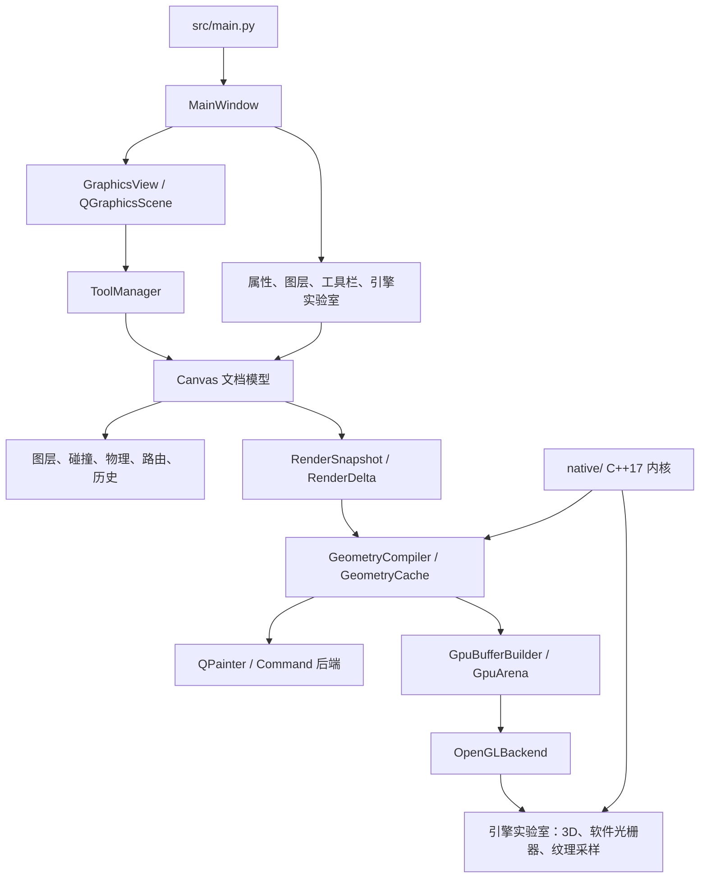

# Vector Editor：Qt、C++ 与 OpenGL 图形学实验平台

Vector Editor 是一个桌面二维矢量图形编辑器，也是面向图形客户端、渲染与引擎开发岗位的技术展示项目。它以 **PyQt5 Graphics View Framework** 保持可编辑文档语义，以可替换渲染后端展示从 QPainter 到 OpenGL 的演进，并在独立“引擎实验室”中提供 C++17、GPU 管线、纹理采样、软件光栅化与 3D 渲染的可视化对照。

项目不依赖完整外部游戏引擎。Python/Qt 负责桌面应用、文档模型与交互；C++17 负责纯算法内核；OpenGL 资源和 context 生命周期仍由 Qt 管理。这种边界使同一编辑场景同时服务于“可用的编辑器”和“可讲解的图形学实验”。

## 项目特点

- 二维编辑：选择、多选、复制粘贴、撤销/重做、平移/旋转/缩放、绘制与 JSON 持久化。
- 图层与约束：Z-order、锁定、隐藏、活动图层变换，以及图元始终约束在画布内的变换策略。
- 游戏客户端基础：AABB/圆形碰撞、空间哈希宽相位、刚体速度/质量/边界反弹、弹簧约束和碰撞调试显示。
- 图形连接：节点锚点自动更新，以及基于网格 A* 的连接线避障。
- 三条二维渲染路径：传统 QPainter、命令缓冲 QPainter、实验性 OpenGL 后端；它们共享稳定的几何和渲染数据契约。
- GPU 数据管理：按图元 ID 的 GeometryCache、RenderDelta、持久化 VBO、局部上传、GpuArena/free-list 与批次观测。
- OpenGL 实验：Shader 变体、Alpha/Additive/Opaque 混合、Scissor/Stencil、离屏 FBO、GPU picking、附件预览、后处理和高分辨率导出。
- C++17 原生内核：描边细分与 coverage、可见性多边形、二维轮廓挤出、软件光栅化、Mip/各向异性采样；CPython 窄绑定与 Python 参考实现相互验证。
- 图形学可视化：2D 多光源阴影、实例化/图集、GPU 字形 Atlas、3D Forward/Deferred、Shadow Map、G-buffer、CPU/GPU 光栅化差异热图、Mip/LOD/footprint/anisotropic taps。

## 当前范围与状态

`main` 分支包含已合并并验证的二维编辑器、OpenGL/原生算法实验，以及 M19.2 的纹理采样与各向异性过滤实验。高级实验功能均为**运行时配置**：不会写入二维文档、保存文件或撤销历史。

计划中的共享 HDR/Tone Mapping、Bloom、自动曝光和 SDF 均属于后续方向；具体范围和顺序以 [PROJECT_PLAN.md](PROJECT_PLAN.md) 为准，不应被理解为当前主线已发布能力。

## 架构



核心原则是：**文档状态与渲染状态分离**。`Canvas`、`Shape`、`Layer` 和序列化快照描述可编辑数据；碰撞缓存、A* 路由结果、GPU buffer、FBO、Qt 对象与 OpenGL context 都是可重建的派生状态。

### 编辑与渲染数据流

```text
工具 / 菜单 / 属性面板
  → Canvas 原子操作与历史事务
  → 图层、碰撞、物理与连接线路由更新
  → RenderDirtyFlag / RenderDelta
  → GeometryCache / GpuArena
  → QPainter 或 OpenGL 后端
```

撤销/重做保存完整文档纯数据快照。恢复后统一重建选择、碰撞、路由和渲染派生状态，因此绘制后再执行移动、缩放、旋转或图层操作仍具有一致的撤销语义。

## 目录结构

```text
vector_editor/
├── src/
│   ├── main.py                  # QApplication、MSAA/stencil 请求与主窗口入口
│   ├── core/                    # 文档、几何、渲染、OpenGL、物理、算法 reference
│   ├── tools/                   # 鼠标工具与预览交互
│   ├── ui/                      # 主窗口、属性/图层面板、引擎实验室页面
│   └── widgets/graphics_view.py # QGraphicsView、SceneRenderItem、后端切换
├── native/
│   ├── include/                 # C++17 算法接口
│   ├── src/                     # 原生算法实现
│   ├── python_bindings/         # CPython C API 窄绑定
│   └── build_native.ps1         # Windows/MSVC/CMake/Ninja 构建脚本
├── tests/                       # unittest、Qt offscreen 与真实 OpenGL smoke
├── benchmarks/                  # 可重复的性能基准脚本
├── data/saved/                  # 示例文档
├── requirements.txt             # 运行时 Python 依赖
└── PROJECT_PLAN.md              # 阶段计划、边界、验证记录与路线图
```

## 核心模块

| 模块 | 职责 |
|---|---|
| `core/canvas.py` | 文档中心、操作入口、世界状态更新、渲染失效管理。 |
| `core/shape.py`、`layer.py`、`transform.py` | 图元、样式、图层状态、Z-order 与变换约束。 |
| `core/serializer.py`、`selection.py` | JSON 风格持久化、完整快照历史与选择语义。 |
| `core/collision.py`、`physics.py`、`routing.py` | 碰撞体、空间哈希、刚体/弹簧与 A* 路由。 |
| `core/rendering.py`、`geometry.py` | 后端抽象、命令数据、GeometryCompiler 与缓存。 |
| `core/gpu_buffers.py`、`gpu_arena.py` | 顶点布局、批处理、上传计划、按图元 GPU slot 管理。 |
| `core/opengl_backend.py` | 主画布 OpenGL Shader、VAO/VBO、裁剪、离屏实验、GPU picking、2D 光照、实例化与 GPU 文字。 |
| `core/pipeline3d.py`、`ui/pipeline3d_panel.py` | 独立 3D viewport、mesh、相机、Shadow Map、G-buffer、Forward/Deferred 对照。 |
| `core/software_*`、`raster_comparison.py` | C++/Python 软件光栅器、CPU/GPU 附件对齐与误差可视化。 |
| `core/texture_sampling.py`、`native_texture.py` | Mip 链、过滤、footprint 与各向异性采样的 Python/C++ 对照。 |

## 渲染后端与实验层

| 路径 | 用途 | 资源边界 |
|---|---|---|
| QPainterBackend | 传统稳定渲染与回退。 | 直接消费图元绘制语义。 |
| CommandQPainterBackend | 验证几何命令/缓存，而不要求 GPU context。 | 共享 RenderDelta 和 GeometryCache。 |
| OpenGLBackend | 主画布实验性 GPU 路径。 | Qt 管理 context；OpenGL 管理 Shader、VAO/VBO、FBO、纹理。 |
| EngineLabWindow | 高级实验分页窗口。 | 不改变二维文档和 History；3D viewport 与主画布 context 独立。 |

OpenGL 后端提供降级策略：context、Shader 或原生模块不可用时，编辑器保留 QPainter/Python 参考路径，并在状态区报告资源或运行时错误。它不是完整商业渲染器替代品，而是用于验证数据布局、状态切换、附件与经典算法的实验性后端。

## C++17 原生层

`native/` 不持有 `QWidget`、`QObject`、图元文档或 OpenGL context。它只接收普通数组/标量数据并返回 POD 风格结果，当前覆盖：

- Polyline stroke tessellation 与 coverage；
- 2D visibility polygon 与射线/线段最近命中；
- 2D contour extrusion、法线与基础 mesh；
- 边函数、重心坐标、深度与透视校正的软件光栅化；
- RGBA8 Mip 生成、Nearest/Bilinear/Trilinear 与手写各向异性采样；

CPython 扩展 `native/bin/vector_engine_native.pyd` 是可选加速层。缺失、ABI 不匹配或运行失败时，`src/core/native_*.py` 自动回退到 Python reference，便于正确性对照与跨环境运行。

详细的 Windows 构建说明见 [native/README.md](native/README.md)。

## 环境与运行

### 基础环境

- Python 3.9+；项目在 Windows + CPython 3.9 + PyQt5 5.15 环境验证。
- 运行时依赖：PyQt5、Pillow、dataclasses-json，见 [requirements.txt](requirements.txt)。
- OpenGL 实验建议使用支持桌面 OpenGL 的显卡驱动；基础编辑功能可使用非 OpenGL 后端。

### 安装与启动

```powershell
git clone https://github.com/45204221/vector-editor.git
cd vector-editor

python -m venv .venv
.\.venv\Scripts\Activate.ps1
python -m pip install --upgrade pip
python -m pip install -r requirements.txt

python src\main.py
```

应用入口会在创建 `QApplication` 前请求 MSAA 与 stencil buffer；若驱动不支持，运行时状态以实际 context 能力及 coverage/scissor 回退为准。

### 可选：构建原生扩展

Windows 开发环境需具备 Visual Studio C++ 工具链、CMake、Ninja 和与当前解释器匹配的 Python development headers：

```powershell
powershell.exe -NoProfile -ExecutionPolicy Bypass -File native\build_native.ps1
```

原生模块与 Python 的 minor version 和架构相关。切换解释器、Python 小版本或编译器环境后应重新构建；不要提交 `native/bin/` 与 `native/build-*` 生成物。

## 测试与验证

运行完整的无窗口回归：

```powershell
python -m unittest discover -s tests
```

开发依赖见 [requirements_dev.txt](requirements_dev.txt)。项目同时保留真实桌面 OpenGL smoke，用于验证 context、Shader、FBO、纹理和资源生命周期；它们应在具备可用显示与 GPU 驱动的环境执行，例如：

```powershell
$env:QT_OPENGL = "desktop"
python tests\opengl_raster_smoke.py
python tests\opengl_postprocess_smoke.py
python tests\opengl_pipeline3d_smoke.py
python tests\opengl_texture_sampling_smoke.py
```

自动化测试覆盖文档/历史中立性、算法 golden cases、C++/Python parity、UI 状态和工作区布局；真实 smoke 负责补足驱动、FBO 与 Shader 编译层面的验证。两类测试不能互相替代。

## 文档与开发流程

- [PROJECT_PLAN.md](PROJECT_PLAN.md)：权威的阶段计划、设计边界、资源预算、验证口径与未来路线。
- [PROJECT_ANALYSIS_AND_OPTIMIZATION.md](PROJECT_ANALYSIS_AND_OPTIMIZATION.md)：早期架构分析与优化记录；其中历史环境与路线结论应与当前计划交叉核对。
- [native/README.md](native/README.md)：C++ 扩展构建、ABI 与回退机制。

推荐工作流：从 `main` 创建功能分支；先在 `PROJECT_PLAN.md` 记录结构设计与验收标准；实施后运行自动化和真实 OpenGL 验证；完成 GUI 验收后提交、推送、创建 PR 并合并。`main` 应只保留已验证阶段，构建产物、缓存、虚拟环境和 IDE 私有配置不进入版本库。

## 设计边界

- 本项目不是完整游戏引擎，也不尝试把 QGraphicsScene 改造成通用 3D DCC。
- 3D、GPU 文字、实例化、纹理采样、软件光栅器和后处理主要用于独立实验与理论展示，不改变二维文档格式。
- 性能面板中的 CPU 提交时间与 GPU timer query 分开记录；没有 GPU timestamp 的数据不会被表述为 GPU 执行时间。
- 用户文档、历史、碰撞与路由优先保证确定性和可恢复性；原生和 OpenGL 路径必须保留可诊断的 Python/QPainter 回退。

## 许可证

仓库当前未包含独立许可证文件。公开发布、复用或分发前，请明确添加适用的 LICENSE 与第三方依赖声明。
